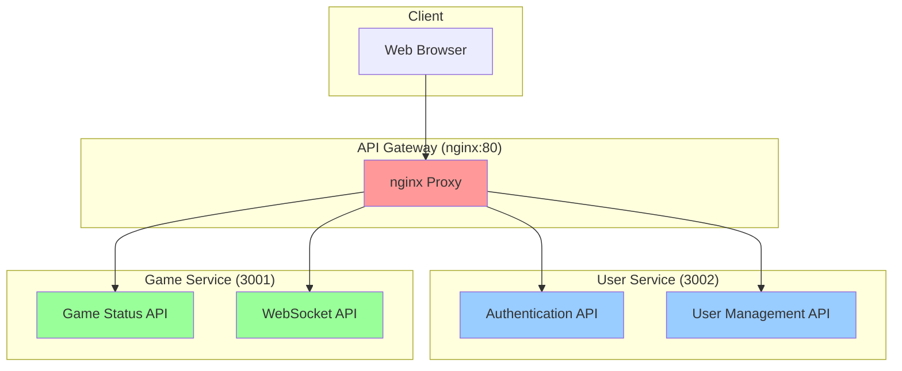

# 🌐 API 문서

**Version:** v4.0  
**Last Updated:** 2025-01-25  
**Architecture:** Independent Microservices with JWT Authentication

## 📋 목차

1. [API 개요](#api-개요)
2. [인증 시스템](#인증-시스템)
3. [User Service API](#user-service-api)
4. [Game Service API](#game-service-api)
5. [WebSocket 이벤트](#websocket-이벤트)
6. [에러 처리](#에러-처리)
7. [Rate Limiting](#rate-limiting)
8. [API 테스트](#api-테스트)

## 🎯 API 개요

### 마이크로서비스 구조



### API 라우팅 규칙

| 경로 | 대상 서비스 | 인증 필요 | 설명 |
|------|-------------|-----------|------|
| `/api/auth/*` | User Service | ❌ | 인증 관련 API |
| `/api/user/*` | User Service | ✅ | 사용자 관리 API |
| `/socket.io/*` | Game Service | ✅ | WebSocket 연결 |
| `/api/status` | Game Service | ❌ | 게임 서버 상태 |

### 공통 응답 형식

#### 성공 응답
```json
{
  "success": true,
  "message": "Operation completed successfully",
  "data": {
    // 응답 데이터
  },
  "timestamp": "2025-01-25T10:00:00Z"
}
```

#### 에러 응답
```json
{
  "success": false,
  "error": {
    "code": "ERROR_CODE",
    "message": "Human readable error message",
    "details": "Additional error details"
  },
  "timestamp": "2025-01-25T10:00:00Z"
}
```

## 🔐 인증 시스템

### JWT 토큰 구조

```json
{
  "header": {
    "alg": "HS256",
    "typ": "JWT"
  },
  "payload": {
    "userId": "uuid",
    "username": "string",
    "isGuest": "boolean",
    "iat": "timestamp",
    "exp": "timestamp"
  }
}
```

### 인증 헤더 형식

```http
Authorization: Bearer <jwt_token>
```

### 토큰 만료 시간

- **기본**: 24시간
- **게스트**: 24시간 (세션 종료 시 삭제)
- **등록 사용자**: 24시간 (갱신 가능)

## 👤 User Service API

**Base URL**: `http://localhost/api/`  
**Port**: 3002 (nginx를 통해 라우팅)

### 🔓 인증 API (인증 불필요)

#### POST /api/auth/users/register
사용자 회원가입

**Request:**
```http
POST /api/auth/users/register
Content-Type: application/json

{
  "username": "testuser",
  "email": "test@example.com",
  "password": "password123"
}
```

**Response (201):**
```json
{
  "success": true,
  "message": "User registered successfully",
  "data": {
    "user": {
      "id": "550e8400-e29b-41d4-a716-446655440000",
      "username": "testuser",
      "email": "test@example.com",
      "isGuest": false,
      "preferredVehicleType": "fighter",
      "createdAt": "2025-01-25T10:00:00Z"
    },
    "token": "eyJhbGciOiJIUzI1NiIsInR5cCI6IkpXVCJ9..."
  }
}
```

**Validation Rules:**
- `username`: 3-50자, 영문/숫자/언더스코어만 허용
- `email`: 유효한 이메일 형식
- `password`: 최소 6자 이상

---

#### POST /api/auth/users/login
사용자 로그인

**Request:**
```http
POST /api/auth/users/login
Content-Type: application/json

{
  "username": "testuser",
  "password": "password123"
}
```

**Response (200):**
```json
{
  "success": true,
  "message": "Login successful",
  "data": {
    "user": {
      "id": "550e8400-e29b-41d4-a716-446655440000",
      "username": "testuser",
      "email": "test@example.com",
      "isGuest": false,
      "preferredVehicleType": "fighter",
      "gameStats": {
        "totalKills": 15,
        "totalDeaths": 8,
        "totalGames": 5,
        "totalScore": 2500,
        "bestScore": 800,
        "playTime": 7200
      },
      "lastLoginAt": "2025-01-25T10:00:00Z"
    },
    "token": "eyJhbGciOiJIUzI1NiIsInR5cCI6IkpXVCJ9..."
  }
}
```

---

#### POST /api/auth/users/guest
게스트 계정 생성

**Request:**
```http
POST /api/auth/users/guest
Content-Type: application/json

{}
```

**Response (201):**
```json
{
  "success": true,
  "message": "Guest user created successfully",
  "data": {
    "user": {
      "id": "550e8400-e29b-41d4-a716-446655440001",
      "username": "Guest_12345",
      "isGuest": true,
      "preferredVehicleType": "fighter",
      "createdAt": "2025-01-25T10:00:00Z"
    },
    "token": "eyJhbGciOiJIUzI1NiIsInR5cCI6IkpXVCJ9..."
  }
}
```

---

#### GET /api/auth/users/verify-token
JWT 토큰 검증 (nginx 내부 사용)

**Request:**
```http
GET /api/auth/users/verify-token
Authorization: Bearer <jwt_token>
```

**Response (200):**
```json
{
  "success": true,
  "data": {
    "userId": "550e8400-e29b-41d4-a716-446655440000",
    "username": "testuser",
    "isGuest": false
  }
}
```

### 🔒 사용자 관리 API (인증 필요)

#### GET /api/user/users/profile
사용자 프로필 조회

**Request:**
```http
GET /api/user/users/profile
Authorization: Bearer <jwt_token>
```

**Response (200):**
```json
{
  "success": true,
  "data": {
    "id": "550e8400-e29b-41d4-a716-446655440000",
    "username": "testuser",
    "email": "test@example.com",
    "isGuest": false,
    "preferredVehicleType": "fighter",
    "gameStats": {
      "totalKills": 15,
      "totalDeaths": 8,
      "totalGames": 5,
      "totalScore": 2500,
      "bestScore": 800,
      "playTime": 7200
    },
    "customization": {
      "vehicleColor": "#ff0000",
      "unlockedItems": ["skin1", "weapon1"],
      "equippedItems": ["skin1"]
    },
    "gamePoints": 150,
    "lastLoginAt": "2025-01-25T10:00:00Z",
    "createdAt": "2025-01-20T10:00:00Z",
    "updatedAt": "2025-01-25T10:00:00Z"
  }
}
```

---

#### PUT /api/user/users/vehicle-settings
차량 설정 업데이트

**Request:**
```http
PUT /api/user/users/vehicle-settings
Authorization: Bearer <jwt_token>
Content-Type: application/json

{
  "preferredVehicleType": "heavy",
  "customization": {
    "vehicleColor": "#00ff00",
    "equippedItems": ["skin2", "weapon2"]
  }
}
```

**Response (200):**
```json
{
  "success": true,
  "message": "Vehicle settings updated successfully",
  "data": {
    "preferredVehicleType": "heavy",
    "customization": {
      "vehicleColor": "#00ff00",
      "unlockedItems": ["skin1", "weapon1", "skin2", "weapon2"],
      "equippedItems": ["skin2", "weapon2"]
    }
  }
}
```

**Valid Vehicle Types:**
- `fighter`: 균형잡힌 전투기
- `heavy`: 중형 전투기
- `test`: 테스트용 전투기

---

#### POST /api/user/users/game-stats
게임 통계 업데이트

**Request:**
```http
POST /api/user/users/game-stats
Authorization: Bearer <jwt_token>
Content-Type: application/json

{
  "kills": 3,
  "deaths": 1,
  "score": 500,
  "playTime": 600
}
```

**Response (200):**
```json
{
  "success": true,
  "message": "Game statistics updated successfully",
  "data": {
    "gameStats": {
      "totalKills": 18,
      "totalDeaths": 9,
      "totalGames": 6,
      "totalScore": 3000,
      "bestScore": 800,
      "playTime": 7800
    },
    "gamePoints": 165
  }
}
```

---

#### GET /api/user/users/list
사용자 목록 조회 (관리자용)

**Request:**
```http
GET /api/user/users/list?page=1&limit=10&search=test
Authorization: Bearer <jwt_token>
```

**Query Parameters:**
- `page`: 페이지 번호 (기본값: 1)
- `limit`: 페이지당 항목 수 (기본값: 10, 최대: 100)
- `search`: 검색어 (사용자명 또는 이메일)
- `isGuest`: 게스트 필터 (true/false)
- `isActive`: 활성 상태 필터 (true/false)

**Response (200):**
```json
{
  "success": true,
  "data": {
    "users": [
      {
        "id": "550e8400-e29b-41d4-a716-446655440000",
        "username": "testuser",
        "email": "test@example.com",
        "isGuest": false,
        "isActive": true,
        "gameStats": {
          "totalKills": 15,
          "totalDeaths": 8,
          "totalGames": 5
        },
        "lastLoginAt": "2025-01-25T10:00:00Z",
        "createdAt": "2025-01-20T10:00:00Z"
      }
    ],
    "pagination": {
      "page": 1,
      "limit": 10,
      "total": 150,
      "totalPages": 15,
      "hasNext": true,
      "hasPrev": false
    }
  }
}
```

---

#### GET /api/user/database/info
데이터베이스 정보 조회

**Request:**
```http
GET /api/user/database/info
Authorization: Bearer <jwt_token>
```

**Response (200):**
```json
{
  "success": true,
  "data": {
    "totalUsers": 150,
    "activeUsers": 120,
    "guestUsers": 30,
    "registeredUsers": 120,
    "databaseStatus": "connected",
    "lastBackup": "2025-01-25T06:00:00Z",
    "statistics": {
      "newUsersToday": 5,
      "activeUsersToday": 45,
      "totalGamesPlayed": 1250,
      "averageSessionTime": 1800
    }
  }
}
```

## 🎮 Game Service API

**Base URL**: `http://localhost:3001/api/`  
**Direct Port**: 3001

### 📊 게임 상태 API (인증 불필요)

#### GET /api/status
게임 서버 상태 조회

**Request:**
```http
GET /api/status
```

**Response (200):**
```json
{
  "success": true,
  "data": {
    "status": "running",
    "uptime": 3600,
    "version": "4.0.0",
    "players": {
      "online": 15,
      "inGame": 12,
      "waiting": 3
    },
    "gameState": {
      "vehicles": 12,
      "projectiles": 45,
      "explosions": 3
    },
    "performance": {
      "fps": 60,
      "memoryUsage": "45.2 MB",
      "cpuUsage": "25%"
    },
    "lastRestart": "2025-01-25T08:00:00Z"
  }
}
```

## 🔄 WebSocket 이벤트

**Connection URL**: `ws://localhost/socket.io/`  
**Authentication**: JWT Token required

### 연결 설정

```javascript
const socket = io('http://localhost', {
  auth: { token: 'your_jwt_token_here' }
});
```

### 클라이언트 → 서버 이벤트

#### `join-game`
게임 참여 요청

**Payload:**
```json
{
  "vehicleType": "fighter",
  "username": "player123"
}
```

**Response Events:**
- `game-joined`: 게임 참여 성공
- `error`: 참여 실패

---

#### `player-input`
플레이어 입력 전송 (60fps)

**Payload:**
```json
{
  "keys": {
    "w": true,
    "a": false,
    "s": false,
    "d": true,
    "shift": false,
    "ctrl": false,
    "space": false,
    "x": false
  },
  "mouseX": 0.5,
  "mouseY": 0.3,
  "timestamp": 1706176800000
}
```

---

#### `fire-weapon`
무기 발사

**Payload:**
```json
{
  "position": {
    "x": 10.5,
    "y": 5.2,
    "z": 20.8
  },
  "direction": {
    "x": 0.0,
    "y": 0.1,
    "z": 1.0
  },
  "timestamp": 1706176800000
}
```

---

#### `leave-game`
게임 퇴장

**Payload:**
```json
{}
```

### 서버 → 클라이언트 이벤트

#### `game-state`
게임 상태 동기화 (60fps)

**Payload:**
```json
{
  "vehicles": [
    {
      "id": "vehicle_123",
      "playerId": "player_456",
      "username": "testuser",
      "vehicleType": "fighter",
      "position": {
        "x": 10.5,
        "y": 5.2,
        "z": 20.8
      },
      "rotation": {
        "x": 0.1,
        "y": 0.5,
        "z": 0.0
      },
      "velocity": {
        "x": 2.5,
        "y": 0.0,
        "z": 5.0
      },
      "health": 35,
      "maxHealth": 40,
      "isDestroyed": false,
      "lastFireTime": 1706176800000
    }
  ],
  "projectiles": [
    {
      "id": "bullet_789",
      "position": {
        "x": 15.2,
        "y": 5.5,
        "z": 25.3
      },
      "direction": {
        "x": 0.0,
        "y": 0.1,
        "z": 1.0
      },
      "playerId": "player_456",
      "speed": 200,
      "damage": 10
    }
  ],
  "timestamp": 1706176800000
}
```

---

#### `player-joined`
플레이어 참여 알림

**Payload:**
```json
{
  "playerId": "player_789",
  "username": "newPlayer",
  "vehicleType": "heavy",
  "position": {
    "x": 0,
    "y": 0,
    "z": 0
  }
}
```

---

#### `player-left`
플레이어 퇴장 알림

**Payload:**
```json
{
  "playerId": "player_456",
  "username": "leftPlayer",
  "reason": "disconnect"
}
```

---

#### `vehicle-destroyed`
차량 파괴 알림

**Payload:**
```json
{
  "vehicleId": "vehicle_123",
  "playerId": "player_456",
  "killerPlayerId": "player_789",
  "position": {
    "x": 10.5,
    "y": 5.2,
    "z": 20.8
  },
  "respawnTime": 5000
}
```

---

#### `explosion-created`
폭발 효과 생성

**Payload:**
```json
{
  "id": "explosion_456",
  "position": {
    "x": 10.5,
    "y": 5.2,
    "z": 20.8
  },
  "size": "large",
  "type": "vehicle-destruction",
  "duration": 2000
}
```

---

#### `game-joined`
게임 참여 성공

**Payload:**
```json
{
  "playerId": "player_456",
  "vehicleId": "vehicle_123",
  "gameState": {
    // 현재 게임 상태
  }
}
```

---

#### `error`
에러 발생

**Payload:**
```json
{
  "code": "INVALID_VEHICLE_TYPE",
  "message": "Invalid vehicle type specified",
  "details": "Available types: fighter, heavy, test"
}
```

## ❌ 에러 처리

### HTTP 상태 코드

| 코드 | 의미 | 설명 |
|------|------|------|
| 200 | OK | 요청 성공 |
| 201 | Created | 리소스 생성 성공 |
| 400 | Bad Request | 잘못된 요청 |
| 401 | Unauthorized | 인증 실패 |
| 403 | Forbidden | 권한 없음 |
| 404 | Not Found | 리소스 없음 |
| 409 | Conflict | 리소스 충돌 |
| 429 | Too Many Requests | Rate limit 초과 |
| 500 | Internal Server Error | 서버 오류 |

### 에러 코드

#### User Service 에러

| 코드 | 설명 |
|------|------|
| `USER_NOT_FOUND` | 사용자를 찾을 수 없음 |
| `INVALID_CREDENTIALS` | 잘못된 인증 정보 |
| `USERNAME_TAKEN` | 사용자명 이미 사용 중 |
| `EMAIL_TAKEN` | 이메일 이미 사용 중 |
| `INVALID_TOKEN` | 유효하지 않은 JWT 토큰 |
| `TOKEN_EXPIRED` | 만료된 JWT 토큰 |
| `VALIDATION_ERROR` | 입력 데이터 검증 실패 |
| `DATABASE_ERROR` | 데이터베이스 오류 |

#### Game Service 에러

| 코드 | 설명 |
|------|------|
| `AUTHENTICATION_ERROR` | WebSocket 인증 실패 |
| `INVALID_VEHICLE_TYPE` | 유효하지 않은 차량 타입 |
| `GAME_FULL` | 게임 서버 만원 |
| `PLAYER_NOT_FOUND` | 플레이어를 찾을 수 없음 |
| `INVALID_INPUT` | 유효하지 않은 입력 |
| `FIRE_RATE_EXCEEDED` | 발사 속도 제한 초과 |
| `SERVER_ERROR` | 게임 서버 오류 |

### 에러 응답 예시

#### 400 Bad Request
```json
{
  "success": false,
  "error": {
    "code": "VALIDATION_ERROR",
    "message": "Validation failed",
    "details": {
      "username": "Username must be at least 3 characters long",
      "email": "Invalid email format"
    }
  },
  "timestamp": "2025-01-25T10:00:00Z"
}
```

#### 401 Unauthorized
```json
{
  "success": false,
  "error": {
    "code": "INVALID_TOKEN",
    "message": "Invalid or expired JWT token",
    "details": "Token signature verification failed"
  },
  "timestamp": "2025-01-25T10:00:00Z"
}
```

#### 429 Too Many Requests
```json
{
  "success": false,
  "error": {
    "code": "RATE_LIMIT_EXCEEDED",
    "message": "Too many requests",
    "details": "Rate limit: 1000 requests per 15 minutes",
    "retryAfter": 300
  },
  "timestamp": "2025-01-25T10:00:00Z"
}
```

## 🚦 Rate Limiting

### User Service Rate Limits

| 엔드포인트 | 제한 | 윈도우 |
|------------|------|--------|
| `/api/auth/*` | 100 requests | 15분 |
| `/api/user/*` | 1000 requests | 15분 |
| 전체 | 1000 requests | 15분 |

### Game Service Rate Limits

| 이벤트 | 제한 | 설명 |
|--------|------|------|
| `player-input` | 60 events/sec | 게임 입력 |
| `fire-weapon` | 차량별 제한 | 무기 발사 속도 |
| WebSocket 연결 | 10 connections/min | 연결 시도 |

### Rate Limit 헤더

```http
X-RateLimit-Limit: 1000
X-RateLimit-Remaining: 999
X-RateLimit-Reset: 1706177700
```

## 🧪 API 테스트

### cURL 예시

#### 회원가입
```bash
curl -X POST http://localhost/api/auth/users/register \
  -H "Content-Type: application/json" \
  -d '{
    "username": "testuser",
    "email": "test@example.com",
    "password": "password123"
  }'
```

#### 로그인
```bash
curl -X POST http://localhost/api/auth/users/login \
  -H "Content-Type: application/json" \
  -d '{
    "username": "testuser",
    "password": "password123"
  }'
```

#### 프로필 조회
```bash
curl -X GET http://localhost/api/user/users/profile \
  -H "Authorization: Bearer YOUR_JWT_TOKEN"
```

#### 게임 서버 상태
```bash
curl -X GET http://localhost:3001/api/status
```

### JavaScript 예시

#### API 클라이언트
```javascript
class GameAPI {
  constructor(baseURL = 'http://localhost') {
    this.baseURL = baseURL;
    this.token = localStorage.getItem('jwt_token');
  }

  async request(endpoint, options = {}) {
    const url = `${this.baseURL}${endpoint}`;
    const config = {
      headers: {
        'Content-Type': 'application/json',
        ...(this.token && { Authorization: `Bearer ${this.token}` })
      },
      ...options
    };

    const response = await fetch(url, config);
    const data = await response.json();

    if (!response.ok) {
      throw new Error(data.error?.message || 'API request failed');
    }

    return data;
  }

  // 인증 API
  async register(username, email, password) {
    const data = await this.request('/api/auth/users/register', {
      method: 'POST',
      body: JSON.stringify({ username, email, password })
    });
    
    this.token = data.data.token;
    localStorage.setItem('jwt_token', this.token);
    return data;
  }

  async login(username, password) {
    const data = await this.request('/api/auth/users/login', {
      method: 'POST',
      body: JSON.stringify({ username, password })
    });
    
    this.token = data.data.token;
    localStorage.setItem('jwt_token', this.token);
    return data;
  }

  async createGuest() {
    const data = await this.request('/api/auth/users/guest', {
      method: 'POST'
    });
    
    this.token = data.data.token;
    localStorage.setItem('jwt_token', this.token);
    return data;
  }

  // 사용자 API
  async getProfile() {
    return this.request('/api/user/users/profile');
  }

  async updateVehicleSettings(settings) {
    return this.request('/api/user/users/vehicle-settings', {
      method: 'PUT',
      body: JSON.stringify(settings)
    });
  }

  async updateGameStats(stats) {
    return this.request('/api/user/users/game-stats', {
      method: 'POST',
      body: JSON.stringify(stats)
    });
  }

  // 게임 API
  async getGameStatus() {
    return this.request(':3001/api/status');
  }
}
```

#### WebSocket 클라이언트
```javascript
class GameSocket {
  constructor(token) {
    this.socket = io('http://localhost', {
      auth: { token }
    });
    
    this.setupEventHandlers();
  }

  setupEventHandlers() {
    this.socket.on('connect', () => {
      console.log('Connected to game server');
    });

    this.socket.on('disconnect', (reason) => {
      console.log('Disconnected:', reason);
    });

    this.socket.on('error', (error) => {
      console.error('Socket error:', error);
    });

    this.socket.on('game-state', (gameState) => {
      this.updateGameState(gameState);
    });

    this.socket.on('player-joined', (player) => {
      console.log('Player joined:', player.username);
    });

    this.socket.on('player-left', (player) => {
      console.log('Player left:', player.username);
    });

    this.socket.on('vehicle-destroyed', (event) => {
      this.handleVehicleDestroyed(event);
    });

    this.socket.on('explosion-created', (explosion) => {
      this.createExplosion(explosion);
    });
  }

  joinGame(vehicleType, username) {
    this.socket.emit('join-game', {
      vehicleType,
      username
    });
  }

  sendInput(keys, mouseX, mouseY) {
    this.socket.emit('player-input', {
      keys,
      mouseX,
      mouseY,
      timestamp: Date.now()
    });
  }

  fireWeapon(position, direction) {
    this.socket.emit('fire-weapon', {
      position,
      direction,
      timestamp: Date.now()
    });
  }

  leaveGame() {
    this.socket.emit('leave-game');
  }

  disconnect() {
    this.socket.disconnect();
  }
}
```

### 테스트 시나리오

#### 1. 사용자 등록 및 로그인 플로우
```javascript
async function testUserFlow() {
  const api = new GameAPI();
  
  try {
    // 1. 회원가입
    const registerResult = await api.register(
      'testuser',
      'test@example.com',
      'password123'
    );
    console.log('Registration successful:', registerResult);
    
---

**📋 문서 버전 관리**

- v3.0: 마이크로서비스 API 문서화
- v2.x: 모놀리식 API 문서
- v1.x: 초기 API 문서

**🔄 업데이트 주기**: API 변경 시 즉시 업데이트 