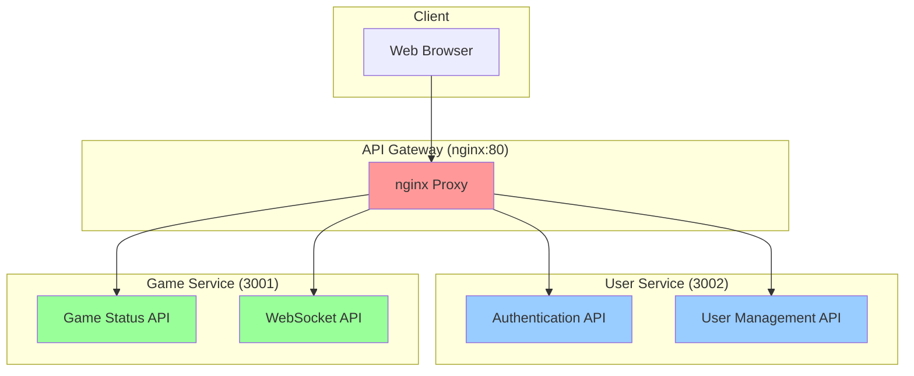

# ?Œ� API 문서

**Version:** v4.0  
**Last Updated:** 2025-06-12  
**Architecture:** Independent Microservices with JWT Authentication

## ?“‹ 목차

1. [API 개요](#api-개요)
2. [?¸ì¦� ?œìŠ¤??(#?¸ì¦�-?œìŠ¤??
3. [User Service API](#user-service-api)
4. [Game Service API](#game-service-api)
5. [WebSocket ?´ë²¤??(#websocket-?´ë²¤??
6. [?�러 처리](#?�러-처리)
7. [Rate Limiting](#rate-limiting)
8. [API ?ŒìŠ¤??(#api-?ŒìŠ¤??

## ?�¯ API 개요

### 마ì�´?¬ë¡œ?œë¹„??구조



### API ?¼ìš°??규칙

| 경로 | ?€???œë¹„??| ?¸ì¦� ?„ìš” | ?¤ëª… |
|------|-------------|-----------|------|
| `/api/auth/*` | User Service | ??| ?¸ì¦� ê´€??API |
| `/api/user/*` | User Service | ??| ?¬ìš©??ê´€ë¦?API |
| `/socket.io/*` | Game Service | ??| WebSocket ?°ê²° |
| `/api/status` | Game Service | ??| 게ì�„ ?œë²„ ?�태 |

### 공통 ?‘답 ?•ì‹�

#### ?±ê³µ ?‘답
```json
{
  "success": true,
  "message": "Operation completed successfully",
  "data": {
    // ?‘답 ?°ì�´??
  },
  "timestamp": "2025-06-12T10:00:00Z"
}
```

#### ?�러 ?‘답
```json
{
  "success": false,
  "error": {
    "code": "ERROR_CODE",
    "message": "Human readable error message",
    "details": "Additional error details"
  },
  "timestamp": "2025-06-12T10:00:00Z"
}
```

## ?”� ?¸ì¦� ?œìŠ¤??

### JWT ? í�° 구조

```json
{
  "header": {
    "alg": "HS256",
    "typ": "JWT"
  },
  "payload": {
    "userId": "uuid",
    "username": "string",
    "isGuest": "boolean",
    "iat": "timestamp",
    "exp": "timestamp"
  }
}
```

### ?¸ì¦� ?¤ë�” ?•ì‹�

```http
Authorization: Bearer <jwt_token>
```

### ? í�° 만료 ?œê°„

- **기본**: 24?œê°„
- **게스??*: 24?œê°„ (?¸ì…˜ 종료 ???? œ)
- **?±ë¡� ?¬ìš©??*: 24?œê°„ (갱신 ê°€??

## ?‘¤ User Service API

**Base URL**: `http://localhost/api/`  
**Port**: 3002 (nginxë¥??µí•´ ?¼ìš°??

### ?”“ ?¸ì¦� API (?¸ì¦� 불필??

#### POST /api/auth/users/register
?¬ìš©???Œì›�ê°€??

**Request:**
```http
POST /api/auth/users/register
Content-Type: application/json

{
  "username": "testuser",
  "email": "test@example.com",
  "password": "password123"
}
```

**Response (201):**
```json
{
  "success": true,
  "message": "User registered successfully",
  "data": {
    "user": {
      "id": "550e8400-e29b-41d4-a716-446655440000",
      "username": "testuser",
      "email": "test@example.com",
      "isGuest": false,
      "preferredVehicleType": "fighter",
      "createdAt": "2025-06-12T10:00:00Z"
    },
    "token": "eyJhbGciOiJIUzI1NiIsInR5cCI6IkpXVCJ9..."
  }
}
```

**Validation Rules:**
- `username`: 3-50?? ?�문/?«ì��/?¸ë�”?¤ì½”?´ë§Œ ?ˆìš©
- `email`: ? íš¨???´ë©”???•ì‹�
- `password`: 최소 6???´ìƒ�

---

#### POST /api/auth/users/login
?¬ìš©??로그??

**Request:**
```http
POST /api/auth/users/login
Content-Type: application/json

{
  "username": "testuser",
  "password": "password123"
}
```

**Response (200):**
```json
{
  "success": true,
  "message": "Login successful",
  "data": {
    "user": {
      "id": "550e8400-e29b-41d4-a716-446655440000",
      "username": "testuser",
      "email": "test@example.com",
      "isGuest": false,
      "preferredVehicleType": "fighter",
      "gameStats": {
        "totalKills": 15,
        "totalDeaths": 8,
        "totalGames": 5,
        "totalScore": 2500,
        "bestScore": 800,
        "playTime": 7200
      },
      "lastLoginAt": "2025-06-12T10:00:00Z"
    },
    "token": "eyJhbGciOiJIUzI1NiIsInR5cCI6IkpXVCJ9..."
  },
  "timestamp": "2025-06-12T10:00:00Z"
}
```

---

#### POST /api/auth/users/guest
게스??계정 ?�성

**Request:**
```http
POST /api/auth/users/guest
Content-Type: application/json

{}
```

**Response (201):**
```json
{
  "success": true,
  "message": "Guest user created successfully",
  "data": {
    "user": {
      "id": "550e8400-e29b-41d4-a716-446655440001",
      "username": "Guest_12345",
      "isGuest": true,
      "preferredVehicleType": "fighter",
      "createdAt": "2025-06-12T10:00:00Z"
    },
    "token": "eyJhbGciOiJIUzI1NiIsInR5cCI6IkpXVCJ9..."
  }
}
```

---

#### GET /api/auth/users/verify-token
JWT ? í�° ê²€ì¦?(nginx ?´ë? ?¬ìš©)

**Request:**
```http
GET /api/auth/users/verify-token
Authorization: Bearer <jwt_token>
```

**Response (200):**
```json
{
  "success": true,
  "data": {
    "userId": "550e8400-e29b-41d4-a716-446655440000",
    "username": "testuser",
    "isGuest": false
  }
}
```

### ?”’ ?¬ìš©??ê´€ë¦?API (?¸ì¦� ?„ìš”)

#### GET /api/user/users/profile
?¬ìš©???„ë¡œ??조회

**Request:**
```http
GET /api/user/users/profile
Authorization: Bearer <jwt_token>
```

**Response (200):**
```json
{
  "success": true,
  "data": {
    "id": "550e8400-e29b-41d4-a716-446655440000",
    "username": "testuser",
    "email": "test@example.com",
    "isGuest": false,
    "preferredVehicleType": "fighter",
    "gameStats": {
      "totalKills": 15,
      "totalDeaths": 8,
      "totalGames": 5,
      "totalScore": 2500,
      "bestScore": 800,
      "playTime": 7200
    },
    "customization": {
      "vehicleColor": "#ff0000",
      "unlockedItems": ["skin1", "weapon1"],
      "equippedItems": ["skin1"]
    },
    "gamePoints": 150,
    "lastLoginAt": "2025-06-12T10:00:00Z",
    "createdAt": "2025-01-20T10:00:00Z",
    "updatedAt": "2025-06-12T10:00:00Z"
  }
}
```

---

#### PUT /api/user/users/vehicle-settings
차량 ?¤ì • ?…ë�°?´íŠ¸

**Request:**
```http
PUT /api/user/users/vehicle-settings
Authorization: Bearer <jwt_token>
Content-Type: application/json

{
  "preferredVehicleType": "heavy",
  "customization": {
    "vehicleColor": "#00ff00",
    "equippedItems": ["skin2", "weapon2"]
  }
}
```

**Response (200):**
```json
{
  "success": true,
  "message": "Vehicle settings updated successfully",
  "data": {
    "preferredVehicleType": "heavy",
    "customization": {
      "vehicleColor": "#00ff00",
      "unlockedItems": ["skin1", "weapon1", "skin2", "weapon2"],
      "equippedItems": ["skin2", "weapon2"]
    }
  }
}
```

**Valid Vehicle Types:**
- `fighter`: 균형?¡í�Œ ?„투ê¸?
- `heavy`: 중형 ?„투ê¸?
- `test`: ?ŒìŠ¤?¸ìš© ?„투ê¸?

---

#### POST /api/user/users/game-stats
게ì�„ ?µê³„ ?…ë�°?´íŠ¸

**Request:**
```http
POST /api/user/users/game-stats
Authorization: Bearer <jwt_token>
Content-Type: application/json

{
  "kills": 3,
  "deaths": 1,
  "score": 500,
  "playTime": 600
}
```

**Response (200):**
```json
{
  "success": true,
  "message": "Game statistics updated successfully",
  "data": {
    "gameStats": {
      "totalKills": 18,
      "totalDeaths": 9,
      "totalGames": 6,
      "totalScore": 3000,
      "bestScore": 800,
      "playTime": 7800
    },
    "gamePoints": 165
  }
}
```

---

#### GET /api/user/users/list
?¬ìš©??목ë¡� 조회 (관리ì��??

**Request:**
```http
GET /api/user/users/list?page=1&limit=10&search=test
Authorization: Bearer <jwt_token>
```

**Query Parameters:**
- `page`: ?˜ì�´ì§€ 번호 (기본ê°? 1)
- `limit`: ?˜ì�´ì§€????ª© ??(기본ê°? 10, 최ë?: 100)
- `search`: ê²€?‰ì–´ (?¬ìš©?�명 ?�는 ?´ë©”??
- `isGuest`: 게스???„í„° (true/false)
- `isActive`: ?œì„± ?�태 ?„í„° (true/false)

**Response (200):**
```json
{
  "success": true,
  "data": {
    "users": [
      {
        "id": "550e8400-e29b-41d4-a716-446655440000",
        "username": "testuser",
        "email": "test@example.com",
        "isGuest": false,
        "isActive": true,
        "gameStats": {
          "totalKills": 15,
          "totalDeaths": 8,
          "totalGames": 5
        },
        "lastLoginAt": "2025-06-12T10:00:00Z",
        "createdAt": "2025-01-20T10:00:00Z"
      }
    ],
    "pagination": {
      "page": 1,
      "limit": 10,
      "total": 150,
      "totalPages": 15,
      "hasNext": true,
      "hasPrev": false
    }
  }
}
```

---

#### GET /api/user/database/info
?°ì�´?°ë² ?´ìŠ¤ ?•ë³´ 조회

**Request:**
```http
GET /api/user/database/info
Authorization: Bearer <jwt_token>
```

**Response (200):**
```json
{
  "success": true,
  "data": {
    "totalUsers": 150,
    "activeUsers": 120,
    "guestUsers": 30,
    "registeredUsers": 120,
    "databaseStatus": "connected",
    "lastBackup": "2025-06-12T06:00:00Z",
    "statistics": {
      "newUsersToday": 5,
      "activeUsersToday": 45,
      "totalGamesPlayed": 1250,
      "averageSessionTime": 1800
    }
  }
}
```

## ?�® Game Service API

**Base URL**: `http://localhost:3001/api/`  
**Direct Port**: 3001

### ?“Š 게ì�„ ?�태 API (?¸ì¦� 불필??

#### GET /api/status
게ì�„ ?œë²„ ?�태 조회

**Request:**
```http
GET /api/status
```

**Response (200):**
```json
{
  "success": true,
  "data": {
    "status": "running",
    "uptime": 3600,
    "version": "4.0.0",
    "players": {
      "online": 15,
      "inGame": 12,
      "waiting": 3
    },
    "gameState": {
      "vehicles": 12,
      "projectiles": 45,
      "explosions": 3
    },
    "performance": {
      "fps": 60,
      "memoryUsage": "45.2 MB",
      "cpuUsage": "25%"
    },
    "lastRestart": "2025-06-12T08:00:00Z"
  }
}
```

## ?”„ WebSocket ?´ë²¤??

**Connection URL**: `ws://localhost/socket.io/`  
**Authentication**: JWT Token required

### ?°ê²° ?¤ì •

```javascript
const socket = io('http://localhost', {
  auth: { token: 'your_jwt_token_here' }
});
```

### ?´ë�¼?´ì–¸?????œë²„ ?´ë²¤??

#### `join-game`
게ì�„ 참여 ?”ì²­

**Payload:**
```json
{
  "vehicleType": "fighter",
  "username": "player123"
}
```

**Response Events:**
- `game-joined`: 게ì�„ 참여 ?±ê³µ
- `error`: 참여 ?¤íŒ¨

---

#### `player-input`
?Œë ˆ?´ì–´ ?…ë ¥ ?„송 (60fps)

**Payload:**
```json
{
  "keys": {
    "w": true,
    "a": false,
    "s": false,
    "d": true,
    "shift": false,
    "ctrl": false,
    "space": false,
    "x": false
  },
  "mouseX": 0.5,
  "mouseY": 0.3,
  "timestamp": 1706176800000
}
```

---

#### `fire-weapon`
무기 발사

**Payload:**
```json
{
  "position": {
    "x": 10.5,
    "y": 5.2,
    "z": 20.8
  },
  "direction": {
    "x": 0.0,
    "y": 0.1,
    "z": 1.0
  },
  "timestamp": 1706176800000
}
```

---

#### `leave-game`
게ì�„ ?´ì�¥

**Payload:**
```json
{}
```

### ?œë²„ ???´ë�¼?´ì–¸???´ë²¤??

#### `game-state`
게ì�„ ?�태 ?™ê¸°??(60fps)

**Payload:**
```json
{
  "vehicles": [
    {
      "id": "vehicle_123",
      "playerId": "player_456",
      "username": "testuser",
      "vehicleType": "fighter",
      "position": {
        "x": 10.5,
        "y": 5.2,
        "z": 20.8
      },
      "rotation": {
        "x": 0.1,
        "y": 0.5,
        "z": 0.0
      },
      "velocity": {
        "x": 2.5,
        "y": 0.0,
        "z": 5.0
      },
      "health": 35,
      "maxHealth": 40,
      "isDestroyed": false,
      "lastFireTime": 1706176800000
    }
  ],
  "projectiles": [
    {
      "id": "bullet_789",
      "position": {
        "x": 15.2,
        "y": 5.5,
        "z": 25.3
      },
      "direction": {
        "x": 0.0,
        "y": 0.1,
        "z": 1.0
      },
      "playerId": "player_456",
      "speed": 200,
      "damage": 10
    }
  ],
  "timestamp": 1706176800000
}
```

---

#### `player-joined`
?Œë ˆ?´ì–´ 참여 ?Œë¦¼

**Payload:**
```json
{
  "playerId": "player_789",
  "username": "newPlayer",
  "vehicleType": "heavy",
  "position": {
    "x": 0,
    "y": 0,
    "z": 0
  }
}
```

---

#### `player-left`
?Œë ˆ?´ì–´ ?´ì�¥ ?Œë¦¼

**Payload:**
```json
{
  "playerId": "player_456",
  "username": "leftPlayer",
  "reason": "disconnect"
}
```

---

#### `vehicle-destroyed`
차량 ?Œê´´ ?Œë¦¼

**Payload:**
```json
{
  "vehicleId": "vehicle_123",
  "playerId": "player_456",
  "killerPlayerId": "player_789",
  "position": {
    "x": 10.5,
    "y": 5.2,
    "z": 20.8
  },
  "respawnTime": 5000
}
```

---

#### `explosion-created`
??°œ ?¨ê³¼ ?�성

**Payload:**
```json
{
  "id": "explosion_456",
  "position": {
    "x": 10.5,
    "y": 5.2,
    "z": 20.8
  },
  "size": "large",
  "type": "vehicle-destruction",
  "duration": 2000
}
```

---

#### `game-joined`
게ì�„ 참여 ?±ê³µ

**Payload:**
```json
{
  "playerId": "player_456",
  "vehicleId": "vehicle_123",
  "gameState": {
    // ?„ì�¬ 게ì�„ ?�태
  }
}
```

---

#### `error`
?�러 발�

**Payload:**
```json
{
  "code": "INVALID_VEHICLE_TYPE",
  "message": "Invalid vehicle type specified",
  "details": "Available types: fighter, heavy, test"
}
```

## ???�러 처리

### HTTP ?�태 코드

| 코드 | ?˜ë? | ?¤ëª… |
|------|------|------|
| 200 | OK | ?”ì²­ ?±ê³µ |
| 201 | Created | 리소???�성 ?±ê³µ |
| 400 | Bad Request | ?˜ëª»???”ì²­ |
| 401 | Unauthorized | ?¸ì¦� ?¤íŒ¨ |
| 403 | Forbidden | 권한 ?†ì�Œ |
| 404 | Not Found | 리소???†ì�Œ |
| 409 | Conflict | 리소??충� |
| 429 | Too Many Requests | Rate limit 초과 |
| 500 | Internal Server Error | ?œë²„ ?¤ë¥˜ |

### ?�러 코드

#### User Service ?�러

| 코드 | ?¤ëª… |
|------|------|
| `USER_NOT_FOUND` | ?¬ìš©?�ë? ì°¾ì�„ ???†ì�Œ |
| `INVALID_CREDENTIALS` | ?˜ëª»???¸ì¦� ?•ë³´ |
| `USERNAME_TAKEN` | ?¬ìš©?�명 ?´ë? ?¬ìš© ì¤?|
| `EMAIL_TAKEN` | ?´ë©”???´ë? ?¬ìš© ì¤?|
| `INVALID_TOKEN` | ? íš¨?˜ì? ?Šì? JWT ? í�° |
| `TOKEN_EXPIRED` | 만료??JWT ? í�° |
| `VALIDATION_ERROR` | ?…ë ¥ ?°ì�´??ê²€ì¦??¤íŒ¨ |
| `DATABASE_ERROR` | ?°ì�´?°ë² ?´ìŠ¤ ?¤ë¥˜ |

#### Game Service ?�러

| 코드 | ?¤ëª… |
|------|------|
| `AUTHENTICATION_ERROR` | WebSocket ?¸ì¦� ?¤íŒ¨ |
| `INVALID_VEHICLE_TYPE` | ? íš¨?˜ì? ?Šì? 차량 ?€??|
| `GAME_FULL` | 게ì�„ ?œë²„ 만ì›� |
| `PLAYER_NOT_FOUND` | ?Œë ˆ?´ì–´ë¥?ì°¾ì�„ ???†ì�Œ |
| `INVALID_INPUT` | ? íš¨?˜ì? ?Šì? ?…ë ¥ |
| `FIRE_RATE_EXCEEDED` | 발사 ?�ë�„ ?œí•œ 초과 |
| `SERVER_ERROR` | 게ì�„ ?œë²„ ?¤ë¥˜ |

### ?�러 ?‘답 ?ˆì‹œ

#### 400 Bad Request
```json
{
  "success": false,
  "error": {
    "code": "VALIDATION_ERROR",
    "message": "Validation failed",
    "details": {
      "username": "Username must be at least 3 characters long",
      "email": "Invalid email format"
    }
  },
  "timestamp": "2025-06-12T10:00:00Z"
}
```

#### 401 Unauthorized
```json
{
  "success": false,
  "error": {
    "code": "INVALID_TOKEN",
    "message": "Invalid or expired JWT token",
    "details": "Token signature verification failed"
  },
  "timestamp": "2025-06-12T10:00:00Z"
}
```

#### 429 Too Many Requests
```json
{
  "success": false,
  "error": {
    "code": "RATE_LIMIT_EXCEEDED",
    "message": "Too many requests",
    "details": "Rate limit: 1000 requests per 15 minutes",
    "retryAfter": 300
  },
  "timestamp": "2025-06-12T10:00:00Z"
}
```

## ?š¦ Rate Limiting

### User Service Rate Limits

| ?”ë“œ?¬ì�¸??| ?œí•œ | ?ˆë�„??|
|------------|------|--------|
| `/api/auth/*` | 100 requests | 15�|
| `/api/user/*` | 1000 requests | 15�|
| ?„ì²´ | 1000 requests | 15ë¶?|

### Game Service Rate Limits

| ?´ë²¤??| ?œí•œ | ?¤ëª… |
|--------|------|------|
| `player-input` | 60 events/sec | 게ì�„ ?…ë ¥ |
| `fire-weapon` | 차량ë³??œí•œ | 무기 발사 ?�ë�„ |
| WebSocket ?°ê²° | 10 connections/min | ?°ê²° ?œë�„ |

### Rate Limit ?¤ë�”

```http
X-RateLimit-Limit: 1000
X-RateLimit-Remaining: 999
X-RateLimit-Reset: 1706177700
```

## ?§ª API ?ŒìŠ¤??

### cURL ?ˆì‹œ

#### ?Œì›�ê°€??
```bash
curl -X POST http://localhost/api/auth/users/register \
  -H "Content-Type: application/json" \
  -d '{
    "username": "testuser",
    "email": "test@example.com",
    "password": "password123"
  }'
```

#### 로그??
```bash
curl -X POST http://localhost/api/auth/users/login \
  -H "Content-Type: application/json" \
  -d '{
    "username": "testuser",
    "password": "password123"
  }'
```

#### ?„ë¡œ??조회
```bash
curl -X GET http://localhost/api/user/users/profile \
  -H "Authorization: Bearer YOUR_JWT_TOKEN"
```

#### 게ì�„ ?œë²„ ?�태
```bash
curl -X GET http://localhost:3001/api/status
```

### JavaScript ?ˆì‹œ

#### API ?´ë�¼?´ì–¸??
```javascript
class GameAPI {
  constructor(baseURL = 'http://localhost') {
    this.baseURL = baseURL;
    this.token = localStorage.getItem('jwt_token');
  }

  async request(endpoint, options = {}) {
    const url = `${this.baseURL}${endpoint}`;
    const config = {
      headers: {
        'Content-Type': 'application/json',
        ...(this.token && { Authorization: `Bearer ${this.token}` })
      },
      ...options
    };

    const response = await fetch(url, config);
    const data = await response.json();

    if (!response.ok) {
      throw new Error(data.error?.message || 'API request failed');
    }

    return data;
  }

  // ?¸ì¦� API
  async register(username, email, password) {
    const data = await this.request('/api/auth/users/register', {
      method: 'POST',
      body: JSON.stringify({ username, email, password })
    });
    
    this.token = data.data.token;
    localStorage.setItem('jwt_token', this.token);
    return data;
  }

  async login(username, password) {
    const data = await this.request('/api/auth/users/login', {
      method: 'POST',
      body: JSON.stringify({ username, password })
    });
    
    this.token = data.data.token;
    localStorage.setItem('jwt_token', this.token);
    return data;
  }

  async createGuest() {
    const data = await this.request('/api/auth/users/guest', {
      method: 'POST'
    });
    
    this.token = data.data.token;
    localStorage.setItem('jwt_token', this.token);
    return data;
  }

  // ?¬ìš©??API
  async getProfile() {
    return this.request('/api/user/users/profile');
  }

  async updateVehicleSettings(settings) {
    return this.request('/api/user/users/vehicle-settings', {
      method: 'PUT',
      body: JSON.stringify(settings)
    });
  }

  async updateGameStats(stats) {
    return this.request('/api/user/users/game-stats', {
      method: 'POST',
      body: JSON.stringify(stats)
    });
  }

  // 게� API
  async getGameStatus() {
    return this.request(':3001/api/status');
  }
}
```

#### WebSocket ?´ë�¼?´ì–¸??
```javascript
class GameSocket {
  constructor(token) {
    this.socket = io('http://localhost', {
      auth: { token }
    });
    
    this.setupEventHandlers();
  }

  setupEventHandlers() {
    this.socket.on('connect', () => {
      console.log('Connected to game server');
    });

    this.socket.on('disconnect', (reason) => {
      console.log('Disconnected:', reason);
    });

    this.socket.on('error', (error) => {
      console.error('Socket error:', error);
    });

    this.socket.on('game-state', (gameState) => {
      this.updateGameState(gameState);
    });

    this.socket.on('player-joined', (player) => {
      console.log('Player joined:', player.username);
    });

    this.socket.on('player-left', (player) => {
      console.log('Player left:', player.username);
    });

    this.socket.on('vehicle-destroyed', (event) => {
      this.handleVehicleDestroyed(event);
    });

    this.socket.on('explosion-created', (explosion) => {
      this.createExplosion(explosion);
    });
  }

  joinGame(vehicleType, username) {
    this.socket.emit('join-game', {
      vehicleType,
      username
    });
  }

  sendInput(keys, mouseX, mouseY) {
    this.socket.emit('player-input', {
      keys,
      mouseX,
      mouseY,
      timestamp: Date.now()
    });
  }

  fireWeapon(position, direction) {
    this.socket.emit('fire-weapon', {
      position,
      direction,
      timestamp: Date.now()
    });
  }

  leaveGame() {
    this.socket.emit('leave-game');
  }

  disconnect() {
    this.socket.disconnect();
  }
}
```

### ?ŒìŠ¤???œë‚˜ë¦¬ì˜¤

#### 1. ?¬ìš©???±ë¡� ë°?로그???Œë¡œ??
```javascript
async function testUserFlow() {
  const api = new GameAPI();
  
  try {
    // 1. ?Œì›�ê°€??
    const registerResult = await api.register(
      'testuser',
      'test@example.com',
      'password123'
    );
    console.log('Registration successful:', registerResult);
    
---

**?“‹ 문서 버전 ê´€ë¦?*

- v3.0: 마ì�´?¬ë¡œ?œë¹„??API 문서??
- v2.x: 모ë?리ì‹� API 문서
- v1.x: 초기 API 문서

**?”„ ?…ë�°?´íŠ¸ 주기**: API ë³€ê²???즉시 ?…ë�°?´íŠ¸ 
