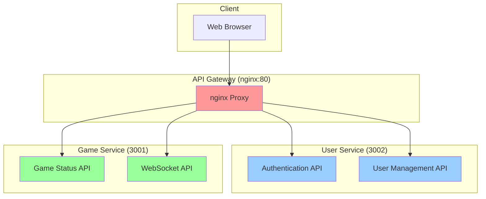

# 🔫 API 문서

**Version:** v4.0  
**Last Updated:** 2025-06-12  
**Architecture:** Independent Microservices with JWT Authentication

## 📋 목차

1. [API 개요](#api-개요)
2. [인증 흐름](#인증-흐름)
3. [User Service API](#user-service-api)
4. [Game Service API](#game-service-api)
5. [WebSocket 이벤트](#websocket-이벤트)
6. [에러 처리](#에러-처리)
7. [Rate Limiting](#rate-limiting)
8. [API 테스트](#api-테스트)

## 📝 API 개요

### 마이크로서비스 구조


```mermaid
graph TB
    subgraph "Client"
        A[Web Browser]
    end
    
    subgraph "API Gateway (nginx:80)"
        B[nginx Proxy]
    end
    
    subgraph "User Service (3002)"
        C[Authentication API]
        D[User Management API]
    end
    
    subgraph "Game Service (3001)"
        E[Game Status API]
        F[WebSocket API]
    end
    
    A --> B
    B --> C
    B --> D
    B --> E
    B --> F
    
    style B fill:#ff9999
    style C fill:#99ccff
    style D fill:#99ccff
    style E fill:#99ff99
    style F fill:#99ff99
```

### API 라우팅 규칙

| 경로 | 대상 서비스 | 인증 필요 | 설명 |
|------|-------------|-----------|------|
| `/api/auth/*` | User Service | 불필요 | 인증 관련 API |
| `/api/user/*` | User Service | 필요 | 사용자 관리 API |
| `/socket.io/*` | Game Service | 필요 | WebSocket 연결 |
| `/api/status` | Game Service | 불필요 | 게임 서버 상태 |

### 공통 응답 형식

#### 성공 응답
```json
{
  "success": true,
  "message": "Operation completed successfully",
  "data": {
    // 응답 데이터
  },
  "timestamp": "2025-06-12T10:00:00Z"
}
```

#### 에러 응답
```json
{
  "success": false,
  "error": {
    "code": "ERROR_CODE",
    "message": "Human readable error message",
    "details": "Additional error details"
  },
  "timestamp": "2025-06-12T10:00:00Z"
}
```

## 🔐 인증 흐름

### JWT 토큰 구조

```json
{
  "header": {
    "alg": "HS256",
    "typ": "JWT"
  },
  "payload": {
    "userId": "uuid",
    "username": "string",
    "isGuest": "boolean",
    "iat": "timestamp",
    "exp": "timestamp"
  }
}
```

### 인증 헤더 형식

```http
Authorization: Bearer <jwt_token>
```

### 토큰 만료 시간

- **기본**: 24시간
- **게스트**: 24시간 (세션 종료 시 만료)
- **등록 사용자**: 24시간 (갱신 가능)

## 👤 User Service API

**Base URL**: `http://localhost/api/`  
**Port**: 3002 (nginx를 통해 라우팅)

### 인증 API (인증 불필요)

#### POST /api/auth/users/register
사용자 회원가입

**Request:**
```http
POST /api/auth/users/register
Content-Type: application/json

{
  "username": "testuser",
  "email": "test@example.com",
  "password": "password123"
}
```

**Response (201):**
```json
{
  "success": true,
  "message": "User registered successfully",
  "data": {
    "user": {
      "id": "550e8400-e29b-41d4-a716-446655440000",
      "username": "testuser",
      "email": "test@example.com",
      "isGuest": false,
      "preferredVehicleType": "fighter",
      "createdAt": "2025-06-12T10:00:00Z"
    },
    "token": "eyJhbGciOiJIUzI1NiIsInR5cCI6IkpXVCJ9..."
  }
}
```

**Validation Rules:**
- `username`: 3-50자 영문/숫자/언더스코어만 허용
- `email`: 유효한 이메일 형식
- `password`: 최소 6자 이상

---

#### POST /api/auth/users/login
사용자 로그인

**Request:**
```http
POST /api/auth/users/login
Content-Type: application/json

{
  "username": "testuser",
  "password": "password123"
}
```

**Response (200):**
```json
{
  "success": true,
  "message": "Login successful",
  "data": {
    "user": {
      "id": "550e8400-e29b-41d4-a716-446655440000",
      "username": "testuser",
      // ... 기타 사용자 정보
    },
    "token": "eyJhbGciOiJIUzI1NiIsInR5cCI6IkpXVCJ9..."
  }
}
```

---
### 사용자 관리 API (인증 필요)

#### GET /api/user/users/profile
사용자 프로필 조회

**Request:**
```http
GET /api/user/users/profile
Authorization: Bearer <jwt_token>
```

**Response (200):**
```json
{
  "success": true,
  "data": {
    "id": "550e8400-e29b-41d4-a716-446655440000",
    "username": "testuser",
    // ... 기타 사용자 정보
  }
}
```

---

#### PUT /api/user/users/vehicle-settings
차량 설정 정보

**Request:**
```http
PUT /api/user/users/vehicle-settings
Authorization: Bearer <jwt_token>
Content-Type: application/json

{
  "preferredVehicleType": "heavy",
  "customization": {
    "vehicleColor": "#00ff00",
    "equippedItems": ["skin2", "weapon2"]
  }
}
```

**Response (200):**
```json
{
  "success": true,
  "message": "Vehicle settings updated successfully",
  "data": {
    "preferredVehicleType": "heavy",
    "customization": {
      "vehicleColor": "#00ff00",
      "unlockedItems": ["skin1", "weapon1", "skin2", "weapon2"],
      "equippedItems": ["skin2", "weapon2"]
    }
  }
}
```

**Valid Vehicle Types:**
- `fighter`: 균형힌 투사체
- `heavy`: 중형 투사체
- `test`: 스테스용 투사체

---

#### POST /api/user/users/game-stats
게임 통계 정보

**Request:**
```http
POST /api/user/users/game-stats
Authorization: Bearer <jwt_token>
Content-Type: application/json

{
  "kills": 3,
  "deaths": 1,
  "score": 500,
  "playTime": 600
}
```

**Response (200):**
```json
{
  "success": true,
  "message": "Game statistics updated successfully",
  "data": {
    "gameStats": {
      "totalKills": 18,
      "totalDeaths": 9,
      "totalGames": 6,
      "totalScore": 3000,
      "bestScore": 800,
      "playTime": 7800
    },
    "gamePoints": 165
  }
}
```

---

#### GET /api/user/users/list
사용자 목록 조회 (관리자용)

**Request:**
```http
GET /api/user/users/list?page=1&limit=10&search=test
Authorization: Bearer <jwt_token>
```

**Query Parameters:**
- `page`: 페이지 번호 (기본값: 1)
- `limit`: 페이지 크기 (기본값: 10, 최대: 100)
- `search`: 검색어 (사용자명 또는 이메일 포함)
- `isGuest`: 게스트 사용자 (true/false)
- `isActive`: 활성 상태 필터 (true/false)

**Response (200):**
```json
{
  "success": true,
  "data": {
    "users": [
      {
        "id": "550e8400-e29b-41d4-a716-446655440000",
        "username": "testuser",
        "email": "test@example.com",
        "isGuest": false,
        "isActive": true,
        "gameStats": {
          "totalKills": 15,
          "totalDeaths": 8,
          "totalGames": 5
        },
        "lastLoginAt": "2025-06-12T10:00:00Z",
        "createdAt": "2025-01-20T10:00:00Z"
      }
    ],
    "pagination": {
      "page": 1,
      "limit": 10,
      "total": 150,
      "totalPages": 15,
      "hasNext": true,
      "hasPrev": false
    }
  }
}
```

---

#### GET /api/user/database/info
데이터베이스 정보 조회

**Request:**
```http
GET /api/user/database/info
Authorization: Bearer <jwt_token>
```

**Response (200):**
```json
{
  "success": true,
  "data": {
    "totalUsers": 150,
    "activeUsers": 120,
    "guestUsers": 30,
    "registeredUsers": 120,
    "databaseStatus": "connected",
    "lastBackup": "2025-06-12T06:00:00Z",
    "statistics": {
      "newUsersToday": 5,
      "activeUsersToday": 45,
      "totalGamesPlayed": 1250,
      "averageSessionTime": 1800
    }
  }
}
```

## 🎮 Game Service API

**Base URL**: `http://localhost/`  
**Port**: 3001 (nginx를 통해 라우팅)

### 상태 확인 API (인증 불필요)

#### GET /api/status
Game Service의 현재 상태와 연결된 플레이어 수를 반환합니다.

**Response (200):**
```json
{
  "success": true,
  "data": {
    "status": "ok",
    "players": 5,
    "uptime": "1h 23m 45s"
  }
}
```

---

## 🛰️ WebSocket 이벤트

Game Service는 Socket.IO를 사용하여 실시간 통신을 처리합니다. 클라이언트는 인증된 JWT 토큰을 사용하여 WebSocket에 연결해야 합니다.

### 연결 엔드포인트
- `http://localhost/` (nginx를 통해 Game Service로 라우팅)

### 인증

연결 시 `auth` 객체에 JWT 토큰을 포함하여 전송해야 합니다.

```javascript
const socket = io("http://localhost/", {
  auth: {
    token: "your-jwt-token"
  }
});
```

### 서버 -> 클라이언트 이벤트

서버가 클라이언트에게 보내는 주요 이벤트입니다.

| 이벤트 | 데이터 | 설명 |
|---|---|---|
| `connect` | - | WebSocket 연결 성공 |
| `disconnect` | `reason` (string) | 연결 종료 (예: `io server disconnect`) |
| `error` | `error` (object) | 에러 발생 (예: 인증 실패) |
| `player:list` | `players` (array) | 현재 게임에 참여 중인 모든 플레이어 목록 |
| `player:joined` | `player` (object) | 새로운 플레이어 접속 |
| `player:left` | `playerId` (string) | 플레이어 퇴장 |
| `player:update` | `updateData` (object) | 특정 플레이어의 상태(위치, 체력, 점수 등) 업데이트 |
| `player:respawn`| `player` (object) | 플레이어 부활 |
| `bullet:spawn` | `bullet` (object) | 새로운 총알 생성 |
| `missile:spawn`| `missile` (object) | 새로운 미사일 생성 |
| `object:destroyed` | `objectId` (string) | 파괴된 오브젝트(예: 광고판) ID |
| `giftbox:spawn` | `giftBox` (object) | 새로운 선물 상자 생성 |
| `giftbox:collected` | `data` (object) | 플레이어가 선물 상자 획득 (`{ collectorId, giftBoxId }`) |

### 클라이언트 -> 서버 이벤트

클라이언트가 서버에게 보내는 주요 이벤트입니다.

| 이벤트 | 데이터 | 설명 |
|---|---|---|
| `player:move` | `movementData` (object) | 플레이어의 이동 및 회전 정보 전송 |
| `weapon:fire` | `fireData` (object) | 무기 발사 (기관총) |
| `missile:launch` | `missileData` (object) | 미사일 발사 |
| `player:set-target` | `targetId` (string) | 새로운 타겟 설정 |

---

## 🚨 에러 처리

### 공통 에러 코드

| 코드 | 메시지 | 설명 |
|---|---|---|
| `UNAUTHORIZED` | Authentication failed | 인증 실패 (유효하지 않은 토큰) |
| `FORBIDDEN` | Access denied | 권한 없음 |
| `NOT_FOUND` | Resource not found | 요청한 리소스를 찾을 수 없음 |
| `VALIDATION_ERROR` | Invalid input data | 입력 데이터 유효성 검사 실패 |
| `SERVER_ERROR` | Internal server error | 서버 내부 오류 |

### User Service 에러

| 코드 | 메시지 | 설명 |
|---|---|---|
| `USERNAME_EXISTS` | Username is already taken | 사용자 이름 중복 |
| `EMAIL_EXISTS` | Email is already registered | 이메일 중복 |
| `INVALID_CREDENTIALS` | Invalid username or password | 로그인 정보 불일치 |

### Game Service 에러 (WebSocket)

| 코드 | 메시지 | 설명 |
|---|---|---|
| `INVALID_TOKEN` | Invalid or expired token | 유효하지 않거나 만료된 토큰 |
| `PLAYER_NOT_FOUND`| Player not found in game | 게임 월드에서 플레이어를 찾을 수 없음 |

## ⏱️ Rate Limiting

DDoS 공격 및 서비스 남용을 방지하기 위해 API 엔드포인트에 Rate Limiting이 적용됩니다.

- **User Service (인증 API)**: 1분에 10회 요청
- **User Service (사용자 관리 API)**: 1분에 100회 요청
- **Game Service (상태 API)**: 1분에 20회 요청

> 제한을 초과하면 `429 Too Many Requests` 에러가 반환됩니다.

## 🧪 API 테스트

- User Service API는 `api-test.html` 파일을 통해 브라우저에서 직접 테스트할 수 있습니다.
  - URL: `http://localhost/api-test.html`
- 게임 클라이언트를 통해 Game Service의 WebSocket 이벤트를 테스트할 수 있습니다.
  - URL: `http://localhost`
