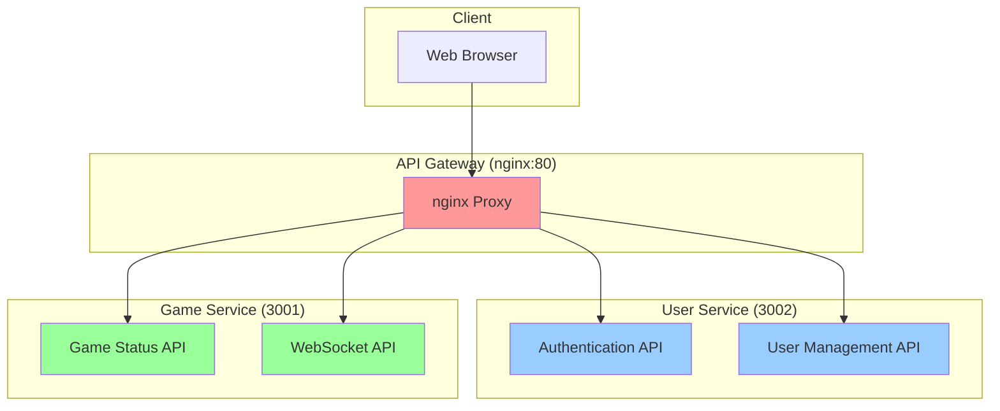

# 🔫 API 문서

**Version:** v4.0  
**Last Updated:** 2025-06-12  
**Architecture:** Independent Microservices with JWT Authentication

## 📋 목차

1. [API 개요](#api-개요)
2. [인증 흐름](#인증-흐름)
3. [User Service API](#user-service-api)
4. [Game Service API](#game-service-api)
5. [WebSocket 이벤트](#websocket-이벤트)
6. [에러 처리](#에러-처리)
7. [Rate Limiting](#rate-limiting)
8. [API 테스트](#api-테스트)

## 📝 API 개요

### 마이크로서비스 구조


```mermaid
graph TB
    subgraph "Client"
        A[Web Browser]
    end
    
    subgraph "API Gateway (nginx:80)"
        B[nginx Proxy]
    end
    
    subgraph "User Service (3002)"
        C[Authentication API]
        D[User Management API]
    end
    
    subgraph "Game Service (3001)"
        E[Game Status API]
        F[WebSocket API]
    end
    
    A --> B
    B --> C
    B --> D
    B --> E
    B --> F
    
    style B fill:#ff9999
    style C fill:#99ccff
    style D fill:#99ccff
    style E fill:#99ff99
    style F fill:#99ff99
```

### API 라우팅 규칙

| 경로 | 대상 서비스 | 인증 필요 | 설명 |
|------|-------------|-----------|------|
| `/api/auth/*` | User Service | 불필요 | 인증 관련 API |
| `/api/user/*` | User Service | 필요 | 사용자 관리 API |
| `/socket.io/*` | Game Service | 필요 | WebSocket 연결 |
| `/api/status` | Game Service | 불필요 | 게임 서버 상태 |

### 공통 응답 형식

#### 성공 응답
```json
{
  "success": true,
  "message": "Operation completed successfully",
  "data": {
    // 응답 데이터
  },
  "timestamp": "2025-06-12T10:00:00Z"
}
```

#### 에러 응답
```json
{
  "success": false,
  "error": {
    "code": "ERROR_CODE",
    "message": "Human readable error message",
    "details": "Additional error details"
  },
  "timestamp": "2025-06-12T10:00:00Z"
}
```

## 🔐 인증 흐름

### JWT 토큰 구조

```json
{
  "header": {
    "alg": "HS256",
    "typ": "JWT"
  },
  "payload": {
    "userId": "uuid",
    "username": "string",
    "isGuest": "boolean",
    "iat": "timestamp",
    "exp": "timestamp"
  }
}
```

### 인증 헤더 형식

```http
Authorization: Bearer <jwt_token>
```

### 토큰 만료 시간

- **기본**: 24시간
- **게스트**: 24시간 (세션 종료 시 만료)
- **등록 사용자**: 24시간 (갱신 가능)

## 👤 User Service API

**Base URL**: `http://localhost/api/`  
**Port**: 3002 (nginx를 통해 라우팅)

### 인증 API (인증 불필요)

#### POST /api/auth/users/register
사용자 회원가입

**Request:**
```http
POST /api/auth/users/register
Content-Type: application/json

{
  "username": "testuser",
  "email": "test@example.com",
  "password": "password123"
}
```

**Response (201):**
```json
{
  "success": true,
  "message": "User registered successfully",
  "data": {
    "user": {
      "id": "550e8400-e29b-41d4-a716-446655440000",
      "username": "testuser",
      "email": "test@example.com",
      "isGuest": false,
      "preferredVehicleType": "fighter",
      "createdAt": "2025-06-12T10:00:00Z"
    },
    "token": "eyJhbGciOiJIUzI1NiIsInR5cCI6IkpXVCJ9..."
  }
}
```

**Validation Rules:**
- `username`: 3-50자 영문/숫자/언더스코어만 허용
- `email`: 유효한 이메일 형식
- `password`: 최소 6자 이상

---

#### POST /api/auth/users/login
사용자 로그인

**Request:**
```http
POST /api/auth/users/login
Content-Type: application/json

{
  "username": "testuser",
  "password": "password123"
}
```

**Response (200):**
```json
{
  "success": true,
  "message": "Login successful",
  "data": {
    "user": {
      "id": "550e8400-e29b-41d4-a716-446655440000",
      "username": "testuser",
      // ... 기타 사용자 정보
    },
    "token": "eyJhbGciOiJIUzI1NiIsInR5cCI6IkpXVCJ9..."
  }
}
```

---
### 사용자 관리 API (인증 필요)

#### GET /api/user/users/profile
사용자 프로필 조회

**Request:**
```http
GET /api/user/users/profile
Authorization: Bearer <jwt_token>
```

**Response (200):**
```json
{
  "success": true,
  "data": {
    "id": "550e8400-e29b-41d4-a716-446655440000",
    "username": "testuser",
    // ... 기타 사용자 정보
  }
}
```

---

#### PUT /api/user/users/vehicle-settings
차량 설정 정보

**Request:**
```http
PUT /api/user/users/vehicle-settings
Authorization: Bearer <jwt_token>
Content-Type: application/json

{
  "preferredVehicleType": "heavy",
  "customization": {
    "vehicleColor": "#00ff00",
    "equippedItems": ["skin2", "weapon2"]
  }
}
```

**Response (200):**
```json
{
  "success": true,
  "message": "Vehicle settings updated successfully",
  "data": {
    "preferredVehicleType": "heavy",
    "customization": {
      "vehicleColor": "#00ff00",
      "unlockedItems": ["skin1", "weapon1", "skin2", "weapon2"],
      "equippedItems": ["skin2", "weapon2"]
    }
  }
}
```

**Valid Vehicle Types:**
- `fighter`: 균형힌 투사체
- `heavy`: 중형 투사체
- `test`: 스테스용 투사체

---

#### POST /api/user/users/game-stats
게임 통계 정보

**Request:**
```http
POST /api/user/users/game-stats
Authorization: Bearer <jwt_token>
Content-Type: application/json

{
  "kills": 3,
  "deaths": 1,
  "score": 500,
  "playTime": 600
}
```

**Response (200):**
```json
{
  "success": true,
  "message": "Game statistics updated successfully",
  "data": {
    "gameStats": {
      "totalKills": 18,
      "totalDeaths": 9,
      "totalGames": 6,
      "totalScore": 3000,
      "bestScore": 800,
      "playTime": 7800
    },
    "gamePoints": 165
  }
}
```

---

#### GET /api/user/users/list
사용자 목록 조회 (관리자용)

**Request:**
```http
GET /api/user/users/list?page=1&limit=10&search=test
Authorization: Bearer <jwt_token>
```

**Query Parameters:**
- `page`: 페이지 번호 (기본값: 1)
- `limit`: 페이지 크기 (기본값: 10, 최대: 100)
- `search`: 검색어 (사용자명 또는 이메일 포함)
- `isGuest`: 게스트 사용자 (true/false)
- `isActive`: 활성 상태 필터 (true/false)

**Response (200):**
```json
{
  "success": true,
  "data": {
    "users": [
      {
        "id": "550e8400-e29b-41d4-a716-446655440000",
        "username": "testuser",
        "email": "test@example.com",
        "isGuest": false,
        "isActive": true,
        "gameStats": {
          "totalKills": 15,
          "totalDeaths": 8,
          "totalGames": 5
        },
        "lastLoginAt": "2025-06-12T10:00:00Z",
        "createdAt": "2025-01-20T10:00:00Z"
      }
    ],
    "pagination": {
      "page": 1,
      "limit": 10,
      "total": 150,
      "totalPages": 15,
      "hasNext": true,
      "hasPrev": false
    }
  }
}
```

---

#### GET /api/user/database/info
데이터베이스 정보 조회

**Request:**
```http
GET /api/user/database/info
Authorization: Bearer <jwt_token>
```

**Response (200):**
```json
{
  "success": true,
  "data": {
    "totalUsers": 150,
    "activeUsers": 120,
    "guestUsers": 30,
    "registeredUsers": 120,
    "databaseStatus": "connected",
    "lastBackup": "2025-06-12T06:00:00Z",
    "statistics": {
      "newUsersToday": 5,
      "activeUsersToday": 45,
      "totalGamesPlayed": 1250,
      "averageSessionTime": 1800
    }
  }
}
```

## 🎮 Game Service API

**Base URL**: `http://localhost:3001/api/`  
**Direct Port**: 3001

### 게임 상태 API (인증 불필요)

#### GET /api/status
게임 서버 상태 조회

**Request:**
```http
GET /api/status
```

**Response (200):**
```json
{
  "success": true,
  "data": {
    "status": "running",
    "uptime": 3600,
    "version": "4.0.0",
    "players": {
      "online": 15,
      "inGame": 12
    }
  }
}
```

## 🔫 WebSocket 이벤트

**Connection URL**: `ws://localhost/socket.io/`  
**Authentication**: JWT Token in `auth.token`

### 연결 과정
클라이언트는 `io()` 함수를 호출할 때 `auth` 객체에 유효한 JWT 토큰을 포함하여 연결을 시도합니다. 서버는 연결 시 토큰을 검증하고, 유효한 경우에만 연결을 수락합니다.

```javascript
const socket = io('ws://your-server-address', {
  auth: {
    token: 'your_jwt_token_here'
  }
});
```

### 클라이언트 → 서버 이벤트

#### `join-game`
플레이어가 게임에 참여하고 자신의 비행체 종류를 선택합니다.

**Payload:**
```json
{
  "name": "PlayerName",
  "vehicleType": "fighter" 
}
```
- `name`: 플레이어 이름 (선택 사항).
- `vehicleType`: 'fighter', 'heavy', 'test' 등 `game-config.yaml`에 정의된 비행체 타입.

---

#### `player-input`
플레이어의 조작 및 액션 입력을 서버로 전송합니다. 이 이벤트는 클라이언트의 렌더링 루프(예: `requestAnimationFrame`)에 맞춰 지속적으로 발생합니다.

**Payload:**
```json
{
  "keys": { "w": true, "s": false, "a": false, "d": false, ... },
  "fire": false,
  "fireMissile": false
}
```
- `keys`: 키보드 입력 상태.
- `fire`: `true`일 경우 기관총을 발사합니다.
- `fireMissile`: `true`일 경우 미사일을 발사합니다.

---

#### `disconnect`
클라이언트의 연결이 끊어질 때 자동으로 발생하는 이벤트입니다. 서버는 이 이벤트를 감지하여 해당 플레이어를 게임에서 제거합니다.

**Payload:** (없음)

---

### 서버 → 클라이언트 이벤트

#### `gameStateUpdate`
서버가 현재 게임의 모든 상태를 담아 클라이언트로 브로드캐스트하는 핵심 이벤트입니다. 클라이언트는 이 데이터를 받아 화면을 렌더링합니다.

**Payload:**
```json
{
  "vehicles": [ /* Vehicle 객체 배열 */ ],
  "players": [ /* Player 객체 배열 */ ],
  "billboards": [ /* Billboard 객체 배열 */ ],
  "projectiles": [ /* Projectile 객체 배열 */ ],
  "effects": { /* 활성화된 Effect 정보 */ },
  "gameState": "playing",
  "timestamp": 1706176800000
}
```
- 각 배열에는 `serialize()` 메소드를 통해 직렬화된 게임 엔티티의 정보가 담겨 있습니다.
- `effects`: 폭발, 피격 효과 등의 정보를 포함합니다.

---

#### `vehicleDestroyed`
비행체가 파괴되었을 때 발생하는 이벤트입니다.

**Payload:**
```json
{
  "vehicleId": "vehicle_123",
  "playerId": "player_456",
  "killedBy": "player_789",
  "position": { "x": 10, "y": 20, "z": 30 },
  "shouldHide": true
}
```
- `killedBy`: 파괴한 플레이어의 ID.
- `shouldHide`: 클라이언트에서 해당 비행체를 즉시 숨겨야 하는지 여부.

---

#### `missileLaunched`
플레이어가 미사일을 발사했을 때 발생하는 이벤트입니다.

**Payload:**
```json
{
  "playerId": "player_123",
  "vehicleId": "vehicle_456",
  "missileId": "missile_789",
  "targetId": "target_vehicle_123"
}
```
- `targetId`: 미사일이 추적하는 대상 비행체의 ID.

---

#### `billboardDestroyed`
광고판이 파괴되었을 때 발생하는 이벤트입니다.

**Payload:**
```json
{
  "billboardId": "billboard_1",
  "debris": { /* 파편 데이터 */ },
  "destroyedBy": "player_123"
}
```

---

#### `muzzleFlash`
기관총 발사 시 총구 섬광 효과를 위해 발생하는 이벤트입니다.

**Payload:**
```json
{
  "playerId": "player_123",
  "vehicleId": "vehicle_456"
}
```

---

## 🚨 에러 처리

### HTTP API 에러

| 상태 코드 | 에러 코드 | 의미 |
|---|---|---|
| 400 Bad Request | `VALIDATION_ERROR` | 요청 데이터 유효성 검사 실패 |
| 401 Unauthorized | `INVALID_TOKEN` | 유효하지 않은 JWT 토큰 |
| 429 Too Many Requests | `RATE_LIMIT_EXCEEDED` | Rate limit 초과 |

### 에러 코드

#### User Service 에러
| 코드 | 설명 |
|---|---|
| `USER_NOT_FOUND` | 사용자를 찾을 수 없음 |
| `INVALID_CREDENTIALS` | 잘못된 인증 정보 |
| `USERNAME_TAKEN` | 이미 사용 중인 사용자명 |
| `EMAIL_TAKEN` | 이미 사용 중인 이메일 |

#### Game Service 에러 (WebSocket)
| 코드 | 설명 |
|---|---|
| `AUTHENTICATION_ERROR` | WebSocket 인증 실패 |
| `INVALID_VEHICLE_TYPE` | 유효하지 않은 비행체 타입 |
| `GAME_FULL` | 게임 서버가 가득 참 |

## ⚖️ Rate Limiting

### User Service
- **인증 API**: 15분에 100회
- **사용자 API**: 15분에 1000회

### Game Service
- `player-input`: 초당 60회
- `fire`, `fireMissile`: 무기별 발사 속도에 따름

---
**문서 버전 관리**: API 변경 시 즉시 업데이트합니다.
