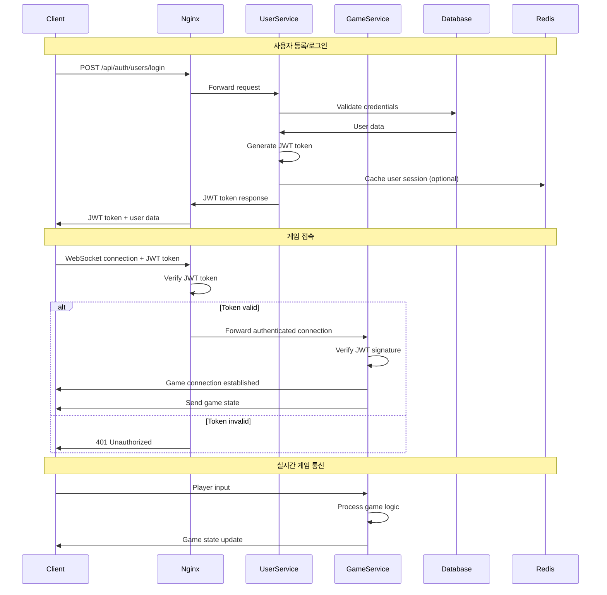
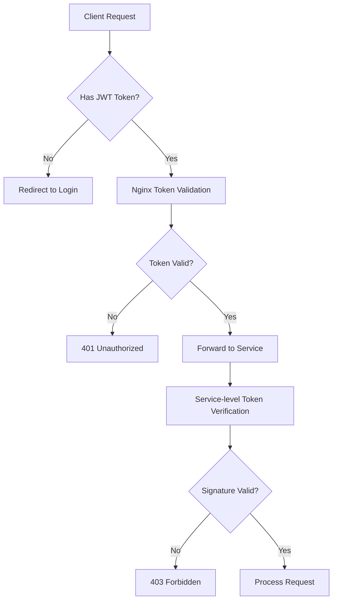
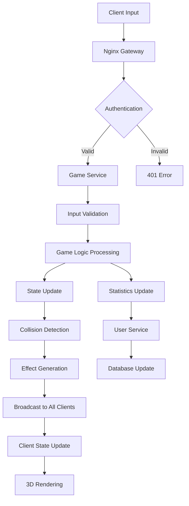
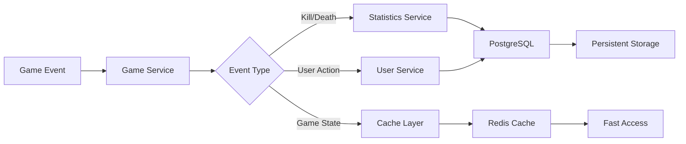
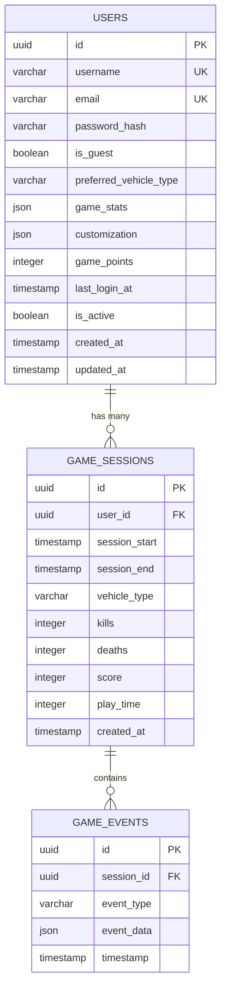
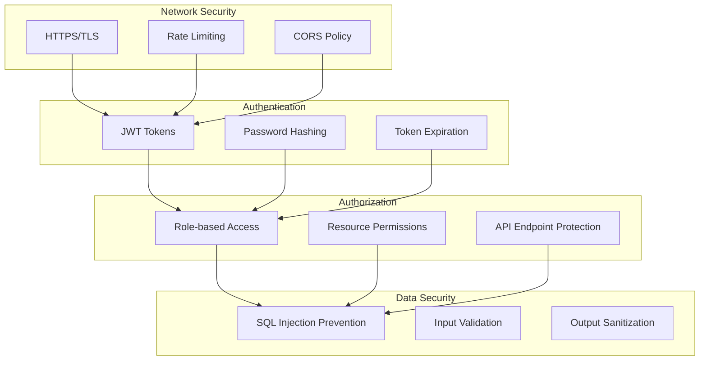
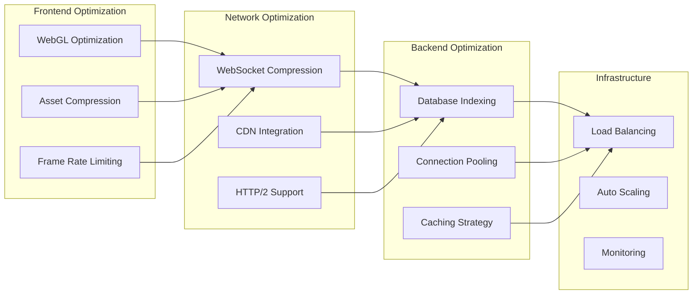
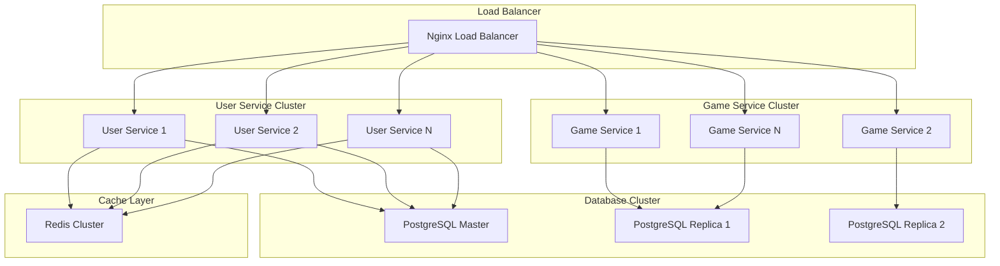

# 🏗️ 시스템 아키텍처 문서

**Version:** v3.0  
**Last Updated:** 2025-01-25  
**Architecture Type:** Microservices with JWT Authentication

## 📋 목차

1. [시스템 개요](#시스템-개요)
2. [아키텍처 다이어그램](#아키텍처-다이어그램)
3. [서비스 구성](#서비스-구성)
4. [인증 시스템](#인증-시스템)
5. [데이터 플로우](#데이터-플로우)
6. [API 게이트웨이](#api-게이트웨이)
7. [데이터베이스 설계](#데이터베이스-설계)
8. [보안 아키텍처](#보안-아키텍처)
9. [성능 최적화](#성능-최적화)
10. [확장성 고려사항](#확장성-고려사항)

## 시스템 개요

### 🎯 아키텍처 목표
- **확장성**: 마이크로서비스 기반으로 독립적 확장 가능
- **보안성**: JWT 기반 인증과 API 게이트웨이를 통한 보안 강화
- **유지보수성**: 서비스별 독립적 개발 및 배포
- **성능**: 실시간 게임을 위한 최적화된 통신

### 🏛️ 아키텍처 패턴
- **마이크로서비스 아키텍처**: 기능별 서비스 분리
- **API 게이트웨이 패턴**: 중앙집중식 라우팅 및 인증
- **이벤트 기반 아키텍처**: 실시간 게임 이벤트 처리
- **CQRS 패턴**: 읽기/쓰기 작업 분리

## 아키텍처 다이어그램

### 🔄 전체 시스템 아키텍처

```mermaid
graph TB
    subgraph "Client Layer"
        A[Web Browser]
        B[Login Screen]
        C[Vehicle Selection]
        D[3D Game Client]
    end
    
    subgraph "Load Balancer / CDN"
        E[Nginx API Gateway<br/>Port 80]
    end
    
    subgraph "Authentication Layer"
        F[JWT Token Verification]
        G[Rate Limiting]
        H[CORS Handler]
    end
    
    subgraph "Microservices"
        I[User Service<br/>Port 3002]
        J[Game Service<br/>Port 3001]
    end
    
    subgraph "Data Layer"
        K[PostgreSQL<br/>user_service DB]
        L[Redis Cache<br/>(Future)]
    end
    
    subgraph "External Services"
        M[Email Service<br/>(Future)]
        N[Analytics<br/>(Future)]
    end
    
    A --> E
    B --> E
    C --> E
    D --> E
    
    E --> F
    E --> G
    E --> H
    
    F --> I
    F --> J
    G --> I
    G --> J
    H --> I
    H --> J
    
    I --> K
    I --> L
    I --> M
    
    J --> N
    
    style E fill:#ff9999
    style I fill:#99ccff
    style J fill:#99ff99
    style K fill:#ffcc99
```

### 🔐 인증 플로우 다이어그램



## 서비스 구성

### 🌐 Nginx API Gateway (Port 80)

**역할:**
- 클라이언트 요청의 단일 진입점
- 서비스별 라우팅 및 로드 밸런싱
- JWT 토큰 검증
- Rate Limiting 및 CORS 처리
- 정적 파일 서빙

**주요 기능:**
```nginx
# 라우팅 규칙
/api/auth/*     → User Service (인증 불필요)
/api/user/*     → User Service (인증 필요)
/socket.io/*    → Game Service (인증 필요)
/               → Static files (게임 클라이언트)
```

### 👤 User Service (Port 3002)

**역할:**
- 사용자 인증 및 권한 관리
- 사용자 프로필 및 설정 관리
- 게임 통계 저장
- JWT 토큰 발급 및 검증

**기술 스택:**
- **Framework**: Express.js
- **Database**: PostgreSQL + Sequelize ORM
- **Authentication**: JWT + bcrypt
- **Validation**: Joi

**주요 엔드포인트:**
```javascript
// 인증 관련 (인증 불필요)
POST /api/auth/users/register
POST /api/auth/users/login
POST /api/auth/users/guest
GET  /api/auth/users/verify-token

// 사용자 관리 (인증 필요)
GET  /api/user/users/profile
PUT  /api/user/users/vehicle-settings
POST /api/user/users/game-stats
GET  /api/user/users/list
```

### 🎮 Game Service (Port 3001)

**역할:**
- 실시간 게임 로직 처리
- 멀티플레이어 세션 관리
- 게임 상태 동기화
- 물리 엔진 및 충돌 감지

**기술 스택:**
- **Framework**: Express.js + Socket.IO
- **Game Engine**: Custom JavaScript Engine
- **3D Graphics**: Three.js (클라이언트)
- **Physics**: Custom Physics Engine

**주요 기능:**
```javascript
// 게임 관리
- Player connection/disconnection
- Vehicle creation and management
- Real-time input processing
- Collision detection
- Game state synchronization

// WebSocket Events
- playerInput
- gameStateUpdate
- bulletCreated/Destroyed
- explosionCreated
- vehicleDestroyed/Respawned
```

## 인증 시스템

### 🔑 JWT 토큰 구조

```json
{
  "header": {
    "alg": "HS256",
    "typ": "JWT"
  },
  "payload": {
    "userId": "uuid",
    "username": "string",
    "isGuest": "boolean",
    "iat": "timestamp",
    "exp": "timestamp"
  },
  "signature": "HMACSHA256(base64UrlEncode(header) + '.' + base64UrlEncode(payload), secret)"
}
```

### 🛡️ 보안 계층



### 🔒 인증 레벨

1. **Public Endpoints**: 인증 불필요
   - `/api/auth/users/login`
   - `/api/auth/users/register`
   - `/api/auth/users/guest`

2. **Protected Endpoints**: JWT 토큰 필요
   - `/api/user/*` (모든 사용자 API)
   - `/socket.io/*` (게임 WebSocket)

3. **Admin Endpoints**: 관리자 권한 필요 (Future)
   - `/api/admin/*`

## 데이터 플로우

### 📊 게임 세션 데이터 플로우



### 💾 데이터 저장 플로우



## API 게이트웨이

### 🚪 Nginx 설정 구조

```nginx
# 업스트림 서버 정의
upstream user_service {
    server 127.0.0.1:3002 max_fails=3 fail_timeout=30s;
    # server 127.0.0.1:3003 backup;  # 백업 서버 (Future)
}

upstream game_service {
    server 127.0.0.1:3001 max_fails=3 fail_timeout=30s;
    # server 127.0.0.1:3004 backup;  # 백업 서버 (Future)
}

server {
    listen 80;
    server_name localhost;
    
    # Rate Limiting
    limit_req_zone $binary_remote_addr zone=api:10m rate=10r/s;
    limit_req_zone $binary_remote_addr zone=auth:10m rate=5r/s;
    
    # CORS 설정
    add_header Access-Control-Allow-Origin *;
    add_header Access-Control-Allow-Methods "GET, POST, PUT, DELETE, OPTIONS";
    add_header Access-Control-Allow-Headers "Authorization, Content-Type";
    
    # 인증 불필요 엔드포인트
    location /api/auth/ {
        limit_req zone=auth burst=10 nodelay;
        proxy_pass http://user_service;
        proxy_set_header Host $host;
        proxy_set_header X-Real-IP $remote_addr;
        proxy_set_header X-Forwarded-For $proxy_add_x_forwarded_for;
    }
    
    # 인증 필요 엔드포인트
    location /api/user/ {
        auth_request /auth;
        limit_req zone=api burst=20 nodelay;
        proxy_pass http://user_service;
        proxy_set_header Host $host;
        proxy_set_header X-Real-IP $remote_addr;
        proxy_set_header X-Forwarded-For $proxy_add_x_forwarded_for;
    }
    
    # WebSocket 프록시 (인증 필요)
    location /socket.io/ {
        auth_request /auth;
        proxy_pass http://game_service;
        proxy_http_version 1.1;
        proxy_set_header Upgrade $http_upgrade;
        proxy_set_header Connection "upgrade";
        proxy_set_header Host $host;
        proxy_set_header X-Real-IP $remote_addr;
        proxy_set_header X-Forwarded-For $proxy_add_x_forwarded_for;
    }
    
    # 내부 인증 엔드포인트
    location = /auth {
        internal;
        proxy_pass http://user_service/api/auth/users/verify-token;
        proxy_pass_request_body off;
        proxy_set_header Content-Length "";
        proxy_set_header X-Original-URI $request_uri;
        proxy_set_header X-Real-IP $remote_addr;
        proxy_set_header X-Forwarded-For $proxy_add_x_forwarded_for;
    }
}
```

## 데이터베이스 설계

### 🗄️ PostgreSQL 스키마

```sql
-- Users 테이블
CREATE TABLE users (
    id UUID PRIMARY KEY DEFAULT gen_random_uuid(),
    username VARCHAR(50) UNIQUE NOT NULL,
    email VARCHAR(255) UNIQUE,
    password_hash VARCHAR(255),
    is_guest BOOLEAN DEFAULT true,
    preferred_vehicle_type VARCHAR(20) DEFAULT 'fighter',
    game_stats JSON DEFAULT '{
        "totalKills": 0,
        "totalDeaths": 0,
        "totalGames": 0,
        "totalScore": 0,
        "bestScore": 0,
        "playTime": 0
    }',
    customization JSON DEFAULT '{
        "vehicleColor": null,
        "unlockedItems": [],
        "equippedItems": []
    }',
    game_points INTEGER DEFAULT 0,
    last_login_at TIMESTAMP WITH TIME ZONE,
    is_active BOOLEAN DEFAULT true,
    created_at TIMESTAMP WITH TIME ZONE NOT NULL,
    updated_at TIMESTAMP WITH TIME ZONE NOT NULL
);

-- 인덱스 생성
CREATE INDEX idx_users_username ON users(username);
CREATE INDEX idx_users_email ON users(email);
CREATE INDEX idx_users_is_active ON users(is_active);
CREATE INDEX idx_users_last_login ON users(last_login_at);

-- 게임 세션 테이블 (Future)
CREATE TABLE game_sessions (
    id UUID PRIMARY KEY DEFAULT gen_random_uuid(),
    user_id UUID REFERENCES users(id),
    session_start TIMESTAMP WITH TIME ZONE NOT NULL,
    session_end TIMESTAMP WITH TIME ZONE,
    vehicle_type VARCHAR(20),
    kills INTEGER DEFAULT 0,
    deaths INTEGER DEFAULT 0,
    score INTEGER DEFAULT 0,
    play_time INTEGER DEFAULT 0, -- seconds
    created_at TIMESTAMP WITH TIME ZONE NOT NULL
);

-- 게임 이벤트 로그 테이블 (Future)
CREATE TABLE game_events (
    id UUID PRIMARY KEY DEFAULT gen_random_uuid(),
    session_id UUID REFERENCES game_sessions(id),
    event_type VARCHAR(50) NOT NULL,
    event_data JSON,
    timestamp TIMESTAMP WITH TIME ZONE NOT NULL
);
```

### 📈 데이터 관계도



## 보안 아키텍처

### 🔐 보안 계층 구조



### 🛡️ 보안 조치

1. **네트워크 보안**
   - HTTPS 강제 (프로덕션)
   - Rate Limiting (1000 req/15min)
   - CORS 정책 적용

2. **인증 보안**
   - JWT 토큰 기반 인증
   - bcrypt 패스워드 해싱
   - 토큰 만료 시간 설정 (24시간)

3. **데이터 보안**
   - Sequelize ORM으로 SQL Injection 방지
   - Joi 라이브러리로 입력 검증
   - XSS 방지를 위한 출력 이스케이핑

4. **API 보안**
   - 엔드포인트별 인증 레벨 설정
   - 민감한 정보 로그 제외
   - 에러 메시지 정보 노출 최소화

## 성능 최적화

### ⚡ 성능 최적화 전략



### 📊 성능 메트릭

1. **클라이언트 성능**
   - FPS: 60fps 목표
   - 렌더링 지연: <16ms
   - 메모리 사용량: <500MB

2. **네트워크 성능**
   - WebSocket 지연: <50ms
   - API 응답 시간: <200ms
   - 대역폭 사용량: <1MB/min

3. **서버 성능**
   - CPU 사용률: <70%
   - 메모리 사용률: <80%
   - 데이터베이스 응답: <100ms

## 확장성 고려사항

### 🚀 수평 확장 전략



### 📈 확장 시나리오

1. **사용자 증가 대응**
   - User Service 인스턴스 추가
   - 데이터베이스 읽기 복제본 추가
   - Redis 캐시 클러스터 구성

2. **게임 세션 증가 대응**
   - Game Service 인스턴스 추가
   - WebSocket 연결 분산
   - 게임 룸 기반 샤딩

3. **지역별 확장**
   - CDN 배포
   - 지역별 서버 클러스터
   - 데이터베이스 지역 복제

### 🔮 미래 확장 계획

1. **마이크로서비스 추가**
   - Analytics Service
   - Notification Service
   - Leaderboard Service
   - Chat Service

2. **기술 스택 확장**
   - Kubernetes 오케스트레이션
   - Service Mesh (Istio)
   - Message Queue (RabbitMQ/Kafka)
   - Monitoring (Prometheus/Grafana)

3. **기능 확장**
   - 팀 배틀 모드
   - 토너먼트 시스템
   - 업적 시스템
   - 소셜 기능

---

**📋 문서 버전 관리**

- v3.0: 마이크로서비스 아키텍처 도입
- v2.x: 모놀리식 아키텍처
- v1.x: 초기 프로토타입

**🔄 업데이트 주기**: 주요 아키텍처 변경 시 업데이트 