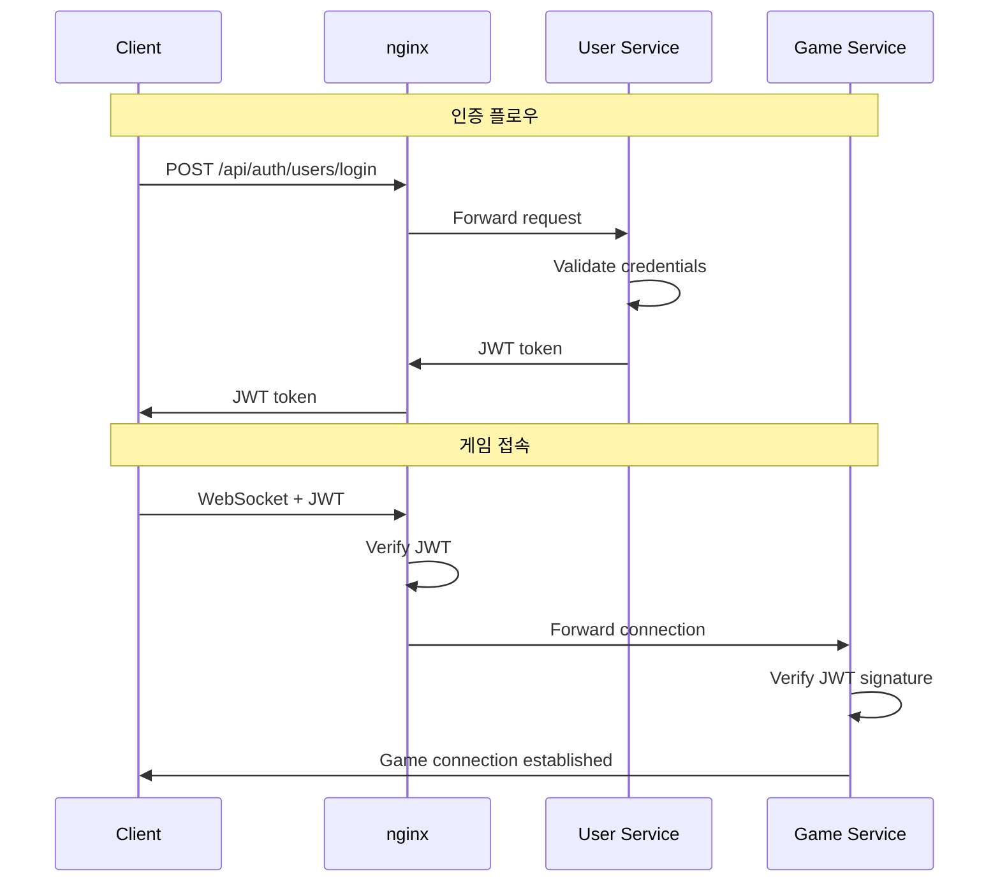
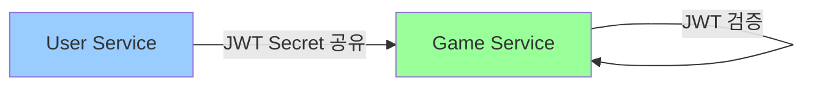
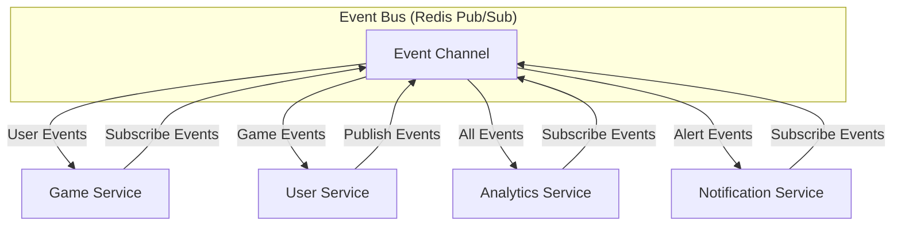
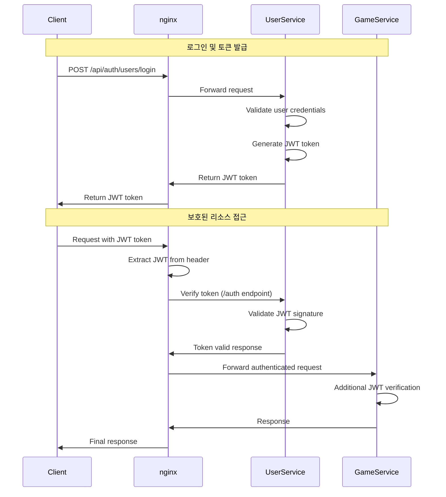
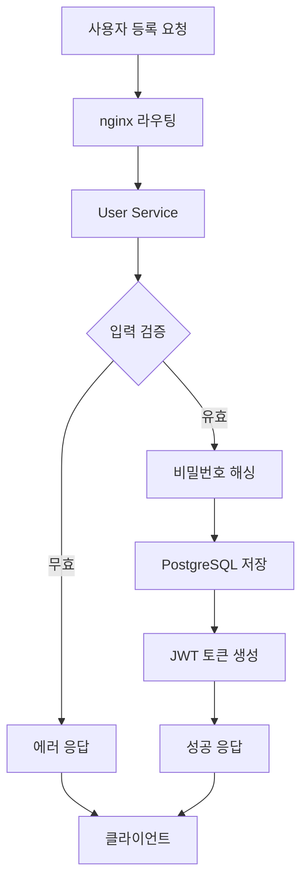
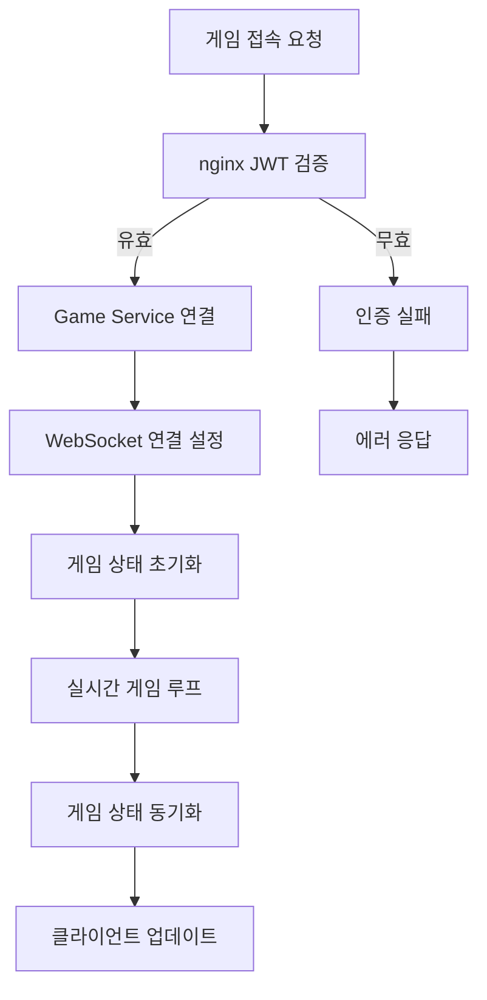
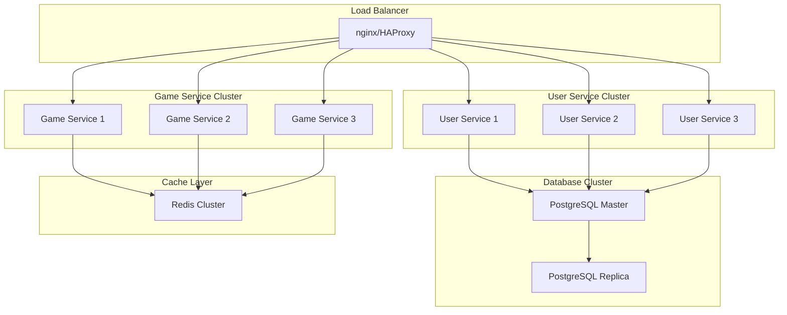
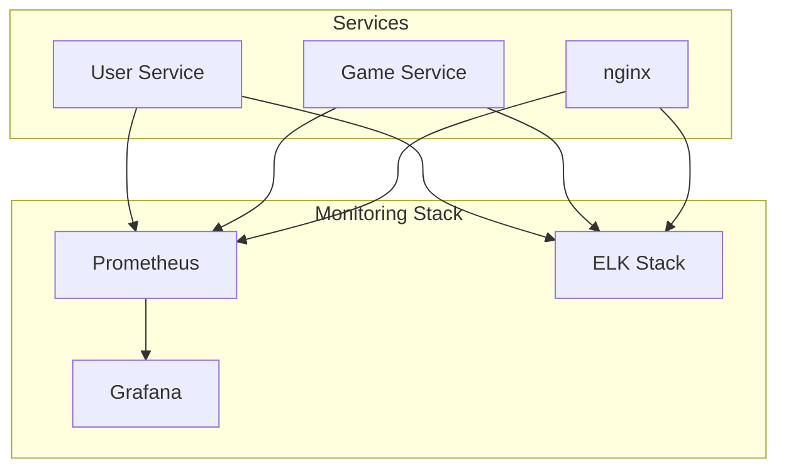

# 🏗️ 시스템 아키텍처 문서

**Version:** v4.0  
**Last Updated:** 2025-01-25  
**Architecture Type:** Independent Microservices with JWT Authentication

## 📋 목차

1. [아키텍처 개요](#아키텍처-개요)
2. [마이크로서비스 독립성](#마이크로서비스-독립성)
3. [서비스별 상세 구조](#서비스별-상세-구조)
4. [통신 패턴](#통신-패턴)
5. [보안 아키텍처](#보안-아키텍처)
6. [데이터 플로우](#데이터-플로우)
7. [배포 아키텍처](#배포-아키텍처)
8. [확장성 고려사항](#확장성-고려사항)

## 🎯 아키텍처 개요

### 핵심 설계 원칙

1. **완전한 서비스 독립성**: 각 마이크로서비스는 독립적인 package.json과 의존성을 가짐
2. **단일 책임 원칙**: 각 서비스는 명확한 단일 책임을 가짐
3. **API Gateway 패턴**: nginx를 통한 중앙집중식 라우팅
4. **JWT 기반 인증**: 상태 없는(stateless) 인증 시스템
5. **이벤트 기반 통신**: 서비스 간 느슨한 결합

### 전체 시스템 구조

```mermaid
graph TB
    subgraph "Client Layer"
        A[Web Browser<br/>Three.js + WebGL]
        B[Login Interface]
        C[Game Interface]
    end
    
    subgraph "API Gateway Layer"
        D[nginx<br/>Port 80<br/>Load Balancer + Proxy]
    end
    
    subgraph "Independent Microservices"
        E[User Service<br/>Port 3002<br/>독립 package.json<br/>PostgreSQL]
        F[Game Service<br/>Port 3001<br/>독립 package.json<br/>In-Memory]
    end
    
    subgraph "Data Layer"
        G[PostgreSQL<br/>user_service DB<br/>사용자 데이터]
        H[Redis<br/>(향후 확장)<br/>세션 캐시]
    end
    
    subgraph "Static Assets"
        I[Client Files<br/>HTML/CSS/JS<br/>3D Models/Textures]
    end
    
    A --> D
    B --> D
    C --> D
    
    D --> E
    D --> F
    D --> I
    
    E --> G
    F -.-> H
    
    style D fill:#ff9999
    style E fill:#99ccff
    style F fill:#99ff99
    style G fill:#ffcc99
    style I fill:#cccccc
```

## 🔧 마이크로서비스 독립성

### 완전한 독립성 달성

#### 1. 의존성 격리
```
services/
├── user-service/
│   ├── package.json          # 독립적 의존성
│   ├── node_modules/         # 격리된 패키지
│   ├── .env                  # 서비스별 환경변수
│   └── src/
│
└── game-service/
    ├── package.json          # 독립적 의존성
    ├── node_modules/         # 격리된 패키지
    ├── .env                  # 서비스별 환경변수
    └── src/
```

#### 2. 환경 변수 독립성

**User Service (.env)**:
```env
# 서버 설정
NODE_ENV=development
PORT=3002

# 데이터베이스 설정
DB_TYPE=postgres
DB_HOST=localhost
DB_PORT=5432
DB_NAME=user_service
DB_USER=app_user
DB_PASS="app123!@#"

# JWT 설정
JWT_SECRET="your-super-secret-jwt-key-change-in-production"
JWT_EXPIRY=24h
```

**Game Service (.env)**:
```env
# 서버 설정
NODE_ENV=development
PORT=3001

# JWT 설정 (User Service와 동일해야 함)
JWT_SECRET="your-super-secret-jwt-key-change-in-production"
```

#### 3. 독립적 배포 가능성
- 각 서비스는 독립적으로 빌드, 테스트, 배포 가능
- 한 서비스의 장애가 다른 서비스에 영향 없음
- 서비스별로 다른 기술 스택 사용 가능

## 🎯 서비스별 상세 구조

### User Service (포트 3002)

#### 책임 영역
- 사용자 인증 및 권한 관리
- 사용자 프로필 관리
- 게임 통계 저장
- JWT 토큰 발급 및 검증

#### 기술 스택
```json
{
  "dependencies": {
    "express": "^4.18.2",
    "sequelize": "^6.35.2",
    "pg": "^8.11.3",
    "bcryptjs": "^2.4.3",
    "jsonwebtoken": "^9.0.2",
    "express-rate-limit": "^7.1.5",
    "helmet": "^7.1.0",
    "cors": "^2.8.5",
    "dotenv": "^16.3.1"
  }
}
```

#### 데이터베이스 스키마
```sql
-- Users 테이블
CREATE TABLE users (
    id UUID PRIMARY KEY DEFAULT gen_random_uuid(),
    username VARCHAR(50) UNIQUE NOT NULL,
    email VARCHAR(255) UNIQUE,
    password_hash VARCHAR(255),
    is_guest BOOLEAN DEFAULT true,
    preferred_vehicle_type VARCHAR(20) DEFAULT 'fighter',
    game_stats JSON DEFAULT '{"totalKills":0,"totalDeaths":0,"totalGames":0,"totalScore":0,"bestScore":0,"playTime":0}',
    customization JSON DEFAULT '{"vehicleColor":null,"unlockedItems":[],"equippedItems":[]}',
    game_points INTEGER DEFAULT 0,
    last_login_at TIMESTAMP WITH TIME ZONE,
    is_active BOOLEAN DEFAULT true,
    created_at TIMESTAMP WITH TIME ZONE NOT NULL,
    updated_at TIMESTAMP WITH TIME ZONE NOT NULL
);
```

#### API 엔드포인트
```
POST /api/auth/users/register     # 회원가입
POST /api/auth/users/login        # 로그인
POST /api/auth/users/guest        # 게스트 계정
GET  /api/auth/users/verify-token # JWT 검증

GET  /api/user/users/profile           # 프로필 조회
PUT  /api/user/users/vehicle-settings  # 차량 설정
POST /api/user/users/game-stats        # 게임 통계
GET  /api/user/users/list              # 사용자 목록
GET  /api/user/database/info           # DB 정보
```

### Game Service (포트 3001)

#### 책임 영역
- 실시간 게임 로직 처리
- WebSocket 연결 관리
- 게임 상태 동기화
- 물리 시뮬레이션

#### 기술 스택
```json
{
  "dependencies": {
    "express": "^4.18.2",
    "socket.io": "^4.7.4",
    "jsonwebtoken": "^9.0.2",
    "yaml": "^2.3.4",
    "uuid": "^9.0.1",
    "axios": "^1.6.0",
    "dotenv": "^16.3.1"
  }
}
```

#### 게임 엔티티 구조
```javascript
// Vehicle Factory Pattern
class VehicleFactory {
    static createVehicle(type, id, playerId, position) {
        const configs = {
            fighter: { health: 40, maxSpeed: 120, fireRate: 100 },
            heavy: { health: 60, maxSpeed: 80, fireRate: 150 },
            test: { health: 20, maxSpeed: 100, fireRate: 80 }
        };
        return new Vehicle(id, playerId, position, configs[type]);
    }
}

// Game State Manager
class GameManager {
    constructor() {
        this.players = new Map();
        this.vehicles = new Map();
        this.projectiles = new Map();
        this.gameLoop = null;
    }
}
```

#### WebSocket 이벤트
```javascript
// 클라이언트 → 서버
'join-game'           // 게임 참여
'player-input'        // 플레이어 입력
'fire-weapon'         // 무기 발사
'disconnect'          // 연결 해제

// 서버 → 클라이언트
'game-state'          // 게임 상태 동기화
'player-joined'       // 플레이어 참여 알림
'player-left'         // 플레이어 퇴장 알림
'vehicle-destroyed'   // 차량 파괴 알림
```

## 🔄 통신 패턴

### 1. 클라이언트 ↔ API Gateway (nginx)



### 2. 서비스 간 통신 (현재: JWT 공유)



### 3. 향후 확장: 이벤트 기반 통신



## 🔐 보안 아키텍처

### JWT 토큰 플로우



### 보안 계층

1. **nginx 레벨**
   - Rate limiting (1000 requests/15분)
   - CORS 정책 적용
   - SSL/TLS 종료점 (프로덕션)

2. **User Service 레벨**
   - JWT 토큰 검증
   - 비밀번호 해싱 (bcrypt)
   - SQL Injection 방지 (Sequelize ORM)

3. **Game Service 레벨**
   - JWT 서명 검증
   - WebSocket 연결 인증
   - 입력 데이터 검증

## 📊 데이터 플로우

### 사용자 등록 플로우



### 게임 세션 플로우



## 🚀 배포 아키텍처

### 개발 환경

```
Local Development:
├── User Service (localhost:3002)
├── Game Service (localhost:3001)
├── nginx (localhost:80)
├── PostgreSQL (localhost:5432)
└── Client Files (served by nginx)
```

### 프로덕션 환경 (권장)



### Docker 컨테이너 구조

```yaml
# docker-compose.yml
version: '3.8'
services:
  nginx:
    image: nginx:alpine
    ports:
      - "80:80"
    volumes:
      - ./nginx.conf:/etc/nginx/nginx.conf
      - ./client:/usr/share/nginx/html
    depends_on:
      - user-service
      - game-service

  user-service:
    build: ./services/user-service
    environment:
      - NODE_ENV=production
      - DB_HOST=postgres
    depends_on:
      - postgres

  game-service:
    build: ./services/game-service
    environment:
      - NODE_ENV=production

  postgres:
    image: postgres:13
    environment:
      - POSTGRES_DB=user_service
      - POSTGRES_USER=app_user
      - POSTGRES_PASSWORD=app123!@#
    volumes:
      - postgres_data:/var/lib/postgresql/data

volumes:
  postgres_data:
```

## 📈 확장성 고려사항

### 수평 확장 전략

1. **User Service 확장**
   - 상태 없는 서비스로 설계됨
   - 로드 밸런서를 통한 다중 인스턴스 운영
   - 데이터베이스 연결 풀 관리

2. **Game Service 확장**
   - 게임 룸별 서비스 인스턴스 분산
   - Redis를 통한 게임 상태 공유
   - WebSocket 연결 분산

3. **데이터베이스 확장**
   - 읽기 전용 복제본 추가
   - 샤딩을 통한 데이터 분산
   - 연결 풀 최적화

### 성능 최적화

1. **캐싱 전략**
   ```mermaid
   graph LR
       A[Client] --> B[nginx Cache]
       B --> C[Redis Cache]
       C --> D[Database]
       
       B -.->|Cache Hit| A
       C -.->|Cache Hit| B
   ```

2. **데이터베이스 최적화**
   - 인덱스 최적화 (username, email)
   - 쿼리 최적화 (Sequelize ORM)
   - 연결 풀 관리

3. **네트워크 최적화**
   - gzip 압축
   - HTTP/2 지원
   - CDN 활용 (정적 자원)

### 모니터링 및 로깅



## 🔮 향후 확장 계획

### Phase 1: 현재 (v4.0)
- ✅ 독립적 마이크로서비스
- ✅ JWT 기반 인증
- ✅ nginx API Gateway

### Phase 2: 이벤트 기반 통신 (v4.1)
- 🔄 Redis Pub/Sub 도입
- 🔄 서비스 간 이벤트 통신
- 🔄 JWT 의존성 제거

### Phase 3: 서비스 확장 (v4.2)
- 📋 Analytics Service 추가
- 📋 Notification Service 추가
- 📋 Matchmaking Service 추가

### Phase 4: 고급 기능 (v4.3)
- 📋 Service Discovery (Consul)
- 📋 Circuit Breaker Pattern
- 📋 Distributed Tracing

---

**📋 이 문서는 시스템의 전체적인 아키텍처를 설명합니다. 각 서비스별 상세 구현은 해당 서비스의 README를 참조하세요.** 