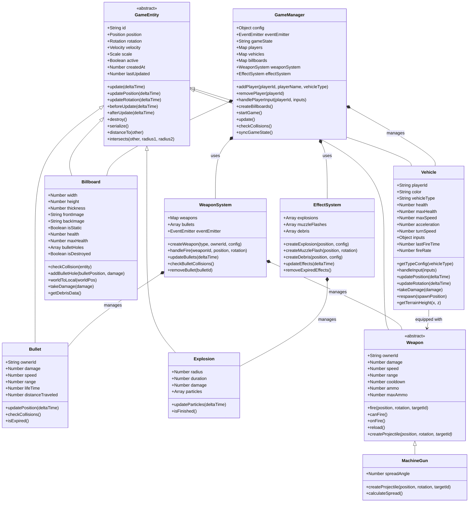
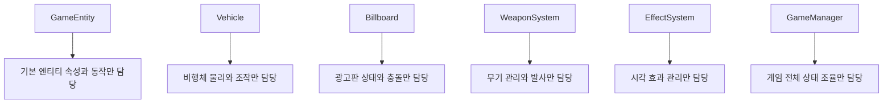
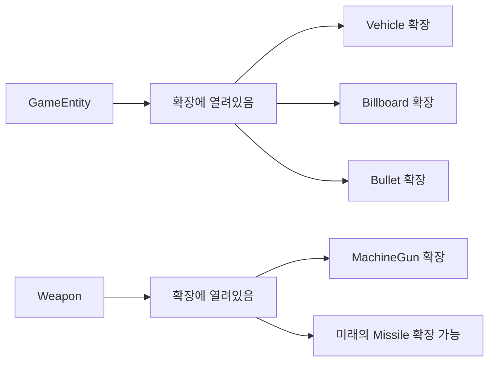
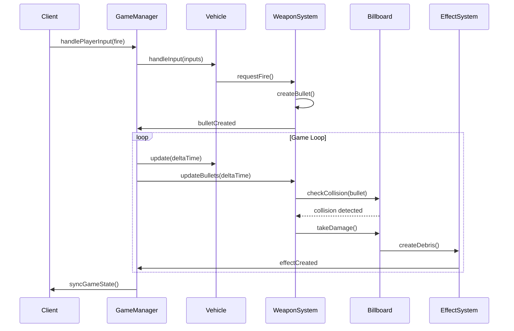

# Multiplayer 3D Vehicle Combat Game

SOLID 원칙을 적용한 실시간 멀티플레이어 3D 비행체 전투 게임입니다.

## 🎮 게임 특징

- **멀티플레이어**: 최대 8명까지 동시 플레이 (최소 1명으로 게임 시작 가능)
- **3D 비행체 전투**: Three.js 기반 3D 그래픽
- **실시간 동기화**: Socket.IO를 통한 실시간 플레이어 동기화
- **플레이어별 고유 색상**: 각 플레이어마다 다른 색상의 비행체
- **물리 엔진**: 현실적인 비행 물리 법칙 적용
- **충돌 감지**: 총알, 비행체, 지형 간 충돌 감지
- **폭발 효과**: 충돌 시 파티클 폭발 효과
- **리스폰 시스템**: 파괴된 비행체 자동 재생성 (3초)
- **카메라 시점**: 1인칭/3인칭 시점 전환 (V키)
- **🌐 외부 접근**: 인터넷을 통한 원격 플레이 지원
- **📺 파괴 가능한 광고판**: 지상에 설치된 양면 텍스처 광고판
- **🎯 총알 자국 시스템**: 광고판에 총알이 맞으면 자국이 남음 (최대 50개)
- **💥 파편 효과**: 광고판 파괴 시 현실적인 파편 물리 시뮬레이션
- **🏞️ 지형 기반 배치**: 평평한 지역에만 광고판 자동 배치
- **🎮 점수 시스템**: 적 격추 및 광고판 파괴로 점수 획득
- **✈️ 비행체 타입 선택**: 전투기와 중형기 중 선택 가능
- **⚡ 성능 최적화**: 저성능 모드 지원으로 다양한 기기에서 플레이 가능

## 🆕 최신 업데이트 (v2.2)

### ✈️ 듀얼 비행체 타입 시스템
- **전투기 (Fighter)**: 빠르고 민첩한 경량 비행체
  - 최고속도: 120, 가속력: 60
  - 회전속도: 3.5 (요/피치/롤)
  - 체력: 80 HP
  - 기관총: 12발/초, 데미지 8, 사거리 300
  - 미사일: 4발 (25초 재장전)
  - 단일 엔진 (파란색 글로우)
  
- **중형기 (Heavy)**: 강력하고 튼튼한 중량 비행체
  - 최고속도: 80, 가속력: 35
  - 회전속도: 2.0 (전투기보다 느림)
  - 체력: 150 HP
  - 기관총: 8발/초, 데미지 15, 사거리 350
  - 미사일: 6발 (30초 재장전)
  - 듀얼 엔진 (주황색 글로우)

### 🎨 개선된 UI/UX
- **비행체 선택 화면**: 직관적인 버튼 방식 선택 인터페이스
- **적절한 아이콘**: ✈️ 전투기, 🚀 중형기 아이콘 사용
- **시각적 피드백**: 선택된 비행체 타입에 따른 색상 변화
- **플레이어 목록 개선**: Unknown 플레이어 표시 문제 해결
- **점수 표시**: 플레이어 목록에 실시간 점수 표시

### 🎯 광고판 파괴 시스템
- **체력 시스템**: 광고판이 80 HP를 가지며 총알 8발로 파괴 가능
- **총알 자국**: 파괴되기 전까지 총알이 맞은 위치에 검은 자국이 남음
- **파편 효과**: 파괴 시 8-20개의 파편이 물리 법칙에 따라 흩어짐
- **점수 보상**: 광고판 파괴 시 50점 획득
- **실시간 동기화**: 모든 플레이어가 동일한 파괴 효과 확인
- **다중 이미지 지원**: 앞면/뒷면에 서로 다른 이미지 적용 가능

### 🏞️ 개선된 지형 시스템
- **스마트 배치**: 광고판이 평평한 지역에만 자동 배치
- **지형 높이 계산**: 정확한 지형 높이에 맞춰 광고판 설치
- **가시성 최적화**: 산속에 묻히지 않고 잘 보이는 위치에 배치
- **충돌 회피**: 물 위와 급경사 지역 자동 회피
- **배치 알고리즘**: 최대 100회 시도로 최적 위치 탐색

### 💥 향상된 시각 효과
- **파편 물리**: 중력, 바운스, 마찰 효과가 적용된 현실적인 파편
- **페이드 아웃**: 파편이 3-5초 후 서서히 투명해지며 사라짐
- **랜덤 효과**: 파편 크기, 색상, 회전이 랜덤하게 생성
- **지면 충돌**: 파편이 지면에 닿으면 바운스 효과
- **총구 스파크**: 발사 시 현실적인 총구 화염 효과 (15개 파티클, 150ms)
- **총알 궤적**: 글로우 효과가 적용된 총알 궤적 (길이 3, 반지름 0.1)

### ⚡ 성능 최적화
- **저성능 모드**: 그림자, 안티앨리어싱 비활성화로 성능 향상
- **GPU 전력 설정**: 저전력 모드 지원
- **구름/나무 개수 최적화**: 성능을 위해 개수 조정 (구름 10개, 나무 50개)
- **그림자 맵 최적화**: 2048px 해상도로 품질과 성능 균형

## 🏗️ 아키텍처

### SOLID 원칙 적용

- **Single Responsibility**: 각 클래스는 하나의 책임만 가짐
- **Open/Closed**: 새로운 엔티티는 기존 코드 수정 없이 확장 가능
- **Liskov Substitution**: 모든 엔티티는 GameEntity를 대체 가능
- **Interface Segregation**: 클라이언트는 필요한 인터페이스만 의존
- **Dependency Inversion**: 고수준 모듈은 추상화에 의존

### 프로젝트 구조

```
├── server/                 # 백엔드 서버
│   ├── entities/           # 게임 엔티티 클래스들
│   │   ├── GameEntity.js   # 기본 엔티티 클래스
│   │   ├── Vehicle.js      # 비행체 클래스
│   │   ├── Bullet.js       # 총알 클래스
│   │   ├── Explosion.js    # 폭발 효과 클래스
│   │   ├── Billboard.js    # 광고판 클래스
│   │   └── weapons/        # 무기 시스템
│   │       ├── Weapon.js   # 무기 추상 클래스
│   │       └── MachineGun.js # 기관총 클래스
│   ├── services/           # 서비스 레이어
│   │   ├── GameManager.js  # 게임 매니저
│   │   ├── WeaponSystem.js # 무기 시스템
│   │   └── EffectSystem.js # 효과 시스템
│   ├── config/             # 설정 파일
│   │   └── game-config.yaml # 게임 설정
│   └── index.js            # 메인 서버 파일
├── client/                 # 프론트엔드 클라이언트
│   ├── index.html          # 메인 HTML
│   ├── assets/             # 게임 에셋
│   │   └── billboards/     # 광고판 이미지
│   └── js/
│       └── GameClient.js   # 게임 클라이언트 로직
└── package.json            # 프로젝트 설정
```

## 🎯 클래스 설계 분석

### 📊 클래스 다이어그램



### 🎯 SOLID 원칙 상세 분석

#### 1. **Single Responsibility Principle (SRP)**


#### 2. **Open/Closed Principle (OCP)**


#### 3. **Liskov Substitution Principle (LSP)**
- 모든 `GameEntity` 하위 클래스는 `GameEntity`를 완전히 대체 가능
- `Vehicle`, `Billboard`, `Bullet` 모두 동일한 인터페이스 제공
- `update()`, `serialize()`, `destroy()` 메서드 일관성 유지

#### 4. **Interface Segregation Principle (ISP)**
- 각 시스템은 필요한 인터페이스만 의존
- `WeaponSystem`은 무기 관련 기능만 노출
- `EffectSystem`은 효과 관련 기능만 노출

#### 5. **Dependency Inversion Principle (DIP)**
- `GameManager`는 구체적인 클래스가 아닌 추상화에 의존
- 시스템들은 인터페이스를 통해 통신
- 설정은 외부에서 주입 (Dependency Injection)

### 🔄 시스템 상호작용 다이어그램



### 📋 주요 설계 패턴

#### 🎯 **Template Method Pattern**
- `GameEntity.update()`: 공통 업데이트 흐름 정의
- `Weapon.fire()`: 무기 발사 흐름 정의

#### 🏭 **Factory Pattern**
- `WeaponSystem.createWeapon()`: 무기 타입별 생성
- `EffectSystem.createExplosion()`: 효과 타입별 생성

#### 🎮 **Observer Pattern**
- `EventEmitter`를 통한 시스템 간 통신
- 게임 이벤트 발생 시 관련 시스템들에 알림

#### 📦 **Composition over Inheritance**
- `GameManager`가 시스템들을 조합하여 사용
- 각 시스템은 독립적으로 교체 가능

### 🚀 확장성 고려사항

#### 새로운 기능 추가 방법

1. **새로운 비행체 타입 추가**
   ```javascript
   // Vehicle.js의 getTypeConfig()에 새 타입 추가
   bomber: {
       health: 200,
       maxSpeed: 60,
       acceleration: 30,
       // ... 기타 설정
   }
   ```

2. **새로운 무기 타입 추가**
   ```javascript
   // weapons/Missile.js 생성
   export class Missile extends Weapon {
       createProjectile(position, rotation, targetId) {
           // 미사일 특화 로직
       }
   }
   ```

3. **새로운 효과 추가**
   ```javascript
   // EffectSystem.js에 메서드 추가
   createShockwave(position, config) {
       // 충격파 효과 생성
   }
   ```

4. **새로운 게임 모드**
   ```javascript
   // GameManager.js에 상태 추가
   this.gameMode = config.game.gameMode; // 'team', 'capture', etc.
   ```

### 🔧 코드 품질 보장

#### 테스트 가능한 설계
- 각 클래스는 독립적으로 테스트 가능
- 의존성 주입으로 Mock 객체 사용 가능
- 순수 함수 중심의 로직 구현

#### 성능 최적화
- 객체 풀링으로 메모리 할당 최소화
- 효율적인 충돌 검사 알고리즘
- 불필요한 업데이트 방지

#### 에러 처리
- 각 시스템별 독립적인 에러 처리
- 게임 진행에 영향을 주지 않는 안전한 실패
- 상세한 로깅 시스템

이 설계는 **확장성**, **유지보수성**, **테스트 가능성**을 모두 고려한 현대적인 게임 아키텍처입니다! 🎮✨

## 🚀 설치 및 실행

### 필요 조건

- Node.js 14.0 이상
- npm 또는 yarn

### 설치

```bash
# 저장소 클론
git clone <repository-url>
cd multiplayer-vehicle-game

# 의존성 설치
npm install
```

### 실행

```bash
# 서버 시작
npm start

# 개발 모드 (자동 재시작)
npm run dev

# 또는 직접 실행
node server/index.js
```

서버가 시작되면 다음 주소로 접속:
- **게임 클라이언트**: http://localhost:3001
- **서버 상태**: http://localhost:3001/api/status
- **네트워크 정보**: http://localhost:3001/api/network

## 🌐 외부 접근 설정

### 네트워크 설정

`server/config/game-config.yaml` 파일에서 외부 접근을 설정할 수 있습니다:

```yaml
server:
  port: 3001
  host: "0.0.0.0"  # 모든 인터페이스에서 접근 허용
  tickRate: 60     # 서버 업데이트 주기 (Hz)

network:
  allowExternalAccess: true  # 외부 접근 허용
  cors:
    enabled: true
    origins: "*"  # 허용할 도메인 (* = 모든 도메인)
  publicUrl: ""  # 공개 URL (비어있으면 자동 감지)
```

### 외부 접근 활성화

1. **설정 파일 수정**: `game-config.yaml`에서 `allowExternalAccess: true` 설정
2. **서버 재시작**: `npm start`로 서버 재시작
3. **네트워크 정보 확인**: 게임 로딩 화면에서 "네트워크 정보" 버튼 클릭
4. **외부 접속**: 표시된 외부 IP 주소로 다른 기기에서 접속

### 보안 고려사항

⚠️ **외부 접근 활성화 시 주의사항:**
- 서버가 인터넷에 노출됩니다
- 방화벽 설정을 확인하세요
- 필요시 특정 IP만 허용하도록 설정하세요
- 프로덕션 환경에서는 HTTPS 사용을 권장합니다

### 방화벽 설정 (Windows)

```powershell
# Windows 방화벽에서 포트 3001 허용
netsh advfirewall firewall add rule name="Game Server" dir=in action=allow protocol=TCP localport=3001
```

### 공유기 포트포워딩

외부 인터넷에서 접속하려면 공유기에서 포트포워딩 설정이 필요할 수 있습니다:
1. 공유기 관리 페이지 접속
2. 포트포워딩/가상서버 설정
3. 포트 3001을 서버 컴퓨터 IP로 포워딩

## 🎯 게임 조작법

### 키보드 조작

- **W/S**: 비행체 상하 회전 (피치)
- **A/D**: 비행체 좌우 회전 (요)
- **Q/E**: 비행체 롤링
- **Shift**: 추력 증가 (가속)
- **Ctrl**: 추력 감소 (감속)
- **스페이스바**: 상승
- **X**: 하강
- **P**: 기관총 발사
- **V**: 1인칭/3인칭 시점 전환

### 마우스 조작 (1인칭 모드)

- **마우스 이동**: 시선 조절
- **마우스 클릭**: 기관총 발사

### 게임 목표

- **적 비행체 격추**: 100점 획득
- **광고판 파괴**: 50점 획득
- **생존**: 파괴되면 3초 후 리스폰

## 🛠️ 기술 스택

### 백엔드
- **Node.js**: 서버 런타임
- **Express**: 웹 서버 프레임워크
- **Socket.IO**: 실시간 통신
- **YAML**: 설정 파일 관리
- **UUID**: 고유 ID 생성

### 프론트엔드
- **Three.js**: 3D 그래픽 렌더링
- **Socket.IO Client**: 서버 통신
- **HTML5 Canvas**: 렌더링 컨텍스트

## ⚙️ 게임 설정

`server/config/game-config.yaml` 파일에서 게임 설정을 변경할 수 있습니다:

### 기본 게임 설정
```yaml
game:
  name: "Multiplayer Vehicle Combat"
  version: "1.0.0"
  maxPlayers: 8
  minPlayersToStart: 1
  gameMode: "deathmatch"
  respawnTime: 3000  # 밀리초
```

### 서버 설정
```yaml
server:
  port: 3001
  host: "0.0.0.0"  # 외부 접근용
  tickRate: 60     # 서버 업데이트 주기 (Hz)
```

### 월드 설정
```yaml
world:
  size: 400              # 맵 크기 (정사각형)
  terrainDetail: 100     # 지형 세부도
  waterLevel: -5         # 물 높이
  maxHeight: 200         # 최대 비행 높이
  gravity: -9.81         # 중력 가속도
  boundaryBuffer: 10     # 맵 경계 여유 공간
  spawnDistance:
    min: 50              # 스폰 최소 거리
    max: 150             # 스폰 최대 거리
  spawnHeight:
    min: 80              # 스폰 최소 높이
    max: 120             # 스폰 최대 높이
```

### 광고판 설정
```yaml
billboards:
  enabled: true
  count: 5               # 광고판 개수
  width: 40              # 광고판 너비
  height: 20             # 광고판 높이
  thickness: 2           # 광고판 두께
  health: 80             # 광고판 체력 (총알 8발로 파괴)
  minDistance: 80        # 광고판 간 최소 거리
  maxBulletHoles: 50     # 광고판당 최대 총알 자국 수
  maxPlacementAttempts: 100  # 배치 최대 시도 횟수
  terrainFlatness:
    checkPoints: 8       # 평탄도 검사 포인트 수
    maxHeightDiff: 10    # 허용 최대 높이 차이
    checkRadius: 15      # 검사 반경
  debris:
    minCount: 8          # 최소 파편 개수
    maxCount: 20         # 최대 파편 개수
    lifeTimeMin: 3000    # 파편 최소 지속 시간 (ms)
    lifeTimeMax: 5000    # 파편 최대 지속 시간 (ms)
  images:
    front:
      - "assets/billboards/front.svg"
      - "assets/billboards/kimhk.jpg"
    back:
      - "assets/billboards/back.svg"
      - "assets/billboards/kimhk.jpg"
```

### 비행체 설정
```yaml
vehicles:
  colors:  # 플레이어별 비행체 색상
    - "#FF0000"  # 빨강
    - "#00FF00"  # 초록
    - "#0000FF"  # 파랑
    - "#FFFF00"  # 노랑
    - "#FF00FF"  # 마젠타
    - "#00FFFF"  # 시안
    - "#FFA500"  # 주황
    - "#800080"  # 보라
  
  fighter:  # 전투기 설정
    maxSpeed: 120
    acceleration: 60
    turnSpeed: 3.5
    health: 80
    fireRate: 12
    bulletDamage: 8
    bulletSpeed: 220
    bulletRange: 300
    engineType: "single"
    engineColor: "#00AAFF"
    
  heavy:  # 중형기 설정
    maxSpeed: 80
    acceleration: 35
    turnSpeed: 2.0
    health: 150
    fireRate: 8
    bulletDamage: 15
    bulletSpeed: 180
    bulletRange: 350
    engineType: "dual"
    engineColor: "#FF4400"
```

### 물리 설정
```yaml
physics:
  airResistance: 0.98      # 공기 저항 (0.98 = 2% 감속)
  groundFriction: 0.95     # 지면 마찰
  collisionDamping: 0.5    # 충돌 감쇠
  collisionRadius: 5       # 기본 충돌 반경
```

### 시각 효과 설정
```yaml
effects:
  explosionDuration: 2     # 폭발 지속 시간 (초)
  bulletTrailLength: 10    # 총알 궤적 길이
  muzzleFlash:
    duration: 150          # 총구 스파크 지속 시간 (ms)
    particleCount: 15      # 파티클 개수
    spreadDistance: 3      # 확산 거리
  bullet:
    radius: 0.5            # 총알 반지름
    trailRadius: 0.1       # 궤적 반지름
    trailLength: 3         # 궤적 길이
    glowRadius: 0.8        # 글로우 반지름
    color: "#FFFF00"       # 총알 색상
    trailColor: "#FF8800"  # 궤적 색상
    glowOpacity: 0.3       # 글로우 투명도
```

### 성능 최적화 설정
```yaml
client:
  clouds:
    count: 10              # 구름 개수 (성능 최적화)
  trees:
    count: 50              # 나무 개수 (성능 최적화)
  performance:
    enableShadows: false   # 그림자 비활성화 (성능 향상)
    shadowMapType: "basic" # 그림자 타입
    antialias: false       # 안티앨리어싱 비활성화
    powerPreference: "low-power"  # GPU 전력 설정
    lowPerformanceMode: true      # 저성능 모드 활성화
```

## 🎨 게임 특징 상세

### 비행체 시스템
- 현실적인 비행 물리 법칙
- 관성과 가속도 적용
- 3축 회전 (피치, 요, 롤)
- 플레이어별 고유 색상
- 듀얼 비행체 타입 (전투기/중형기)
- 엔진 글로우 효과 (단일/듀얼)

### 무기 시스템
- **기관총**: 연속 발사 가능, 빠른 속도
- **미사일**: 강력한 데미지, 느린 속도 (미래 기능)
- 총구 스파크 효과
- 총알 궤적 및 글로우 효과

### 지형 시스템
- 절차적 생성 지형
- 높이맵 기반 충돌 감지
- 나무와 환경 오브젝트 배치
- 물 시스템 (수위 -5)

### 광고판 시스템
- **대형 광고판**: 지상에 설치된 양면 텍스처 광고판
- **사용자 정의 이미지**: SVG, JPG, PNG 등 다양한 형식 지원
- **자동 배치**: 설정된 거리 간격으로 자동 배치
- **양면 텍스처**: 앞면과 뒷면에 서로 다른 이미지 적용
- **그림자 효과**: 실시간 그림자 렌더링
- **총알 자국**: 최대 50개까지 자국 표시
- **파편 효과**: 파괴 시 물리 기반 파편 시뮬레이션

### 멀티플레이어
- 실시간 플레이어 동기화
- 지연 보상 시스템
- 안정적인 서버-클라이언트 통신
- 외부 네트워크 접근 지원

## 🌐 네트워크 기능

### 자동 네트워크 감지
- 서버 시작 시 사용 가능한 네트워크 인터페이스 자동 감지
- 외부 접속 가능한 IP 주소 표시
- 실시간 네트워크 상태 모니터링

### API 엔드포인트
- `GET /api/status`: 서버 상태 및 게임 정보
- `GET /api/network`: 네트워크 접속 정보
- `GET /api/config`: 게임 설정 정보

### 클라이언트 네트워크 정보
게임 로딩 화면에서 "네트워크 정보" 버튼을 클릭하면:
- 현재 서버 접근 설정 확인
- 외부 접속 가능한 IP 주소 목록
- 보안 주의사항 안내

## 🐛 문제 해결

### 일반적인 문제들

1. **게임이 로드되지 않음**
   - 브라우저 콘솔에서 오류 확인
   - 서버가 정상 실행 중인지 확인
   - Node.js 버전 확인 (14.0 이상 필요)

2. **조작이 안됨**
   - 게임 화면을 클릭하여 포커스 설정
   - 키보드 레이아웃 확인
   - 브라우저 호환성 확인

3. **연결 문제**
   - 방화벽 설정 확인
   - 포트 3001이 사용 가능한지 확인
   - 다른 프로그램이 포트를 사용하고 있는지 확인

4. **외부 접근 불가**
   - `game-config.yaml`에서 `allowExternalAccess: true` 확인
   - 방화벽에서 포트 3001 허용 확인
   - 공유기 포트포워딩 설정 확인
   - 네트워크 인터페이스 설정 확인

5. **성능 문제**
   - `game-config.yaml`에서 `lowPerformanceMode: true` 설정
   - 그림자 및 안티앨리어싱 비활성화
   - 구름/나무 개수 조정

## 📝 개발 로그

이 게임은 단일 파일 3D 비행체 시뮬레이션을 멀티플레이어 게임으로 발전시킨 프로젝트입니다. 개발 과정에서 해결한 주요 문제들:

- Three.js Quaternion 호환성 문제
- 키보드 입력 처리 최적화
- 카메라 시스템 개선
- 비행체 물리 법칙 조정
- 지형 충돌 감지 정확도 향상
- **외부 네트워크 접근 기능 추가**
- **CORS 설정 및 보안 강화**
- **자동 네트워크 인터페이스 감지**
- **듀얼 비행체 타입 시스템 구현**
- **성능 최적화 및 저성능 모드 추가**

## 🎯 향후 계획

- [ ] 팀 모드 추가
- [ ] 미사일 시스템 구현
- [ ] 업그레이드 시스템
- [ ] 맵 에디터
- [ ] 리플레이 시스템
- [ ] 랭킹 시스템
- [x] 외부 네트워크 접근 지원
- [x] 듀얼 비행체 타입 시스템
- [x] 성능 최적화 모드
- [ ] HTTPS/WSS 보안 연결
- [ ] 서버 클러스터링
- [ ] 게임 룸 시스템
- [ ] 모바일 터치 컨트롤 지원
- [ ] VR 지원

## 📺 광고판 설정

### 광고판 이미지 추가

1. **이미지 파일 준비**: 
   - 권장 크기: 1024x512 픽셀 (2:1 비율)
   - 지원 형식: JPG, PNG, SVG, GIF

2. **이미지 파일 배치**:
   ```
   client/assets/billboards/
   ├── front.svg    # 앞면 이미지
   ├── back.svg     # 뒷면 이미지
   ├── kimhk.jpg    # 추가 광고 이미지
   └── ad2.png      # 추가 광고 이미지
   ```

3. **설정 파일 수정**:
   ```yaml
   billboards:
     enabled: true
     count: 10  # 광고판 개수 조정
     width: 50  # 크기 조정
     height: 25
     images:
       front: "assets/billboards/your-front-image.jpg"
       back: "assets/billboards/your-back-image.png"
   ```

### 다중 광고 이미지

여러 광고 이미지를 랜덤하게 사용하려면:

```yaml
billboards:
  images:
    front: 
      - "assets/billboards/game-ad1.jpg"
      - "assets/billboards/game-ad2.png"
      - "assets/billboards/game-ad3.svg"
    back:
      - "assets/billboards/tech-ad1.jpg"
      - "assets/billboards/tech-ad2.png"
```

각 광고판마다 배열에서 랜덤하게 선택된 이미지가 적용됩니다.

## 📈 성능 최적화

### 자동 성능 최적화
- **60Hz 서버 틱레이트**: 부드러운 게임플레이
- **효율적인 충돌 검사**: AABB 기반 충돌 감지
- **메모리 관리**: 최대 총알 자국 수 제한 (50개)
- **네트워크 최적화**: 필요한 데이터만 전송
- **파편 수명 관리**: 자동 정리로 메모리 누수 방지

### 저성능 모드 설정
```yaml
client:
  performance:
    enableShadows: false        # 그림자 비활성화
    shadowMapType: "basic"      # 기본 그림자 타입
    antialias: false           # 안티앨리어싱 비활성화
    powerPreference: "low-power"  # 저전력 GPU 사용
    lowPerformanceMode: true    # 저성능 모드 활성화
  clouds:
    count: 10                  # 구름 개수 감소
  trees:
    count: 50                  # 나무 개수 감소
```

### 성능 모니터링
- 브라우저 개발자 도구에서 FPS 확인
- 메모리 사용량 모니터링
- 네트워크 지연 시간 확인

## 🔧 개발자 정보

### 디버깅

서버 로그에서 다음 정보를 확인할 수 있습니다:
- 플레이어 연결/해제
- 광고판 파괴 이벤트
- 게임 시작/종료
- 네트워크 상태
- 성능 메트릭

### API 엔드포인트

- `GET /` - 게임 클라이언트
- `GET /api/status` - 서버 상태 정보
- `GET /api/network` - 네트워크 정보
- `GET /api/config` - 게임 설정 정보

### 개발 모드

```bash
# 개발 모드로 실행 (자동 재시작)
npm run dev

# 클라이언트만 별도 서버로 실행
npm run client
```

## 📝 변경 로그

### v2.2.0 (2024-01-XX)
- ✨ 듀얼 비행체 타입 시스템 (전투기/중형기)
- ⚡ 성능 최적화 및 저성능 모드 추가
- 🎨 향상된 엔진 글로우 효과 (단일/듀얼)
- 🔧 상세한 게임 설정 옵션 추가
- 📊 성능 모니터링 개선

### v2.1.0 (2024-01-XX)
- ✨ 광고판 파괴 시스템 추가
- ✨ 총알 자국 시스템 구현
- ✨ 파편 물리 효과 추가
- 🏞️ 지형 기반 광고판 배치 개선
- 🎮 점수 시스템 확장

### v2.0.0 (2024-01-XX)
- 🎮 기본 멀티플레이어 전투 시스템
- 🌐 외부 접근 지원
- 📺 기본 광고판 시스템
- 🎯 실시간 동기화

### v1.0.0 (2024-01-XX)
- 🎮 기본 3D 비행체 시뮬레이션
- 🎯 단일 플레이어 모드
- 🏞️ 기본 지형 시스템

## 🤝 기여하기

1. 이 저장소를 포크합니다
2. 새로운 기능 브랜치를 만듭니다 (`git checkout -b feature/AmazingFeature`)
3. 변경사항을 커밋합니다 (`git commit -m 'Add some AmazingFeature'`)
4. 브랜치에 푸시합니다 (`git push origin feature/AmazingFeature`)
5. Pull Request를 생성합니다

### 기여 가이드라인

- SOLID 원칙을 따라 코드를 작성해주세요
- 새로운 기능은 `game-config.yaml`에서 설정 가능하도록 해주세요
- 성능에 영향을 주는 변경사항은 저성능 모드를 고려해주세요
- 테스트를 추가하고 기존 테스트가 통과하는지 확인해주세요

## 📄 라이센스

이 프로젝트는 MIT 라이센스 하에 배포됩니다. 자세한 내용은 `LICENSE` 파일을 참조하세요.

## 🙏 감사의 말

- [Three.js](https://threejs.org/) - 3D 그래픽 라이브러리
- [Socket.IO](https://socket.io/) - 실시간 통신
- [Express](https://expressjs.com/) - 웹 서버 프레임워크
- [YAML](https://yaml.org/) - 설정 파일 형식
- [UUID](https://github.com/uuidjs/uuid) - 고유 ID 생성

---

**즐거운 게임 되세요! 🎮✈️💥**

*Made with ❤️ using SOLID principles and modern web technologies* 