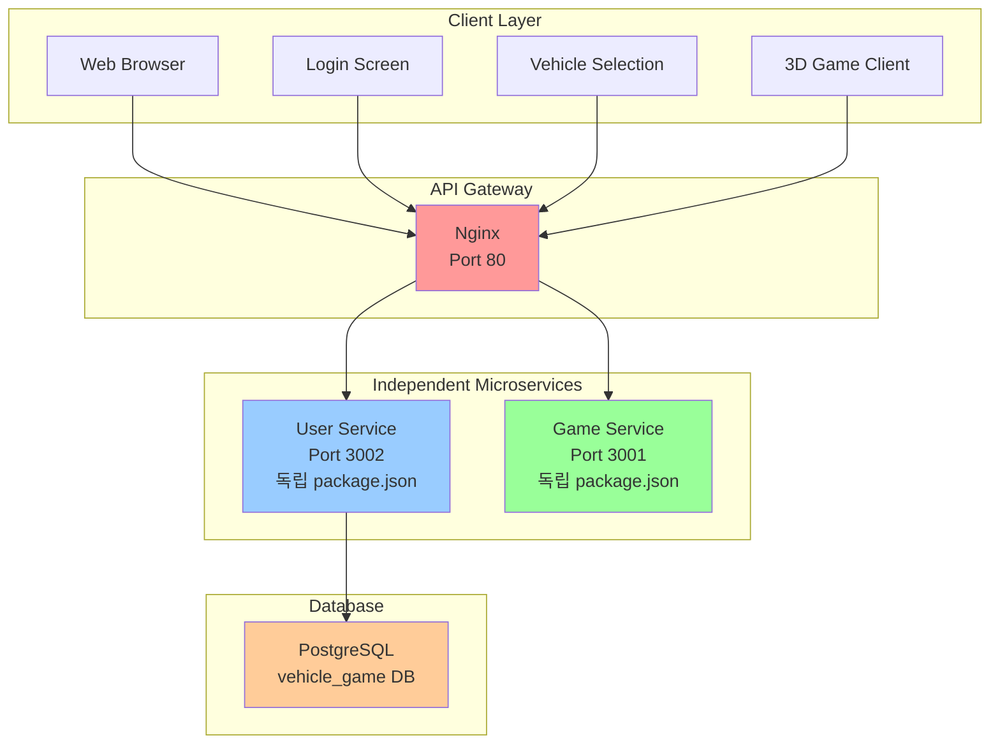
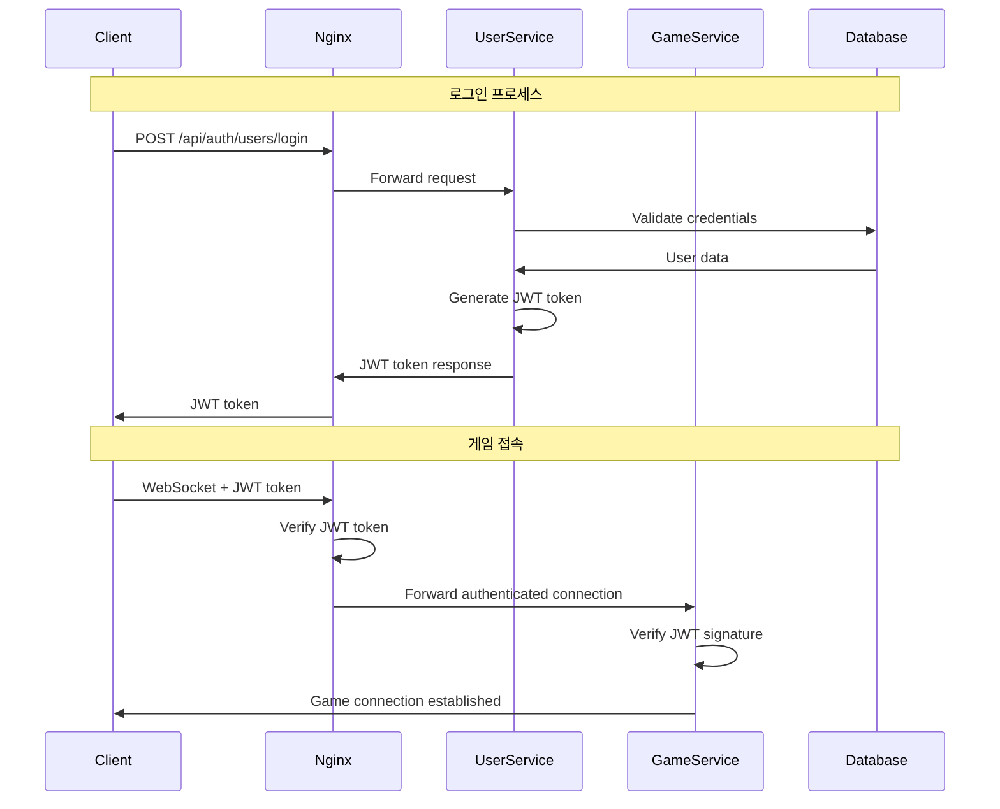

# 🚁 Multiplayer 3D Vehicle Combat Game

**Version:** v4.0  
**Last Updated:** 2025-06-12  
**Architecture:** Independent Microservices with JWT Authentication

## 📖 게임 소개

실시간 멀티플레이어 3D 비행체 전투 게임입니다. 완전히 독립적인 마이크로서비스 아키텍처와 JWT 인증을 통한 보안 시스템을 갖춘 본격적인 웹 게임입니다. nginx API 게이트웨이를 통해 사용자 인증과 게임 서비스가 분리되어 있으며, PostgreSQL 데이터베이스를 사용한 사용자 관리 시스템을 제공합니다.

## 🏗️ 시스템 아키텍처



### 🔐 인증 플로우



## ✨ 주요 특징

### 🎮 게임플레이
- **실시간 멀티플레이어**: Socket.IO 기반 실시간 동기화
- **3가지 비행체 타입**: 전투기(Fighter), 중형기(Heavy), 테스트기(Test)
- **물리 기반 비행**: 현실적인 비행 역학 시뮬레이션
- **무기 시스템**: 머신건 기반 전투 시스템
- **폭발 효과**: 피격 시 작은 폭발, 파괴 시 대형 폭발
- **점수 시스템**: 킬/데스 통계 및 점수 집계
- **자동 리스폰**: 5초 후 자동 부활
- **1인칭/3인칭 시점**: V키로 시점 전환

### 🔒 보안 시스템
- **JWT 인증**: 토큰 기반 사용자 인증
- **API 게이트웨이**: nginx를 통한 중앙집중식 라우팅 (외부 접근 허용)
- **마이크로서비스 격리**: User/Game Service는 localhost만 허용 (외부 직접 접근 차단)
- **WebSocket 보안**: JWT 토큰 검증을 통한 WebSocket 연결 보호
- **Rate Limiting**: API 호출 제한으로 DDoS 방지
- **CORS 설정**: 적절한 Cross-Origin 정책

### 🏗️ 마이크로서비스 특징
- **완전한 독립성**: 각 서비스별 독립적인 package.json과 의존성
- **독립적 배포**: 서비스별로 따로 배포 가능
- **SOLID 원칙 준수**: 확장 가능하고 유지보수가 용이한 설계
- **Factory Pattern**: 새로운 비행체 타입 쉽게 추가 가능
- **Observer Pattern**: 이벤트 기반 시스템 아키텍처
- **성능 모니터링**: 실시간 서버 성능 추적
- **중앙집중식 설정**: YAML 기반 설정 관리
- **PostgreSQL 데이터베이스**: 사용자 데이터 영구 저장

## 🚀 빠른 시작

### 필수 요구사항
- Node.js 16.0 이상
- PostgreSQL 12.0 이상
- nginx 1.20 이상
- npm 또는 yarn

### 설치 및 실행

#### 1. 저장소 클론 및 의존성 설치
```bash
git clone <repository-url>
cd multiplayer-vehicle-game

# 루트 의존성 설치 (개발 도구)
npm install

# 각 서비스별 의존성 설치
npm run install:all
```

#### 2. PostgreSQL 데이터베이스 설정
```sql
-- PostgreSQL에 접속하여 실행
psql -U postgres -h localhost

-- User Service용 데이터베이스 및 사용자 생성
CREATE DATABASE user_service;
CREATE USER app_user WITH PASSWORD 'app123!@#';
GRANT ALL PRIVILEGES ON DATABASE user_service TO app_user;

-- 연결 테스트
\l  -- 데이터베이스 목록 확인
\q  -- 종료
```

#### 3. 환경 변수 설정 (.env 파일 생성)

각 서비스 디렉토리에 `.env` 파일을 생성하세요. `sample.env` 파일을 참고하여 복사 후 수정하시면 됩니다.

**User Service 환경 변수** (`services/user-service/.env`):
```env
# 서버 설정
NODE_ENV=development              # 실행 환경 (development/production)
HOST=127.0.0.1                   # 서버 바인딩 주소 (보안상 localhost만 허용)
PORT=3002                         # User Service 포트 번호

# 데이터베이스 설정 (PostgreSQL)
DB_TYPE=postgres                  # 데이터베이스 타입 (postgres/sqlite)
DB_HOST=localhost                 # 데이터베이스 호스트 주소
DB_PORT=5432                      # PostgreSQL 기본 포트
DB_NAME=vehicle_game              # 데이터베이스 이름 (변경됨: user_service -> vehicle_game)
DB_USER=app_user                  # 데이터베이스 사용자명
DB_PASS="app123!@#"              # 데이터베이스 비밀번호 (특수문자 포함시 따옴표 필요)

# JWT 인증 설정
JWT_SECRET=your-super-secret-jwt-key-change-in-production  # JWT 서명 키 (반드시 변경 필요)
JWT_EXPIRY=24h                    # 토큰 만료 시간 (24시간)

# 네트워크 보안 설정
ALLOW_EXTERNAL_ACCESS=false       # 외부 접근 허용 여부 (nginx를 통해서만 접근)

# 프록시 설정 (회사 네트워크 등에서 필요한 경우)
HTTP_PROXY=http://70.10.15.10:8080   # HTTP 프록시 서버 주소
HTTPS_PROXY=http://70.10.15.10:8080  # HTTPS 프록시 서버 주소
NO_PROXY=localhost,127.0.0.1,::1     # 프록시를 사용하지 않을 주소 목록
```

**Game Service 환경 변수** (`services/game-service/.env`):
```env
# 서버 설정
NODE_ENV=development              # 실행 환경 (development/production)
HOST=127.0.0.1                   # 서버 바인딩 주소 (보안상 localhost만 허용)
PORT=3001                         # Game Service 포트 번호

# JWT 인증 설정 (User Service와 동일해야 함)
JWT_SECRET=your-super-secret-jwt-key-change-in-production  # JWT 서명 키 (User Service와 동일)

# 네트워크 보안 설정
ALLOW_EXTERNAL_ACCESS=false       # 외부 접근 허용 여부 (nginx를 통해서만 접근)
```

> **⚠️ 중요 보안 사항:**
> - `JWT_SECRET`은 반드시 복잡한 문자열로 변경하세요
> - User Service와 Game Service의 `JWT_SECRET`은 동일해야 합니다
> - `HOST=127.0.0.1`로 설정하여 외부 직접 접근을 차단합니다
> - 프로덕션 환경에서는 `NODE_ENV=production`으로 설정하세요

> **📝 환경 변수 파일 생성 방법:**
> ```bash
> # User Service
> cp services/user-service/sample.env services/user-service/.env
> 
> # Game Service  
> cp services/game-service/sample.env services/game-service/.env
> ```

#### 4. 서비스 시작

**개별 서비스 실행:**
```powershell
# User Service 시작
npm run start:user

# Game Service 시작 (새 터미널에서)
npm run start:game
```

**모든 서비스 동시 실행 (개발용):**
```powershell
npm run dev:all
```

**Nginx 시작:**
```powershell
cd C:\nginx; copy C:\pypjt\test2\nginx.conf C:\nginx\conf\nginx.conf; .\nginx.exe
```

#### 5. 게임 접속
- 🎮 게임 클라이언트: http://localhost
- 📊 User Service API 테스트: http://localhost/api-test.html
- 🔧 Game Service 상태: http://localhost:3001/api/status

## 📁 프로젝트 구조

```
multiplayer-vehicle-game/
├── services/
│   ├── user-service/              # 사용자 관리 마이크로서비스
│   │   ├── src/
│   │   ├── package.json           # 독립적 의존성
│   │   ├── .env                   # 환경 변수
│   │   └── README.md
│   │
│   └── game-service/              # 게임 로직 마이크로서비스
│       ├── src/
│       ├── package.json           # 독립적 의존성
│       ├── .env                   # 환경 변수
│       └── README.md
│
├── client/                        # 프론트엔드
├── nginx.conf                     # API Gateway 설정
├── package.json                   # 루트 스크립트 (개발 도구)
└── README.md
```

## 🎯 게임 조작법

### 기본 조작
- **W/S**: 피치 조정 (기수 상승/하강)
- **A/D**: 요 조정 (좌/우 회전)
- **Q/E**: 롤 조정 (좌/우 기울기)
- **Shift**: 추력 증가 (부스터)
- **Ctrl**: 추력 감소
- **Space**: 수직 상승
- **X**: 수직 하강
- **P**: 발사 (또는 마우스 좌클릭)
- **V**: 1인칭/3인칭 시점 전환

### 비행체 타입별 특성

#### ⚡ 전투기 (Fighter)
- **체력**: 40 HP
- **최대 속도**: 120
- **특징**: 균형잡힌 성능, 빠른 기동성
- **연사 속도**: 100ms
- **엔진**: 단일 엔진 (파란색 글로우)

#### 🛡️ 중형기 (Heavy)
- **체력**: 60 HP  
- **최대 속도**: 80
- **특징**: 높은 내구성, 느린 기동성
- **연사 속도**: 150ms
- **엔진**: 듀얼 엔진 (주황색 글로우)

#### 🧪 테스트기 (Test)
- **체력**: 20 HP
- **최대 속도**: 100
- **특징**: 빠른 테스트용, 높은 기동성
- **연사 속도**: 80ms
- **엔진**: 단일 엔진 (녹색 글로우)

## 🔐 사용자 인증 시스템

### 회원가입 및 로그인
1. **회원가입**: 사용자명, 이메일, 비밀번호로 계정 생성
2. **로그인**: 사용자명과 비밀번호로 JWT 토큰 획득
3. **차량 선택**: 로그인 후 원하는 비행체 타입 선택
4. **게임 입장**: JWT 토큰으로 인증된 게임 세션 시작

### 게스트 사용자
- 임시 계정으로 빠른 게임 참여 가능
- 제한된 기능 (통계 저장 안됨)

### 사용자 프로필
- 게임 통계 (총 킬, 데스, 게임 수, 점수)
- 차량 커스터마이징 설정
- 게임 포인트 시스템

## 🌐 API 엔드포인트

### 인증 API (User Service)
```
POST /api/auth/users/register    # 회원가입
POST /api/auth/users/login       # 로그인
POST /api/auth/users/guest       # 게스트 계정 생성
GET  /api/auth/users/verify-token # JWT 토큰 검증
```

### 사용자 API (User Service)
```
GET  /api/user/users/profile           # 프로필 조회
PUT  /api/user/users/vehicle-settings  # 차량 설정 업데이트
POST /api/user/users/game-stats        # 게임 통계 업데이트
GET  /api/user/users/list              # 사용자 목록 (관리자)
GET  /api/user/database/info           # 데이터베이스 정보
```

### 게임 API (Game Service)
```
GET  /api/status                 # 서버 상태
WebSocket /socket.io/            # 실시간 게임 통신
```

## ⚙️ 개발 스크립트

### 루트 레벨 스크립트
```bash
# 서비스 실행
npm run start:user              # User Service 실행
npm run start:game              # Game Service 실행
npm run dev:all                 # 모든 서비스 동시 개발 모드

# 의존성 관리
npm run install:user            # User Service 의존성 설치
npm run install:game            # Game Service 의존성 설치
npm run install:all             # 모든 서비스 의존성 설치

# 정리
npm run clean                   # 모든 node_modules 삭제
```

## 🛠️ 문제 해결

### 환경 변수 관련 문제

#### .env 파일 특수문자 문제
**증상**: 비밀번호에 `#` 문자가 있을 때 주석으로 인식
**해결**: 비밀번호를 따옴표로 감싸기
```env
DB_PASS="app123!@#"  # ✅ 올바름
DB_PASS=app123!@#    # ❌ 틀림 (# 이후 주석으로 인식)
```

#### JWT 토큰 불일치
**증상**: "invalid signature" 오류
**원인**: User Service와 Game Service의 JWT_SECRET 불일치
**해결**: 두 서비스의 .env 파일에서 동일한 JWT_SECRET 사용

### 데이터베이스 관련 문제

#### 사용자 인증 실패
**증상**: `사용자 "app_user"의 password 인증에 실패했습니다`
**해결**: PostgreSQL에서 사용자 및 데이터베이스 생성 확인
```sql
-- 사용자 존재 확인
\du

-- 데이터베이스 존재 확인
\l

-- 필요시 재생성
DROP USER IF EXISTS app_user;
CREATE USER app_user WITH PASSWORD 'app123!@#';
GRANT ALL PRIVILEGES ON DATABASE user_service TO app_user;
```

### 의존성 관련 문제

#### 패키지 누락 오류
**증상**: `Cannot find package 'uuid'` 등
**해결**: 각 서비스에서 의존성 재설치
```bash
cd services/game-service
npm install

cd ../user-service
npm install
```

## 📊 성능 최적화

### WebGL 최적화
- **GPU 가속**: `powerPreference: "high-performance"`
- **프레임 제한**: 60fps 제한으로 과도한 렌더링 방지
- **렌더링 통계**: 자동 리셋으로 메모리 최적화
- **객체 정렬**: 드로우콜 최적화

### 네트워크 최적화
- **Rate Limiting**: API 호출 제한 (1000 requests/15분)
- **WebSocket 압축**: 실시간 데이터 압축 전송
- **JWT 캐싱**: 토큰 검증 결과 캐싱

### 마이크로서비스 최적화
- **독립적 스케일링**: 각 서비스별로 독립적으로 확장 가능
- **의존성 격리**: 한 서비스의 장애가 다른 서비스에 영향 없음
- **개발 효율성**: 팀별로 독립적인 개발 및 배포 가능

## 🔧 배포

### Docker 배포 (권장)
```bash
# 각 서비스별 Docker 이미지 빌드
cd services/user-service
docker build -t user-service .

cd ../game-service
docker build -t game-service .

# Docker Compose로 전체 시스템 실행
docker-compose up -d
```

### 수동 배포
```bash
# 프로덕션 환경에서 각 서비스별로 실행
cd services/user-service
NODE_ENV=production npm start

cd ../game-service
NODE_ENV=production npm start
```

## 📝 라이센스

MIT License

## 👥 기여

1. Fork the Project
2. Create your Feature Branch (`git checkout -b feature/AmazingFeature`)
3. Commit your Changes (`git commit -m 'Add some AmazingFeature'`)
4. Push to the Branch (`git push origin feature/AmazingFeature`)
5. Open a Pull Request

---

**🎮 마이크로서비스 기반 멀티플레이어 게임을 즐겨보세요!**

**⚠️ 주의**: 프로덕션 환경에서는 반드시 JWT_SECRET, 데이터베이스 비밀번호 등을 변경하세요!

**🔒 보안 아키텍처:**
- **Nginx (Port 80)**: 외부 접근 허용 - API Gateway 역할
- **User Service (Port 3002)**: localhost만 허용 - nginx를 통해서만 접근
- **Game Service (Port 3001)**: localhost만 허용 - nginx를 통해서만 접근
- **PostgreSQL**: localhost만 허용 - User Service를 통해서만 접근