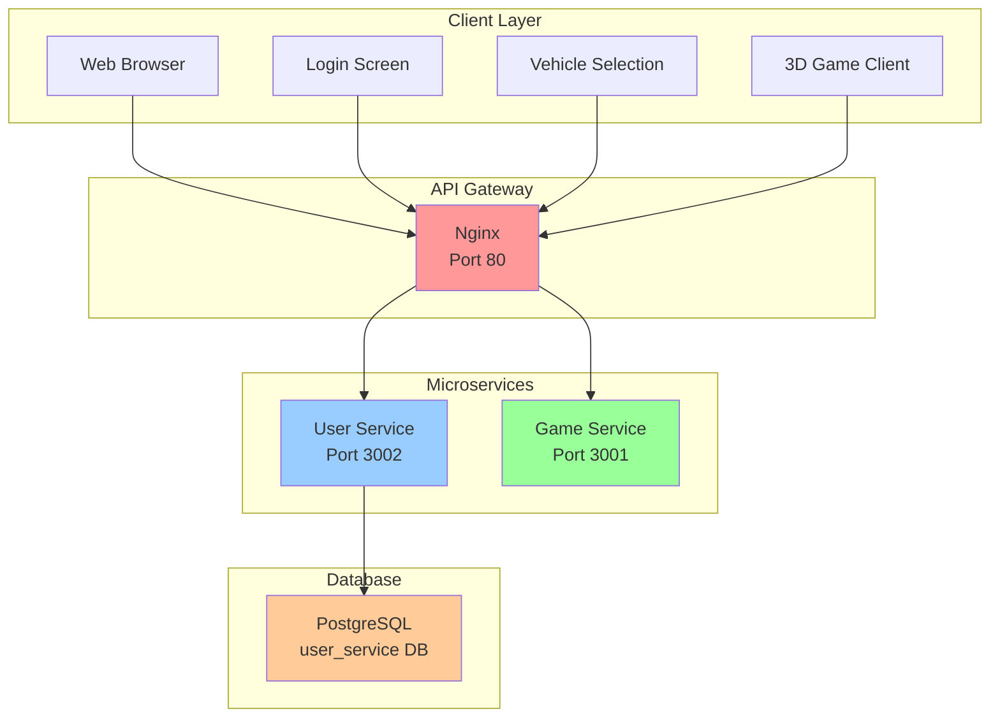
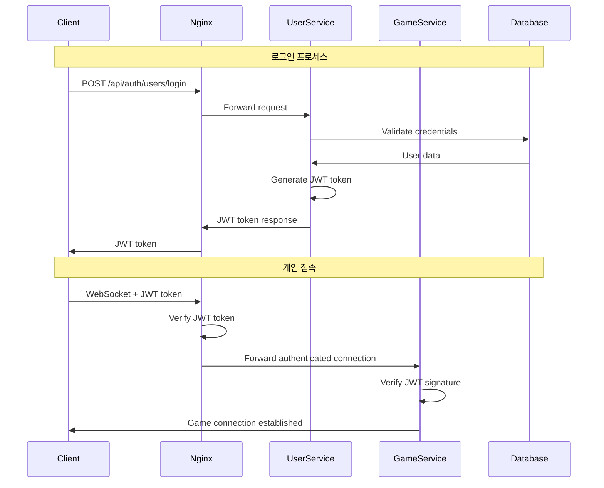

# 🚁 Multiplayer 3D Vehicle Combat Game

**Version:** v3.0  
**Last Updated:** 2025-01-25  
**Architecture:** Microservices with JWT Authentication

## 📖 게임 소개

실시간 멀티플레이어 3D 비행체 전투 게임입니다. 마이크로서비스 아키텍처와 JWT 인증을 통한 보안 시스템을 갖춘 본격적인 웹 게임입니다. nginx API 게이트웨이를 통해 사용자 인증과 게임 서비스가 분리되어 있으며, PostgreSQL 데이터베이스를 사용한 사용자 관리 시스템을 제공합니다.

## 🏗️ 시스템 아키텍처



### 🔐 인증 플로우



## ✨ 주요 특징

### 🎮 게임플레이
- **실시간 멀티플레이어**: Socket.IO 기반 실시간 동기화
- **3가지 비행체 타입**: 전투기(Fighter), 중형기(Heavy), 테스트기(Test)
- **물리 기반 비행**: 현실적인 비행 역학 시뮬레이션
- **무기 시스템**: 머신건 기반 전투 시스템
- **폭발 효과**: 피격 시 작은 폭발, 파괴 시 대형 폭발
- **점수 시스템**: 킬/데스 통계 및 점수 집계
- **자동 리스폰**: 5초 후 자동 부활
- **1인칭/3인칭 시점**: V키로 시점 전환

### 🔒 보안 시스템
- **JWT 인증**: 토큰 기반 사용자 인증
- **API 게이트웨이**: nginx를 통한 중앙집중식 라우팅
- **WebSocket 보안**: JWT 토큰 검증을 통한 WebSocket 연결 보호
- **Rate Limiting**: API 호출 제한으로 DDoS 방지
- **CORS 설정**: 적절한 Cross-Origin 정책

### 🏗️ 기술적 특징
- **마이크로서비스 아키텍처**: 사용자 서비스와 게임 서비스 분리
- **SOLID 원칙 준수**: 확장 가능하고 유지보수가 용이한 설계
- **Factory Pattern**: 새로운 비행체 타입 쉽게 추가 가능
- **Observer Pattern**: 이벤트 기반 시스템 아키텍처
- **성능 모니터링**: 실시간 서버 성능 추적
- **중앙집중식 설정**: YAML 기반 설정 관리
- **PostgreSQL 데이터베이스**: 사용자 데이터 영구 저장

## 🚀 빠른 시작

### 필수 요구사항
- Node.js 16.0 이상
- PostgreSQL 12.0 이상
- nginx 1.20 이상
- npm 또는 yarn

### 설치 및 실행

#### 1. 저장소 클론 및 의존성 설치
```bash
git clone <repository-url>
cd multiplayer-vehicle-game
npm install
```

#### 2. PostgreSQL 데이터베이스 설정
```sql
-- PostgreSQL에 접속하여 실행
CREATE DATABASE user_service;
CREATE USER app_user WITH PASSWORD 'app123!@#';
GRANT ALL PRIVILEGES ON DATABASE user_service TO app_user;
```

#### 3. 서비스 시작 (Windows PowerShell)

**User Service 시작:**
```powershell
cd services\user-service
$env:DB_TYPE="postgres"; $env:DB_USER="app_user"; $env:DB_PASS="app123!@#"; $env:DB_NAME="user_service"; npm start
```

**Game Service 시작:**
```powershell
cd server
npm start
```

**Nginx 시작:**
```powershell
cd C:\nginx; copy C:\pypjt\test2\nginx.conf C:\nginx\conf\nginx.conf; .\nginx.exe
```

#### 4. 게임 접속
- 🎮 게임 클라이언트: http://localhost
- 📊 User Service API 테스트: http://localhost/api-test.html
- 🔧 Game Service 상태: http://localhost:3001/api/status

## 🎯 게임 조작법

### 기본 조작
- **W/S**: 피치 조정 (기수 상승/하강)
- **A/D**: 요 조정 (좌/우 회전)
- **Q/E**: 롤 조정 (좌/우 기울기)
- **Shift**: 추력 증가 (부스터)
- **Ctrl**: 추력 감소
- **Space**: 수직 상승
- **X**: 수직 하강
- **P**: 발사 (또는 마우스 좌클릭)
- **V**: 1인칭/3인칭 시점 전환

### 비행체 타입별 특성

#### ⚡ 전투기 (Fighter)
- **체력**: 40 HP
- **최대 속도**: 120
- **특징**: 균형잡힌 성능, 빠른 기동성
- **연사 속도**: 100ms
- **엔진**: 단일 엔진 (파란색 글로우)

#### 🛡️ 중형기 (Heavy)
- **체력**: 60 HP  
- **최대 속도**: 80
- **특징**: 높은 내구성, 느린 기동성
- **연사 속도**: 150ms
- **엔진**: 듀얼 엔진 (주황색 글로우)

#### 🧪 테스트기 (Test)
- **체력**: 20 HP
- **최대 속도**: 100
- **특징**: 빠른 테스트용, 높은 기동성
- **연사 속도**: 80ms
- **엔진**: 단일 엔진 (녹색 글로우)

## 🔐 사용자 인증 시스템

### 회원가입 및 로그인
1. **회원가입**: 사용자명, 이메일, 비밀번호로 계정 생성
2. **로그인**: 사용자명과 비밀번호로 JWT 토큰 획득
3. **차량 선택**: 로그인 후 원하는 비행체 타입 선택
4. **게임 입장**: JWT 토큰으로 인증된 게임 세션 시작

### 게스트 사용자
- 임시 계정으로 빠른 게임 참여 가능
- 제한된 기능 (통계 저장 안됨)

### 사용자 프로필
- 게임 통계 (총 킬, 데스, 게임 수, 점수)
- 차량 커스터마이징 설정
- 게임 포인트 시스템

## 🌐 API 엔드포인트

### 인증 API (User Service)
```
POST /api/auth/users/register    # 회원가입
POST /api/auth/users/login       # 로그인
POST /api/auth/users/guest       # 게스트 계정 생성
GET  /api/auth/users/verify-token # JWT 토큰 검증
```

### 사용자 API (User Service)
```
GET  /api/user/users/profile           # 프로필 조회
PUT  /api/user/users/vehicle-settings  # 차량 설정 업데이트
POST /api/user/users/game-stats        # 게임 통계 업데이트
GET  /api/user/users/list              # 사용자 목록 (관리자)
GET  /api/user/database/info           # 데이터베이스 정보
```

### 게임 API (Game Service)
```
GET  /api/status                 # 서버 상태
WebSocket /socket.io/            # 실시간 게임 통신
```

## ⚙️ 시스템 설정

### nginx 설정 (nginx.conf)
```nginx
upstream user_service {
    server 127.0.0.1:3002;
}

upstream game_service {
    server 127.0.0.1:3001;
}

server {
    listen 80;
    
    # User Service 라우팅
    location /api/auth/ {
        proxy_pass http://user_service;
    }
    
    location /api/user/ {
        auth_request /auth;
        proxy_pass http://user_service;
    }
    
    # Game Service 라우팅 (WebSocket 포함)
    location /socket.io/ {
        auth_request /auth;
        proxy_pass http://game_service;
        proxy_http_version 1.1;
        proxy_set_header Upgrade $http_upgrade;
        proxy_set_header Connection "upgrade";
    }
    
    # JWT 토큰 검증
    location = /auth {
        internal;
        proxy_pass http://user_service/api/auth/users/verify-token;
        proxy_pass_request_body off;
        proxy_set_header Content-Length "";
        proxy_set_header X-Original-URI $request_uri;
    }
}
```

### 환경 변수 설정

**User Service (.env):**
```env
NODE_ENV=development
PORT=3002
DB_TYPE=postgres
DB_HOST=localhost
DB_PORT=5432
DB_NAME=user_service
DB_USER=app_user
DB_PASS=app123!@#
JWT_SECRET=your-super-secret-jwt-key-change-in-production
```

**Game Service:**
```env
NODE_ENV=development
PORT=3001
JWT_SECRET=your-super-secret-jwt-key-change-in-production
```

## 📊 데이터베이스 스키마

### Users 테이블
```sql
CREATE TABLE users (
    id UUID PRIMARY KEY DEFAULT gen_random_uuid(),
    username VARCHAR(50) UNIQUE NOT NULL,
    email VARCHAR(255) UNIQUE,
    password_hash VARCHAR(255),
    is_guest BOOLEAN DEFAULT true,
    preferred_vehicle_type VARCHAR(20) DEFAULT 'fighter',
    game_stats JSON DEFAULT '{"totalKills":0,"totalDeaths":0,"totalGames":0,"totalScore":0,"bestScore":0,"playTime":0}',
    customization JSON DEFAULT '{"vehicleColor":null,"unlockedItems":[],"equippedItems":[]}',
    game_points INTEGER DEFAULT 0,
    last_login_at TIMESTAMP WITH TIME ZONE,
    is_active BOOLEAN DEFAULT true,
    created_at TIMESTAMP WITH TIME ZONE NOT NULL,
    updated_at TIMESTAMP WITH TIME ZONE NOT NULL
);
```

## 🔧 성능 최적화

### WebGL 최적화
- **GPU 가속**: `powerPreference: "high-performance"`
- **프레임 제한**: 60fps 제한으로 과도한 렌더링 방지
- **렌더링 통계**: 자동 리셋으로 메모리 최적화
- **객체 정렬**: 드로우콜 최적화

### 네트워크 최적화
- **Rate Limiting**: API 호출 제한 (1000 requests/15분)
- **WebSocket 압축**: 실시간 데이터 압축 전송
- **JWT 캐싱**: 토큰 검증 결과 캐싱

### 데이터베이스 최적화
- **Connection Pooling**: 연결 풀 관리
- **인덱스 최적화**: 사용자명, 이메일 인덱스
- **쿼리 최적화**: Sequelize ORM 사용

## 🛠️ 문제 해결

### 인증 관련 문제

#### JWT 토큰 불일치
**증상**: "invalid signature" 오류
**원인**: User Service와 Game Service의 JWT_SECRET 불일치
**해결**: 두 서비스의 JWT_SECRET을 동일하게 설정
```powershell
# 두 서비스 모두 동일한 시크릿 사용
$env:JWT_SECRET="your-super-secret-jwt-key-change-in-production"
```

#### 데이터베이스 연결 실패
**증상**: "password authentication failed" 오류
**해결**: 올바른 데이터베이스 설정 사용
```powershell
$env:DB_USER="app_user"  # postgres 아님!
$env:DB_PASS="app123!@#"
$env:DB_NAME="user_service"
```

### 네트워크 관련 문제

#### Rate Limiting 오류
**증상**: 429 Too Many Requests
**해결**: Rate limit 설정 조정 또는 IP 예외 처리

#### WebSocket 연결 실패
**증상**: Socket.IO 연결 불가
**해결**: nginx WebSocket 프록시 설정 확인

### 성능 관련 문제

#### GPU Stall 경고
**증상**: "GPU stall due to ReadPixels" 콘솔 경고
**해결**: 이미 최적화 적용됨 (성능에 큰 영향 없음)

#### 낮은 FPS
**해결**: 
1. Chrome 플래그 활성화: `chrome://flags/`
2. GPU 가속 활성화
3. 그래픽 드라이버 업데이트

## 📋 개발 가이드

### 새로운 비행체 타입 추가
```javascript
// VehicleFactory에 새 타입 등록
vehicleFactory.registerVehicleType('bomber', (id, playerId, position) => {
    return new Vehicle(id, playerId, position, {
        health: 80,
        maxSpeed: 60,
        weaponType: 'heavyGun',
        vehicleType: 'bomber'
    });
});
```

### 새로운 API 엔드포인트 추가
```javascript
// User Service에 새 라우트 추가
router.get('/api/user/users/achievements', authenticateToken, async (req, res) => {
    // 업적 시스템 구현
});
```

### 새로운 게임 모드 추가
```javascript
// GameManager에 게임 모드 추가
class GameModeManager {
    constructor() {
        this.modes = {
            'deathmatch': new DeathMatchMode(),
            'teamBattle': new TeamBattleMode(),
            'captureFlag': new CaptureFlagMode()
        };
    }
}
```

## 🔍 모니터링 및 로깅

### 서비스 상태 확인
```bash
# User Service 상태
curl http://localhost:3002/health

# Game Service 상태  
curl http://localhost:3001/api/status

# nginx 상태
curl http://localhost/health
```

### 로그 파일 위치
- **User Service**: `services/user-service/logs/`
- **Game Service**: `server/logs/`
- **nginx**: `C:\nginx\logs\`

## 👨‍💻 개발자 정보

**개발자**: AI Assistant  
**아키텍처**: 마이크로서비스 + JWT 인증  
**기술 스택**: 
- **Backend**: Node.js, Express, Socket.IO, Sequelize
- **Database**: PostgreSQL
- **API Gateway**: nginx
- **Frontend**: Three.js, WebGL
- **Authentication**: JWT

## 🤝 기여 가이드라인

1. **코드 스타일**: ESLint 설정 준수
2. **커밋 메시지**: 명확하고 설명적인 메시지 작성
3. **보안**: JWT 시크릿 등 민감 정보 하드코딩 금지
4. **테스트**: 새 기능 추가 시 테스트 코드 포함
5. **문서화**: README 및 API 문서 업데이트

## 📄 라이선스

MIT License - 자유롭게 사용, 수정, 배포 가능

---

**🎮 즐거운 게임 되세요!** 

**🔒 보안 알림**: 프로덕션 환경에서는 반드시 JWT_SECRET, 데이터베이스 비밀번호 등을 변경하세요! 