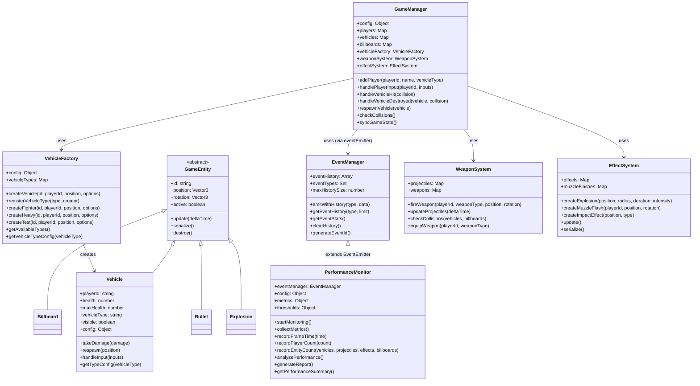
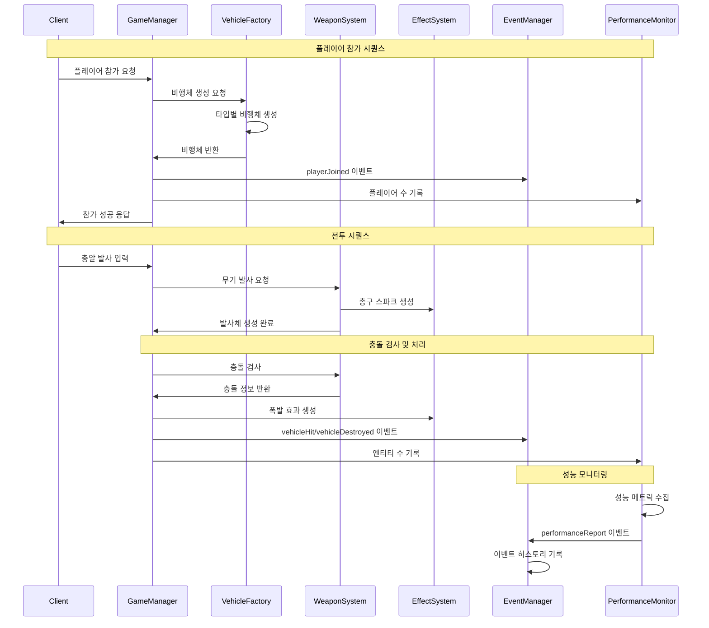
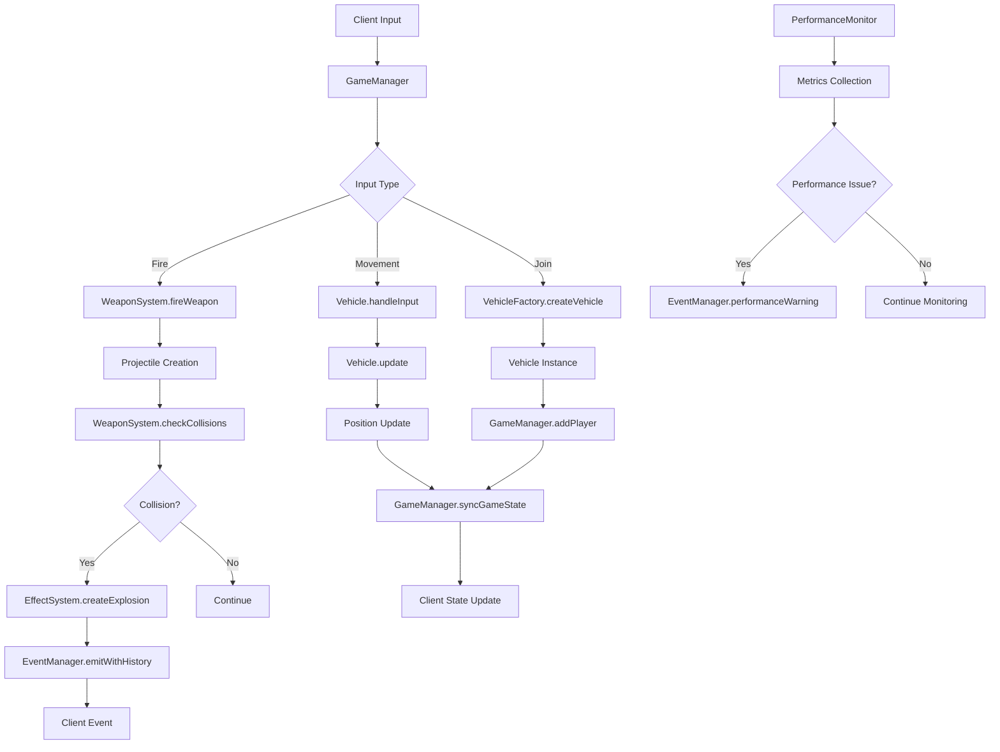

# 🚁 Multiplayer 3D Vehicle Combat Game

**Version:** v2.3  
**Last Updated:** 2025-01-25

## 📖 게임 소개

실시간 멀티플레이어 3D 비행체 전투 게임입니다. WebGL과 Socket.IO를 활용하여 브라우저에서 직접 플레이할 수 있으며, SOLID 원칙을 준수한 확장 가능한 아키텍처로 설계되었습니다.

## ✨ 주요 특징

### 🎮 게임플레이
- **실시간 멀티플레이어**: Socket.IO 기반 실시간 동기화
- **3가지 비행체 타입**: 전투기, 중형기, 테스트기 (각각 다른 성능)
- **물리 기반 비행**: 현실적인 비행 역학 시뮬레이션
- **무기 시스템**: 머신건 기반 전투 시스템
- **폭발 효과**: 피격 시 작은 폭발, 파괴 시 대형 폭발
- **점수 시스템**: 킬/데스 통계 및 점수 집계
- **자동 리스폰**: 5초 후 자동 부활

### 🏗️ 기술적 특징
- **SOLID 원칙 준수**: 확장 가능하고 유지보수가 용이한 설계
- **Factory Pattern**: 새로운 비행체 타입 쉽게 추가 가능
- **Observer Pattern**: 이벤트 기반 시스템 아키텍처
- **성능 모니터링**: 실시간 서버 성능 추적
- **중앙집중식 설정**: YAML 기반 설정 관리

## 🚀 빠른 시작

### 필수 요구사항
- Node.js 16.0 이상
- npm 또는 yarn

### 설치 및 실행
```bash
# 저장소 클론
git clone <repository-url>
cd multiplayer-vehicle-game

# 의존성 설치
npm install

# 서버 시작
npm start
```

서버가 시작되면:
- 🎮 게임 클라이언트: http://localhost:3001
- 📊 서버 상태: http://localhost:3001/api/status

## 🎯 게임 조작법

### 기본 조작
- **W/S**: 전진/후진
- **A/D**: 좌/우 회전 (요)
- **Q/E**: 좌/우 롤
- **마우스**: 피치 조정 (상하 회전)
- **스페이스바**: 발사

### 비행체 타입별 특성

#### ⚡ 전투기 (Fighter)
- **체력**: 40 HP
- **최대 속도**: 120
- **특징**: 균형잡힌 성능, 빠른 기동성
- **연사 속도**: 100ms

#### 🛡️ 중형기 (Heavy)
- **체력**: 60 HP  
- **최대 속도**: 80
- **특징**: 높은 내구성, 느린 기동성
- **연사 속도**: 150ms

#### 🧪 테스트기 (Test)
- **체력**: 20 HP
- **최대 속도**: 100
- **특징**: 빠른 테스트용, 높은 기동성
- **연사 속도**: 80ms

## ⚙️ 게임 설정

### 기본 게임 설정
```yaml
game:
  maxPlayers: 10
  respawnTime: 5000  # 5초
  worldSize: 500
```

### 성능 최적화 설정
```yaml
performance:
  enabled: true
  monitoringInterval: 5000
  maxFrameTime: 33  # 30fps
  autoOptimization: false
```

### 점수 시스템
```yaml
scoring:
  killReward: 100      # 적 격추 시 점수
  billboardDestroyReward: 50  # 광고판 파괴 시 점수
```

### 폭발 효과 설정
```yaml
collision:
  explosionRadiusSmall: 5     # 피격 시 작은 폭발
  explosionRadiusLarge: 25    # 파괴 시 대형 폭발
  explosionDurationSmall: 1000  # 1초
  explosionDurationLarge: 3000  # 3초
```

## 📊 클래스 다이어그램

### 전체 시스템 아키텍처


### SOLID 원칙 적용 상세

```mermaid
graph TD
    A[Single Responsibility Principle] --> A1[GameManager: 게임 로직 관리만]
    A --> A2[VehicleFactory: 비행체 생성만]
    A --> A3[EventManager: 이벤트 관리만]
    A --> A4[PerformanceMonitor: 성능 모니터링만]
    A --> A5[WeaponSystem: 무기 시스템만]
    A --> A6[EffectSystem: 시각 효과만]
    
    B[Open/Closed Principle] --> B1[VehicleFactory: 새 타입 추가 가능]
    B --> B2[GameEntity: 확장 가능한 기본 클래스]
    B --> B3[EventManager: 새 이벤트 타입 추가 가능]
    
    C[Liskov Substitution Principle] --> C1[모든 Vehicle 타입 호환]
    C --> C2[GameEntity 파생 클래스 호환]
    C --> C3[EventEmitter 확장 클래스 호환]
    
    D[Interface Segregation Principle] --> D1[최소한의 인터페이스 의존]
    D --> D2[각 시스템별 독립적 인터페이스]
    
    E[Dependency Inversion Principle] --> E1[추상화에 의존]
    E --> E2[Factory 패턴 활용]
    E --> E3[Dependency Injection 사용]
```


## 🔄 시스템 상호작용



### 데이터 흐름 다이어그램


## 📋 주요 설계 패턴

### 1. **Factory Pattern** (VehicleFactory)
- 새로운 비행체 타입을 쉽게 추가
- 생성 로직의 중앙집중화
- Open/Closed 원칙 준수

### 2. **Observer Pattern** (EventManager)
- 이벤트 기반 시스템 아키텍처
- 느슨한 결합 구현
- 이벤트 히스토리 관리

### 3. **Template Method Pattern** (GameEntity)
- 공통 동작의 기본 구현
- 하위 클래스에서 특화 구현

### 4. **Dependency Injection** (GameManager)
- 시스템 간 의존성 관리
- 테스트 용이성 향상

## 🚀 확장성 고려사항

### 새로운 비행체 타입 추가
```javascript
// VehicleFactory에 새 타입 등록
vehicleFactory.registerVehicleType('bomber', (id, playerId, position) => {
    return new Vehicle(id, playerId, position, {
        health: 80,
        maxSpeed: 60,
        weaponType: 'heavyGun'
    });
});
```

### 새로운 무기 시스템 추가
```javascript
// WeaponFactory 패턴 적용 가능
class WeaponFactory {
    createWeapon(type) {
        switch(type) {
            case 'machineGun': return new MachineGun();
            case 'missile': return new MissileSystem();
            case 'laser': return new LaserWeapon();
        }
    }
}
```

### 새로운 게임 모드 추가
```javascript
// GameModeFactory 패턴 적용 가능
class GameModeFactory {
    createGameMode(type) {
        switch(type) {
            case 'deathmatch': return new DeathMatchMode();
            case 'teamBattle': return new TeamBattleMode();
            case 'captureFlag': return new CaptureFlagMode();
        }
    }
}
```

## 🔧 코드 품질 보장

### 성능 모니터링
- 실시간 프레임 시간 추적
- 메모리 사용량 모니터링
- 네트워크 지연시간 측정
- 자동 성능 리포트 생성

### 이벤트 시스템
- 모든 게임 이벤트 히스토리 기록
- 디버깅 및 분석 지원
- 확장 가능한 이벤트 타입

### 설정 관리
- YAML 기반 중앙집중식 설정
- 하드코딩 제거
- 런타임 설정 변경 지원

## 🛠️ 문제 해결

### 성능 문제
1. **낮은 FPS**: `game-config.yaml`에서 `performance.enabled: true` 설정
2. **높은 지연시간**: 네트워크 설정 확인
3. **메모리 누수**: 성능 모니터링 로그 확인

### 연결 문제
1. **서버 접속 불가**: 방화벽 설정 확인
2. **외부 접속 불가**: `network.allowExternalAccess: true` 설정

### 게임플레이 문제
1. **비행체 조작 불가**: 브라우저 콘솔에서 JavaScript 오류 확인
2. **폭발 효과 없음**: `collision` 설정 확인

## 👨‍💻 개발자 정보

**개발자**: AI Assistant  
**아키텍처**: SOLID 원칙 기반 모듈러 설계  
**기술 스택**: Node.js, Socket.IO, Three.js, WebGL

## 🤝 기여 가이드라인

1. **코드 스타일**: ESLint 설정 준수
2. **커밋 메시지**: 명확하고 설명적인 메시지 작성
3. **테스트**: 새 기능 추가 시 테스트 코드 포함
4. **문서화**: README 및 코드 주석 업데이트

## 📄 라이선스

MIT License - 자유롭게 사용, 수정, 배포 가능

---

**🎮 즐거운 게임 되세요!** 