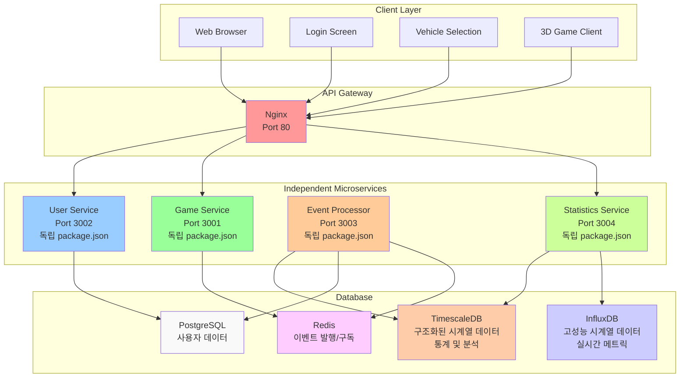
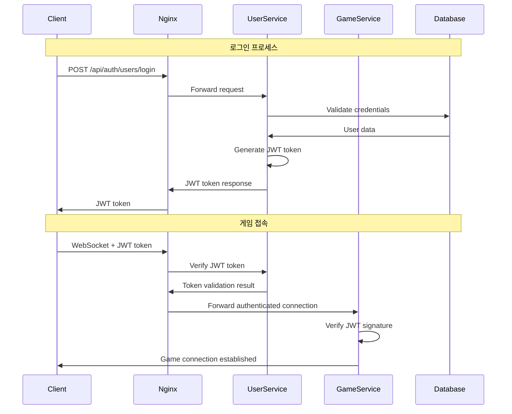

# 🚁 Multiplayer 3D Vehicle Combat Game

**Version:** v4.0  
**Last Updated:** 2025-06-12  
**Architecture:** Independent Microservices with JWT Authentication

## 📖 게임 소개

실시간 멀티플레이어 3D 비행체 전투 게임입니다. 완전히 독립적인 마이크로서비스 아키텍처와 JWT 인증을 통한 보안 시스템을 갖춘 본격적인 웹 게임입니다. nginx API 게이트웨이를 통해 사용자 인증과 게임 서비스가 분리되어 있으며, PostgreSQL 데이터베이스를 사용한 사용자 관리 시스템을 제공합니다.

## 🏗️ 시스템 아키텍처


```mermaid
graph TB
    subgraph "Client Layer"
        A[Web Browser]
        B[Login Screen]
        C[Vehicle Selection]
        D[3D Game Client]
    end
    
    subgraph "API Gateway"
        E[Nginx<br/>Port 80]
    end
    
    subgraph "Independent Microservices"
        F[User Service<br/>Port 3002<br/>독립 package.json]
        G[Game Service<br/>Port 3001<br/>독립 package.json]
        H[Event Processor<br/>Port 3003<br/>독립 package.json]
        S[Statistics Service<br/>Port 3004<br/>독립 package.json]
    end
    
    subgraph "Database"
        I[PostgreSQL<br/>사용자 데이터]
        T[TimescaleDB<br/>구조화된 시계열 데이터<br/>통계 및 분석]
        J[InfluxDB<br/>고성능 시계열 데이터<br/>실시간 메트릭]
        R[Redis<br/>이벤트 발행/구독]
    end
    
    A --> E
    B --> E
    C --> E
    D --> E
    
    E --> F
    E --> G
    E --> S
    
    F --> I
    G --> R
    S --> T
    H --> T
    H --> I
    H --> R
    S --> J
    
    style E fill:#ff9999
    style F fill:#99ccff
    style G fill:#99ff99
    style S fill:#ccff99
    style H fill:#ffcc99
    style I fill:#f9f9f9
    style T fill:#ffccaa
    style J fill:#ccccff
    style R fill:#ffccff
```

### 데이터베이스 역할 분담

- **PostgreSQL**: 사용자 계정, 인증, 권한 및 기본 게임 데이터 저장
- **TimescaleDB**: 
  - PostgreSQL 확장으로, 관계형 데이터와 시계열 데이터를 함께 처리
  - 플레이어 통계, 게임 세션 기록, 장기 분석 데이터 저장
  - SQL 쿼리를 통한 복잡한 분석 및 리포트 생성
- **InfluxDB**: 
  - 고성능 시계열 데이터베이스로 대량 데이터 수집에 최적화
  - 게임 서버 메트릭, 실시간 이벤트 데이터, 모니터링 데이터 저장
  - 빠른 쓰기 및 집계 쿼리에 특화
- **Redis**:
  - 인메모리 데이터 구조 저장소로 고성능 캐싱 및 메시징에 활용
  - 게임 서비스의 이벤트 발행/구독(Pub/Sub) 시스템 제공
  - 세션 캐싱 및 임시 데이터 저장
  - 실시간 게임 상태 공유
  - 예: 게임 이벤트 메시징, 실시간 점수 업데이트, 임시 세션 데이터

### 서비스 역할 분담

- **User Service**: 사용자 인증 및 계정 관리
- **Game Service**: 실시간 게임 로직 및 게임플레이 처리
- **Event Processor**: 게임 이벤트 수집 및 시계열 데이터 저장 (백엔드 전용)
- **Statistics Service**: 통계 데이터 API 제공 및 리더보드 관리 (클라이언트 접근용)

### 🔐 인증 플로우


```mermaid
sequenceDiagram
    participant Client
    participant Nginx
    participant UserService
    participant GameService
    participant Database
    
    Note over Client, Database: 로그인 프로세스
    Client->>Nginx: POST /api/auth/users/login
    Nginx->>UserService: Forward request
    UserService->>Database: Validate credentials
    Database->>UserService: User data
    UserService->>UserService: Generate JWT token
    UserService->>Nginx: JWT token response
    Nginx->>Client: JWT token
    
    Note over Client, Database: 게임 접속
    Client->>Nginx: WebSocket + JWT token
    Nginx->>UserService: Verify JWT token
    UserService->>Nginx: Token validation result
    Nginx->>GameService: Forward authenticated connection
    GameService->>GameService: Verify JWT signature
    GameService->>Client: Game connection established
```

## ✨ 주요 특징

### 🎮 게임플레이
- **실시간 멀티플레이어**: Socket.IO 기반 실시간 동기화
- **3가지 비행체 타입**: 전투기(Fighter), 중형기(Heavy), 테스트기(Test)
- **물리 기반 비행**: 현실적인 비행 역학 시뮬레이션
- **무기 시스템**: 기관총 및 유도 미사일 시스템
- **타겟팅 시스템**: 상황 인식 및 락온(Lock-on) 기능
- **선물 상자 시스템**: 게임 월드에 주기적으로 생성되는 선물 상자를 획득하면 점수, 무기 등 다양한 보상을 얻을 수 있습니다.
- **동적 환경**: 파괴 가능한 광고판(Billboard), 보상을 제공하는 선물 상자(GiftBox) 등 상호작용 가능한 오브젝트
- **폭발 효과**: 피격 시 작은 폭발, 파괴 시 대형 폭발
- **점수 시스템**: 킬/데스 통계 및 점수 집계
- **자동 리스폰**: 5초 후 자동 부활
- **1인칭/3인칭 시점**: V키로 시점 전환

### 🔒 보안 시스템
- **JWT 인증**: 토큰 기반 사용자 인증
- **API 게이트웨이**: nginx를 통한 중앙집중식 라우팅 (외부 접근 허용)
- **마이크로서비스 격리**: User/Game Service는 localhost만 허용 (외부 직접 접근 차단)
- **WebSocket 보안**: JWT 토큰 검증을 통한 WebSocket 연결 보호
- **Rate Limiting**: API 호출 제한으로 DDoS 방지
- **CORS 설정**: 적절한 Cross-Origin 정책

### 🏗️ 마이크로서비스 특징
- **완전한 독립성**: 각 서비스별 독립적인 `package.json`과 의존성
- **독립적 배포**: 서비스별로 따로 배포 가능
- **SOLID 원칙 준수**:
  - **단일 책임 원칙 (SRP)**: 기존의 거대했던 `GameManager`를 `PlayerManager`, `VehicleManager`, `WeaponSystem`, `TargetingManager`, `CollisionSystem` 등 각자의 역할에 충실한 여러 개의 작은 시스템으로 분리
  - 이를 통해 코드의 응집도를 높이고, 유지보수성과 확장성을 크게 향상
- **Factory Pattern**: 새로운 비행체 타입 쉽게 추가 가능
- **Observer Pattern**: `EventEmitter`를 활용한 이벤트 기반 시스템 아키텍처
- **성능 모니터링**: 실시간 서버 성능 추적
- **중앙집중식 설정**: YAML 기반 설정 관리
- **데이터 처리 파이프라인**: 이벤트 프로세서를 통한 게임 이벤트 처리 및 분석
- **PostgreSQL 데이터베이스**: 사용자 데이터 영구 저장
- **InfluxDB**: 시계열 데이터 저장 및 분석

## 🛠️ 주요 기술 스택

- **Backend**: Node.js, Express
- **Frontend**: HTML, CSS, JavaScript, Three.js
- **Real-time Communication**: Socket.IO, Redis
- **Database**: PostgreSQL, TimescaleDB, InfluxDB
- **API Gateway**: Nginx
- **Containerization**: Docker

## 🤝 기여하기

프로젝트에 기여하고 싶으신 분은 언제든지 Pull Request를 보내주시거나 이슈를 등록해주세요.

## 📄 라이선스

본 프로젝트는 MIT 라이선스를 따릅니다.

## 🎯 게임 조작법

### 기본 조작
- **W/S**: 피치 조정 (기수 상승/하강)
- **A/D**: 요 조정 (좌/우 회전)
- **Q/E**: 롤 조정 (좌/우 기울기)
- **Shift**: 추력 증가 (부스터)
- **Ctrl**: 추력 감소
- **Space**: 수직 상승
- **X**: 수직 하강
- **P**: 발사 (또는 마우스 좌클릭)
- **V**: 1인칭/3인칭 시점 전환

### 비행체 타입별 특성

#### ⚡ 전투기 (Fighter)
- **체력**: 40 HP
- **최대 속도**: 120
- **특징**: 균형잡힌 성능, 빠른 기동성
- **연사 속도**: 100ms
- **엔진**: 단일 엔진 (파란색 글로우)

#### 🛡️ 중형기 (Heavy)
- **체력**: 60 HP  
- **최대 속도**: 80
- **특징**: 높은 내구성, 느린 기동성
- **연사 속도**: 150ms
- **엔진**: 듀얼 엔진 (주황색 글로우)

#### 🧪 테스트기 (Test)
- **체력**: 20 HP
- **최대 속도**: 100
- **특징**: 빠른 테스트용, 높은 기동성
- **연사 속도**: 80ms
- **엔진**: 단일 엔진 (녹색 글로우)

## 🔐 사용자 인증 시스템

### 회원가입 및 로그인
1. **회원가입**: 사용자명, 이메일, 비밀번호로 계정 생성
2. **로그인**: 사용자명과 비밀번호로 JWT 토큰 획득
3. **차량 선택**: 로그인 후 원하는 비행체 타입 선택
4. **게임 입장**: JWT 토큰으로 인증된 게임 세션 시작

### 게스트 사용자
- 임시 계정으로 빠른 게임 참여 가능
- 제한된 기능 (통계 저장 안됨)

### 사용자 프로필
- 게임 통계 (총 킬, 데스, 게임 수, 점수)
- 차량 커스터마이징 설정
- 게임 포인트 시스템

## 🌐 API 엔드포인트

### 인증 API (User Service)
```
POST /api/auth/users/register    # 회원가입
POST /api/auth/users/login       # 로그인
POST /api/auth/users/guest       # 게스트 계정 생성
GET  /api/auth/users/verify-token # JWT 토큰 검증
```

### 사용자 API (User Service)
```
GET  /api/user/users/profile           # 프로필 조회
PUT  /api/user/users/vehicle-settings  # 차량 설정 업데이트
POST /api/user/users/game-stats        # 게임 통계 업데이트
GET  /api/user/users/list              # 사용자 목록 (관리자)
GET  /api/user/database/info           # 데이터베이스 정보
```

### 게임 API (Game Service)
```
GET  /api/status                 # 서버 상태
WebSocket /socket.io/            # 실시간 게임 통신
```

### 통계 API (Statistics Service)
```
GET  /api/statistics/players/:id       # 특정 플레이어 통계
GET  /api/statistics/leaderboard       # 리더보드 조회
GET  /api/statistics/sessions/:id      # 특정 게임 세션 통계
GET  /api/statistics/weapons           # 무기 사용 통계
GET  /api/statistics/vehicles          # 차량 유형별 통계
GET  /api/statistics/maps              # 맵별 통계
GET  /api/statistics/trends            # 시간대별 통계 추이
```

## ⚙️ 개발 스크립트

### 루트 레벨 스크립트
```bash
# 서비스 실행
npm run start:user              # User Service 실행
npm run start:game              # Game Service 실행
npm run start:statistics        # Statistics Service 실행
npm run dev:all                 # 모든 서비스 동시 개발 모드

# 의존성 관리
npm run install:user            # User Service 의존성 설치
npm run install:game            # Game Service 의존성 설치
npm run install:statistics      # Statistics Service 의존성 설치
npm run install:all             # 모든 서비스 의존성 설치

# 정리
npm run clean                   # 모든 node_modules 삭제
```

## 📊 성능 최적화

### WebGL 최적화
- **GPU 가속**: `powerPreference: "high-performance"`
- **프레임 제한**: 60fps 제한으로 과도한 렌더링 방지
- **렌더링 통계**: 자동 리셋으로 메모리 최적화
- **객체 정렬**: 드로우콜 최적화

### 네트워크 최적화
- **Rate Limiting**: API 호출 제한 (1000 requests/15분)
- **WebSocket 압축**: 실시간 데이터 압축 전송
- **JWT 캐싱**: 토큰 검증 결과 캐싱

### 마이크로서비스 최적화
- **독립적 스케일링**: 각 서비스별로 독립적으로 확장 가능
- **의존성 격리**: 한 서비스의 장애가 다른 서비스에 영향 없음
- **개발 효율성**: 팀별로 독립적인 개발 및 배포 가능
- **이벤트 처리 최적화**: 배치 처리를 통한 데이터베이스 작업 최적화
- **통계 데이터 캐싱**: 자주 조회되는 통계 데이터 캐싱으로 성능 향상

## 🔧 배포

### Docker 배포 (권장)
```bash
# 각 서비스별 Docker 이미지 빌드
cd services/user-service
docker build -t user-service .

cd ../game-service
docker build -t game-service .

cd ../statistics-service
docker build -t statistics-service .

cd ../event-processor-service
docker build -t event-processor-service .

# Docker Compose로 전체 시스템 실행
docker-compose up -d
```

### 수동 배포
```bash
# 프로덕션 환경에서 각 서비스별로 실행
cd services/user-service
NODE_ENV=production npm start

cd ../game-service
NODE_ENV=production npm start

cd ../statistics-service
NODE_ENV=production npm start
```

## 📝 라이센스

MIT License

## 👥 기여

1. Fork the Project
2. Create your Feature Branch (`git checkout -b feature/AmazingFeature`)
3. Commit your Changes (`git commit -m 'Add some AmazingFeature'`)
4. Push to the Branch (`git push origin feature/AmazingFeature`)
5. Open a Pull Request

---

**🎮 마이크로서비스 기반 멀티플레이어 게임을 즐겨보세요!**

**⚠️ 주의**: 프로덕션 환경에서는 반드시 JWT_SECRET, 데이터베이스 비밀번호 등을 변경하세요!

**🔒 보안 아키텍처:**
- **Nginx (Port 80)**: 외부 접근 허용 - API Gateway 역할
- **User Service (Port 3002)**: localhost만 허용 - nginx를 통해서만 접근
- **Game Service (Port 3001)**: localhost만 허용 - nginx를 통해서만 접근
- **Statistics Service (Port 3004)**: localhost만 허용 - nginx를 통해서만 접근
- **PostgreSQL**: localhost만 허용 - User Service를 통해서만 접근
- **TimescaleDB**: localhost만 허용 - Statistics Service와 Event Processor를 통해서만 접근
- **InfluxDB**: localhost만 허용 - Statistics Service와 Event Processor를 통해서만 접근