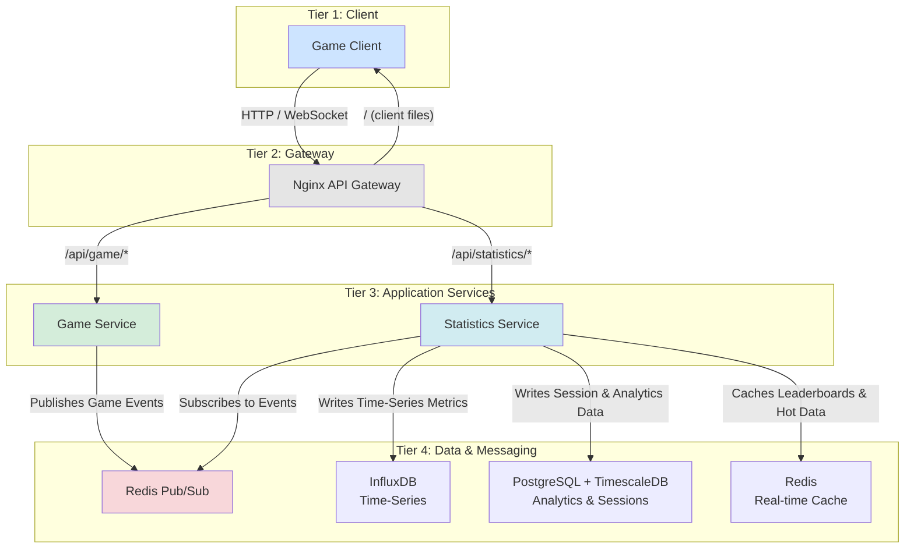

# 📊 비동기 통계 마이크로서비스 구축 계획서 (Windows Native Dev)

**Version:** 1.1  
**작성일:** 2025-06-13  
**프로젝트 목표:** 게임 서비스의 성능에 영향을 주지 않는 완전 비동기 방식의 통계 및 업적 마이크로서비스를 구축하고, 이를 클라이언트에 시각화하여 제공한다.

---

## 🗺️ 전체 아키텍처 개요



---

## 📝 단계별 실행 계획

### 1단계: Game Service → Redis 비동기 이벤트 전송 (성능 영향 없음, 인터페이스 계층 및 우선순위 config 포함)

- **목표:**
    - game-service에서 발생하는 모든 게임 이벤트를 **이벤트 발행 인터페이스 계층**을 통해 비동기(Fire & Forget) 방식으로 전송한다.
    - 1단계에서는 Redis Pub/Sub을 기본 타겟으로 사용하지만, 이 계층을 통해 향후 Kafka, 파일, 기타 메시지 브로커 등 다양한 타겟으로 확장 가능하도록 설계한다.
    - **인터페이스 계층에 어댑트되는 구현체 중 하나가 file log 방식이며, Redis가 끊기거나 연결 불가/에러 발생 시 즉시 file log 방식으로 자동 전환(fallback)되어야 한다.**
    - **이벤트 발행 우선순위 및 각 구현체의 속성은 별도의 yaml config 파일(`event-publisher-config.yaml`)에서 정의하며, game-config와 분리하여 관리한다.**
    - 이 파일 로그는 추후 batch로 통계에 반영할 예정이지만, 1단계에서는 파일 적재만 신경쓰고 통계 반영은 신경쓰지 않는다.
    - Redis 전송/로그 적재 작업은 game-service의 실시간 성능(게임 플레이)에 절대 영향을 주지 않아야 한다.

- **주요 기술:**
    - Node.js, ioredis, 비동기 파일 입출력(fs/promises)
    - **이벤트 발행 인터페이스(추상화) 계층**: 다양한 백엔드(Redis, Kafka, 파일 등)로의 확장성 확보 및 file log 방식의 어댑터 구현
    - **우선순위 및 속성 config**: yaml 포맷, game-config와 분리

- **이벤트 발행 config 예시 (`event-publisher-config.yaml`)**

```yaml
publishers:
  - type: redis
    host: 127.0.0.1
    port: 6379
    channel: game_events
    password: ""
    db: 0
    retryCount: 3
    retryDelayMs: 1000
  - type: file
    logDir: ./logs/events
    filePrefix: game_events_
    fileExt: .jsonl
    maxFileSize: 10485760 # 10MB
    flushIntervalMs: 100
    rotationPolicy: size
    maxRetry: 3
    encoding: utf8
```

- **주요 속성 설명:**
    - `publishers`: 우선순위대로 나열 (첫 번째가 실패하면 두 번째로 자동 전환)
    - `type`: redis, file 등 구현체 구분
    - redis 관련: host, port, channel, password, db, retryCount, retryDelayMs 등
    - file 관련: logDir, filePrefix, fileExt, maxFileSize, flushIntervalMs, rotationPolicy(size/time), maxRetry, encoding 등

| 단계 | 작업 내용 | 결과물 확인 방법 |
|---|---|---|
| **1.1** | **이벤트 발행 인터페이스 계층 설계/구현**<br/>- Redis, 파일, 기타 타겟을 위한 공통 인터페이스(추상 클래스/함수) 정의<br/>- 실제 구현체(RedisPublisher, FileLogger 등)는 이 인터페이스를 구현 | 각 구현체 단위 테스트 및 인터페이스 교체 시 정상 동작 확인 |
| **1.2** | **event-publisher-config.yaml 설계/적용**<br/>- 이벤트 발행 우선순위 및 각 구현체 속성을 yaml로 정의<br/>- game-config와 분리하여 관리 | config 파일에 우선순위 및 속성 정의, 서비스에서 정상적으로 읽어오는지 확인 |
| **1.3** | **Redis Publisher 구현**<br/>- ioredis로 Redis Pub/Sub 비동기 발행 모듈 작성<br/>- 이벤트 발생 시 await 없이 Fire & Forget 방식으로 Redis에 전송 | 테스트 코드에서 Redis에 메시지가 정상적으로 발행되는지 확인 (`redis-cli MONITOR` 등) |
| **1.4** | **File Logger(Fallback) 구현 및 전환 로직**<br/>- Redis 연결 실패(끊김/에러) 시 이벤트를 JSONL 형식으로 파일에 기록<br/>- 이 전환(fallback)은 자동으로 즉시 이루어져야 하며, 파일 기록도 비동기로 처리 | Redis를 중지한 상태에서 이벤트 발생 시 파일에 이벤트가 정상적으로 기록되는지 확인 |
| **1.5** | **EventManager 통합**<br/>- EventManager에서 이벤트 발생 시 인터페이스 계층을 통해 Redis Publisher와 File Logger를 활용<br/>- 두 작업 모두 await 없이 비동기로 처리, Redis 장애 시 자동으로 file log로 전환되는지 확인 | 게임 플레이 중 이벤트가 발생해도 게임 성능 저하 없이 Redis 또는 파일에 이벤트가 기록되는지 확인 |

---

### 2단계: 비동기 이벤트 파이프라인 구축 (예상 소요: 2일)

- **목표:** `game-service`가 Redis Pub/Sub을 통해 이벤트를 비동기적으로 발행(Fire & Forget)하고, `statistics-service`가 이를 구독하여 수신하는 파이프라인을 완성한다.
- **주요 기술:** Redis Pub/Sub, ioredis (npm package)

| 단계 | 작업 내용 | 결과물 확인 방법 |
|---|---|---|
| **2.1** | **`game-service`에 Redis Publisher 구현**<br/>- `ioredis` 패키지 추가<br/>- `RedisPublisher.js` 모듈 작성 (이벤트 발행 로직) | `game-service` 내 테스트 코드로 로컬 Redis에 메시지 발행 성공. `redis-cli MONITOR` 명령으로 발행되는 메시지를 실시간으로 확인. |
| **2.2** | **`EventManager` 수정**<br/>- `game-service`의 `EventManager.js` 수정<br/>- 이벤트 발생 시 `RedisPublisher`를 `await` 없이 호출하여 비동기 발행 | 게임 플레이 중 `player_kill` 같은 이벤트가 발생할 때, Redis 채널로 해당 이벤트 데이터가 실시간으로 발행되는 것을 `MONITOR` 명령어로 확인. |
| **2.3** | **`statistics-service`에 Redis Subscriber 구현**<br/>- `ioredis` 패키지 추가<br/>- `RedisSubscriber.js` 모듈 작성 (채널 구독 및 메시지 수신) | `game-service`에서 발생시킨 게임 이벤트가 `statistics-service`의 콘솔 로그에 실시간으로 출력되는 것을 확인. |

---

### Phase 3: 데이터 저장소 연동 (예상 소요: 3일)

- **목표:** `statistics-service`가 수신한 이벤트를 용도에 맞는 데이터베이스(InfluxDB, TimescaleDB, Redis)에 분산하여 저장하는 로직을 구현한다.
- **주요 기술:** InfluxDB, TimescaleDB, Redis, Node.js DB Clients

| 단계 | 작업 내용 | 결과물 확인 방법 |
|---|---|---|
| **3.1** | **DB 클라이언트 모듈 구현**<br/>- `influxdb-client`, `pg`, `ioredis` 패키지 설치<br/>- 각 DB 연결 및 기본操作을 담당하는 매니저 클래스 작성 | 각 매니저 클래스의 단위 테스트를 통해 로컬 DB 연결 및 간단한 Read/Write가 성공하는지 확인. |
| **3.2** | **이벤트 프로세서 고도화**<br/>- `EventProcessor.js` 구현<br/>- 수신 이벤트를 InfluxDB, TimescaleDB, Redis Cache에 분배하여 저장/업데이트 | 하나의 게임 이벤트 발생 시, 3개의 데이터 저장소에 데이터가 모두 올바르게 저장되는지 각 DB의 UI 또는 CLI로 확인. |
| **3.3** | **배치(Batch) 처리 구현**<br/>- `EventProcessor`에 이벤트 큐와 `setInterval`을 이용한 배치 처리 로직 추가 | 다수의 이벤트를 짧은 시간에 발생시킨 후, DB 로그나 `statistics-service` 로그를 통해 이벤트가 묶어서 처리되는 것을 확인. DB 부하가 줄어드는지 모니터링. |

---

### Phase 4: 통계 API 구현 및 클라이언트 통합 (예상 소요: 2일)

- **목표:** 집계된 통계 데이터를 외부에서 조회할 수 있는 API를 만들고, 이를 게임 클라이언트에 연동하여 시각화한다.
- **주요 기술:** Express.js, Nginx, REST API

| 단계 | 작업 내용 | 결과물 확인 방법 |
|---|---|---|
| **4.1** | **실시간 통계 API 엔드포인트 구현**<br/>- Express 라우터를 사용하여 `/leaderboard`, `/stats/:playerId` 등 엔드포인트 생성 | Postman 또는 curl을 사용하여 각 API를 호출했을 때, Redis Cache 또는 DB에서 조회한 정확한 JSON 데이터가 반환되는지 확인. |
| **4.2** | **Nginx 라우팅 설정**<br/>- 로컬 Nginx의 `nginx.conf`에 `/api/statistics/` 경로를 `statistics-service` (localhost:3003)로 프록시하는 `location` 블록 추가 | 브라우저에서 `http://localhost/api/statistics/leaderboard` 접속 시 Nginx를 통해 API 응답이 정상적으로 반환되는지 개발자 도구로 확인. |
| **4.3** | **게임 클라이언트에 통계 UI 연동**<br/>- `client/` 폴더에 통계/업적 표시 UI 추가<br/>- `fetch` API로 통계 API를 호출하고 결과 데이터를 화면에 렌더링 | 게임에 접속했을 때, 나의 킬/데스, 점수, 리더보드 순위가 UI에 정확하게 표시되는 것을 눈으로 확인. |
| **4.4** | **End-to-End(E2E) 테스트**<br/>- 게임 플레이로 이벤트 발생부터 클라이언트 UI 반영까지 전 과정 테스트 | 게임에서 특정 액션(예: 킬)을 수행한 후, 잠시 뒤에 클라이언트 UI에 해당 통계가 업데이트되는 것을 최종 확인. |

---

### Phase 5: 프로덕션 배포 및 모니터링 (예상 소요: 1일)

- **목표:** 완성된 서비스를 Docker를 사용하여 프로덕션 환경에 안정적으로 배포하고, 기본 모니터링 체계를 갖춘다.
- **주요 기술:** Docker (Multi-stage builds), Shell scripting

| 단계 | 작업 내용 | 결과물 확인 방법 |
|---|---|---|
| **5.1** | **프로덕션용 Dockerfile 최적화**<br/>- Multi-stage build를 적용하여 최종 이미지 용량 최소화<br/>- 개발용 의존성 제거 | `docker images` 명령어로 프로덕션용 이미지의 크기가 개발용 이미지보다 확연히 줄었는지 확인. |
| **5.2** | **프로덕션 배포 스크립트 작성**<br/>- `docker-compose.prod.yml` 파일 작성<br/>- 프로덕션 배포를 위한 쉘 스크립트(`deploy.sh`) 작성 | `sh deploy.sh` 실행 시, 모든 서비스가 프로덕션 모드로 정상 구동되는지 확인. |
| **5.3** | **헬스 체크 및 로깅 설정**<br/>- 모든 마이크로서비스에 `/health` 엔드포인트 추가<br/>- `docker-compose`에 로깅 드라이버 및 옵션 설정 | `curl localhost:<port>/health` 호출 시 200 OK와 "healthy" 응답 확인. `docker logs <container>` 명령으로 로그가 설정된 정책에 맞게 기록되는지 확인. | 