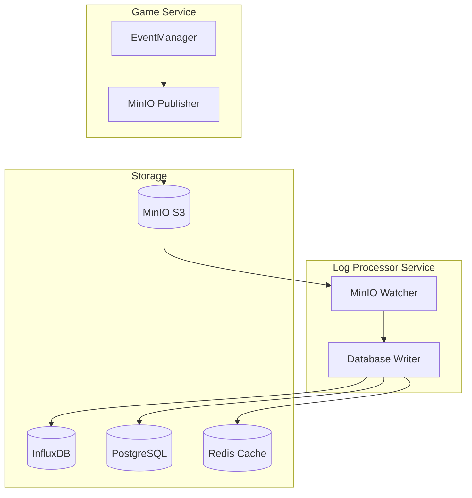

# 📊 MinIO 기반 비동기 통계 마이크로서비스 구현 요약

## 🎯 최종 아키텍처

## 데이터 플로우

### 1. 이벤트 발생 (Game Service)
- **EventManager**: 게임 이벤트 수집 및 관리
- **MinIOPublisher**: 이벤트를 JSONL 형식으로 배치 처리하여 MinIO S3에 업로드
- **배치 처리**: 100개 이벤트 또는 5초마다 업로드

### 2. 로그 저장 (MinIO)
- **버킷**: `game-events`
- **객체 구조**: `events/{timestamp}_{random}.jsonl`
- **메타데이터**: 이벤트 개수, 타임스탬프 등 포함

### 3. 로그 처리 (Log Processor Service)
- **MinIOWatcher**: 5초마다 새로운 객체 감지
- **이벤트 분류**: 실시간 vs 배치 이벤트 구분
- **DB 분배**: 이벤트 타입에 따라 적절한 DB에 저장

### 4. 데이터 저장 (Multi-DB)
- **InfluxDB**: 시계열 데이터 (킬, 데스, 게임 상태 등)
- **PostgreSQL**: 분석 데이터 (세션, 플레이어 정보 등)
- **Redis**: 실시간 캐시 (리더보드, 핫 데이터 등)

## ⚡ 실시간 vs 배치 처리

### 실시간 이벤트 (즉시 처리)
- `playerKill`, `playerDeath`, `gameEnded`
- `playerScoreChanged`, `vehicleDestroyed`
- **처리 방식**: 개별 이벤트 즉시 DB 저장

### 배치 이벤트 (효율적 처리)
- `playerJoined`, `playerLeft`, `gameStarted`
- `explosionCreated`, `muzzleFlash` 등
- **처리 방식**: 배치로 묶어서 효율적으로 처리

## 주요 컴포넌트

### Game Service
- **EventManager**: 이벤트 수집 및 히스토리 관리
- **MinIOPublisher**: S3 호환 API로 로그 업로드
- **배치 큐**: 메모리 효율적인 이벤트 처리

### Log Processor Service
- **MinIOWatcher**: S3 객체 변경 감지
- **DatabaseWriter**: 우선순위 기반 DB 저장
- **이벤트 라우터**: 타입별 DB 분배 로직

### Storage Layer
- **MinIO**: OS 독립적 객체 저장소
- **InfluxDB**: 시계열 메트릭 저장
- **PostgreSQL**: 관계형 분석 데이터
- **Redis**: 실시간 캐시 및 리더보드

## 🔧 기술 스택

### Core Technologies
- **Node.js**: 서비스 런타임
- **MinIO**: S3 호환 객체 저장소
- **InfluxDB**: 시계열 데이터베이스
- **PostgreSQL**: 관계형 데이터베이스
- **Redis**: 인메모리 캐시

### Key Libraries
- **minio**: S3 클라이언트
- **influx**: 시계열 DB 클라이언트
- **pg**: PostgreSQL 클라이언트
- **ioredis**: Redis 클라이언트

## 성능 최적화

### 배치 처리
- **게임 서비스**: 100개 이벤트 또는 5초마다 업로드
- **프로세서**: 50개 이벤트 배치로 DB 저장
- **메모리 효율**: 큐 기반 처리로 메모리 사용량 제어

### 실시간 처리
- **우선순위 이벤트**: 즉시 처리로 지연 최소화
- **병렬 저장**: 여러 DB에 동시 저장
- **에러 복구**: 실패 시 재시도 로직

## 모니터링 & 관리

### API 엔드포인트
- `/health`: 서비스 상태 확인
- `/api/status`: 처리 통계 조회
- `/api/reprocess`: 수동 재처리
- `/api/flush-batch`: 배치 큐 강제 처리

### 통계 정보
- 처리된 파일/객체 수
- 실시간 vs 배치 이벤트 비율
- DB별 저장 성공률
- 처리 지연 시간

## 배포 & 확장

### 독립적 서비스
- **Game Service**: 게임 로직에 집중
- **Log Processor**: 로그 처리에 집중
- **MinIO**: 확장 가능한 저장소

### 수평 확장
- **MinIO**: 클러스터 구성 가능
- **Log Processor**: 여러 인스턴스 실행 가능
- **Database**: 읽기/쓰기 분리 가능

## 💡 주요 장점

✅ **OS 독립적**: MinIO로 모든 플랫폼 지원  
✅ **확장 가능**: S3 호환으로 클라우드 확장  
✅ **실시간 처리**: 중요한 이벤트 즉시 처리  
✅ **효율적 배치**: 일반 이벤트 배치 처리  
✅ **안정성**: 객체 기반 저장으로 데이터 보호  
✅ **모니터링**: 실시간 처리 상태 확인  
✅ **복구 가능**: 로그 재처리로 데이터 복구  

이 구조로 게임 서비스의 성능에 영향을 주지 않으면서도 안정적이고 확장 가능한 통계 시스템을 구축할 수 있습니다!

---

## 🚨 MinIO 연결 장애 및 복구 전략

### 1. 연결 끊김 시나리오
- **일시적 네트워크 문제**: MinIO 업로드 실패, 일시적 연결 불가 → 재시도 로직으로 자동 복구
- **MinIO 서버 다운**: MinIO 서비스 완전 중단 → 로컬 로그 파일로 Fallback
- **디스크 공간 부족**: MinIO 업로드/로컬 로그 모두 실패 → 메모리 큐 유지, 경고 로그

### 2. 대응 전략 (우선순위 기반 저장)
1. **1차**: MinIO S3 업로드
2. **2차**: 로컬 로그 파일 저장 (JSONL, 파일 로테이션)
3. **3차**: 메모리 큐 유지 (최대 크기 제한)
4. **4차**: 경고 및 알림 (운영자에게 즉시 통보)

- **자동 복구**: MinIO 복구 시 로컬 로그/메모리 큐의 이벤트를 다시 업로드
- **재시도 로직**: 지수 백오프 등으로 네트워크/MinIO 복구 시까지 반복 시도
- **헬스 체크**: 주기적으로 MinIO 연결 상태 확인, 자동 전환 및 복구 감지

### 3. 데이터 손실 방지
- **로컬 로그 백업**: MinIO 장애 시 JSONL로 로컬 저장, 복구 후 재업로드
- **메모리 큐 보호**: 큐 크기 제한, 중요 이벤트 우선 보존, 시스템 재시작 시 복구
- **복구 프로세스**: MinIO 복구 감지 → 로컬 로그/메모리 큐 순차 업로드 → 정상화
- **데이터 무결성**: 이벤트 ID/타임스탬프 기반 중복 방지 및 순서 보장

### 4. 복구 시나리오
1. MinIO 연결 복구 감지
2. 로컬 로그 파일 스캔 및 업로드
3. 메모리 큐 이벤트 업로드
4. 정상 상태로 복귀 및 모니터링

### 5. 실제 구현 시 고려사항
- **설정 옵션**: 재시도 횟수/간격, 로컬 로그 보관 기간, 큐 최대 크기, 알림 임계값
- **성능 최적화**: 비동기/배치 처리, 네트워크 효율, 압축 전송
- **모니터링**: 업로드 성공/실패율, 로컬 저장소 사용량, 알림 시스템

---

이 전략을 통해 MinIO 장애 상황에서도 게임 서비스의 이벤트 데이터 손실 없이 안정적으로 통계 시스템을 운영할 수 있습니다. 